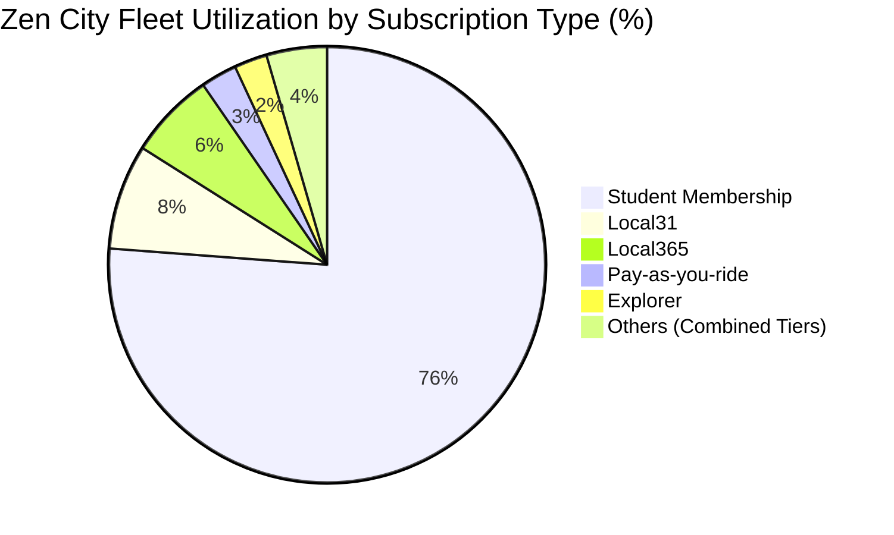
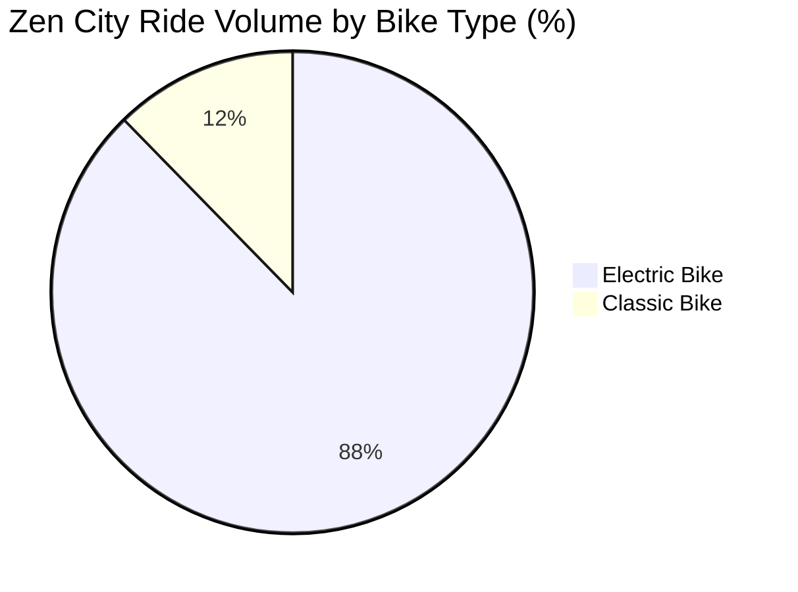
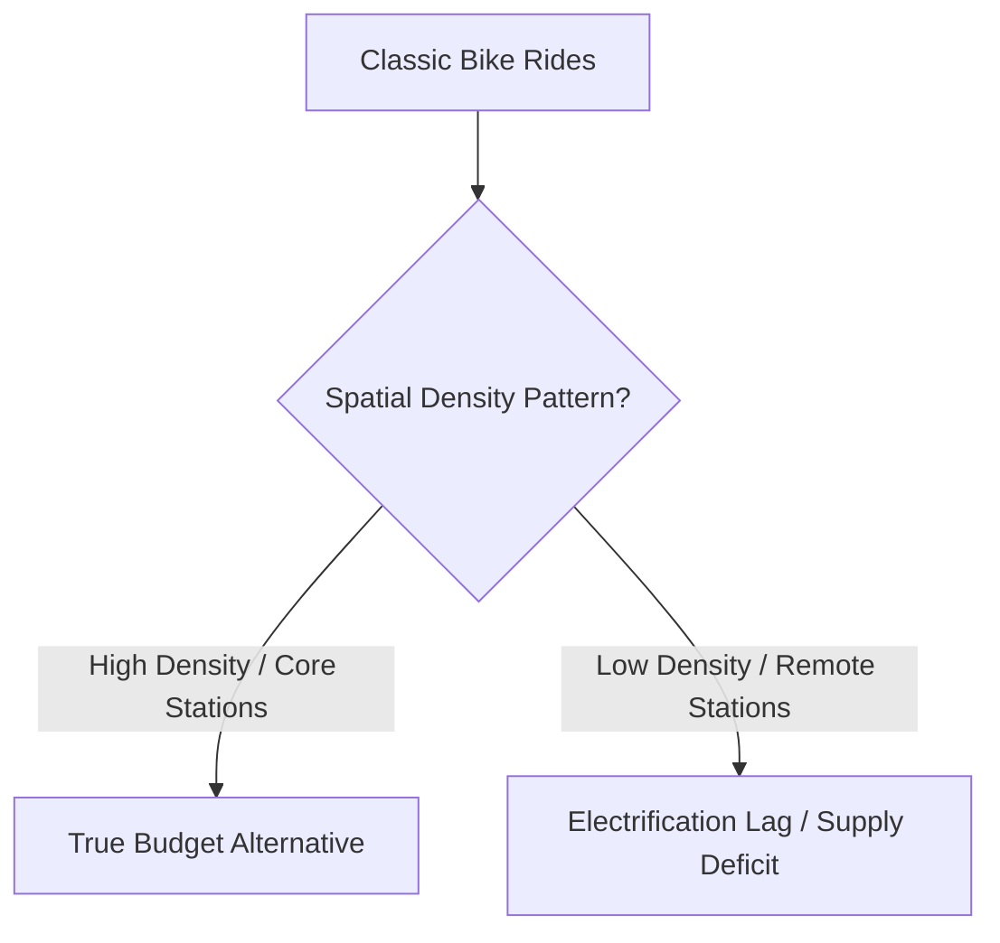
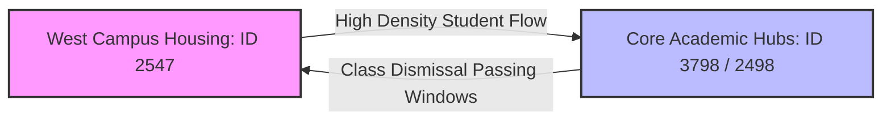
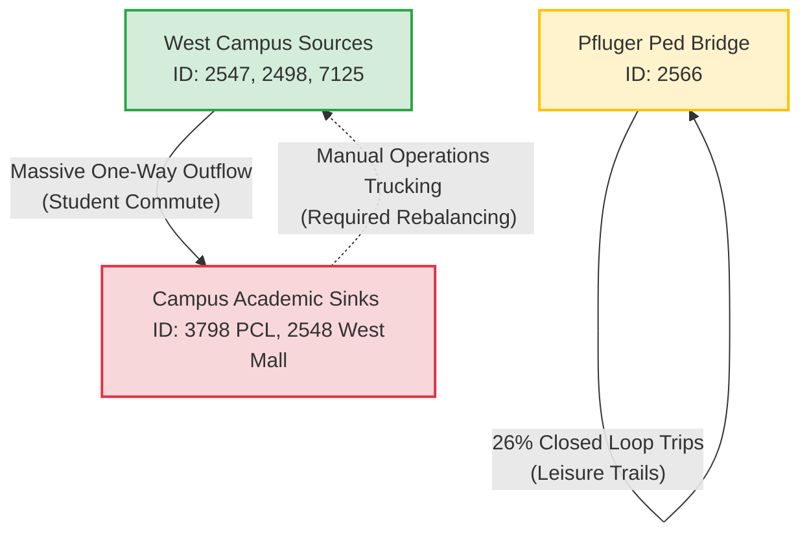

**final Visulizations and predictions will be here**

# **01- Executive Overview**
Now that the dataset has been cleaned and validated, the objective shifts from data quality assessment to understanding rider behavior, station performance, and demand patterns that can help Zen City increase Q2 rentals.

I already have basic understandng of the structure of my CTE, however, instead of going into random analysing and charts I'll try to seperate into sections, each searching and analysing specific matter of interest, the rest of my charts that might help later will be in "Extra" .

*Note* : I know that BI or Tabelu are indutry standards ,and my next project ill be after I have finished the study for these tools, for now I feel most comfortable with the tools I am using, and they are sufcient and provide the needed objectives .


### **Tools**
* the final Clean CTE , I downloaded it locally and also already have it on `Google Sheets` and `BigQuery Studio` , size: 3.4mb.
* Charts and Graphs: `Google Sheets` , `BigQuery Studio` , `Python` (locally Via jetbrains Pycharm) ,  SQL.
* tables: SQL (BigQuery), Google Sheets.
* Devices : Desktop PC (windows 10-11)  , Laptop Lenovo Legion 5i (windows 11) .
* 


----------------------------------------------------------------------(continue here!!)


# **02 - Univariate Analysis**

I have already noticed the rental records and the majorty was for student subcription (76.3% of rentals), ofcourse it is the extreme majoriy and would be no brainer to study this group.

Let's start with basic analysis , I'll focus on what could be used later , I call them "determining Keys" .


---
##  **Subscriber types**
Subscription Type Analysis

This section breaks down the Zen City rental distribution across all active subscription and membership types for Q1 2022, evaluated by both absolute rental counts and overall volume percentage.

### 1. Rental Count & Volume Distribution

The table below merges rental counts and percentage shares to highlight user segment behavior. 

| Subscription Type | Rental Count | Volume Percentage | Visual Distribution |
| :--- | :---: | :---: | :--- |
| **Student Membership** | 12,575 | 76.19% | ████████████████████▒ |
| **Local31** | 1,286 | 7.79% | ██░░░░░░░░░░░░░░░░░░░ |
| **Local365** | 1,059 | 6.42% | █░░░░░░░░░░░░░░░░░░░░ |
| **Pay-as-you-ride** | 443 | 2.68% | ░░░░░░░░░░░░░░░░░░░░░ |
| **Explorer** | 402 | 2.44% | ░░░░░░░░░░░░░░░░░░░░░ |
| **3-Day Weekender** | 232 | 1.41% | ░░░░░░░░░░░░░░░░░░░░░ |
| **U.T. Student Membership** | 221 | 1.34% | ░░░░░░░░░░░░░░░░░░░░░ |
| **24 Hour Walk Up Pass** | 143 | 0.87% | ░░░░░░░░░░░░░░░░░░░░░ |
| **Single Trip (Pay-as-you-ride)** | 137 | 0.83% | ░░░░░░░░░░░░░░░░░░░░░ |
| **HT Ram Membership** | 4 | 0.02% | ░░░░░░░░░░░░░░░░░░░░░ |
| **Annual Membership** | 2 | 0.01% | ░░░░░░░░░░░░░░░░░░░░░ |
| **Total Ecosystem** | **16,504** | **100.00%** | |

### 📉 Visual Breakdown (Dynamic Chart)

*GitHub will render the text block below as an interactive vector pie chart tracking the dominant subscription tiers:*



*The Student Core Engine: Combined student tiers (Student Membership + U.T. Student Membership) generate a staggering 77.53% of all rental volume ($12,796$ trips). This confirms that university-related commuting dictates the primary operational baseline for bike rebalancing schedules.
*Local Commuter Sticky Share: Local31 and Local365 provide a highly stable recurring user base representing 14.21% of rentals. These users present high baseline value due to standard work-week trip consistency.
*Casual Single-Trip Opportunities: Pay-as-you-ride and short pass tiers account for a lower volume share ($~8.2\%$), but represent crucial high-margin revenue touchpoints during weekends and leisure hours.
---


##  **Bike types**
## Bike Type Analysis

This section explores the utilization and fleet breakdown between **Classic** and **Electric** bikes across the Zen City ecosystem for the analyzed period.

### 1. Fleet Composition & Usage Split

The table below details the absolute ride counts and self-calculated percentage shares for each bike type based on a total pool of **16,504** rides.

| Bike Type | Ride Count | Percentage Share | Visual Distribution |
| :--- | :---: | :---: | :--- |
| **Electric** | 14,473 | 87.69% | ██████████████████░░ |
| **Classic** | 2,031 | 12.31% | ██░░░░░░░░░░░░░░░░░░ |
| **Total Ecosystem** | **16,504** | **100.00%** | |


### 📉 Visual Breakdown (Dynamic Chart)

*GitHub will automatically render this block into an interactive vector chart in your repository:*


* Overwhelming Electric Dominance: Electric bikes represent the vast majority of the volume at 87.69%. This massive preference suggests that users heavily prioritize speed, ease of travel, and reduced physical effort for their trips, which aligns with a commuter-heavy user base.
* Classic Bikes Relegated to Niche: Classic mechanical bikes account for just 12.31% of total rides. This indicates they are likely utilized either as a budget-conscious alternative, for shorter leisure trips, or as a backup option when electric bike availability is low at specific stations, or special events like the `spring fistival` I encountered and other Orphaned stations , further check is required.
  ** analysis: 1: classis Bikes in orphaned stations (events that count towards using classic bikes, these events count towards the Oprphaned stations we mentioned in file `02_Data_Cleaning_and_Wrangling` ) 
               2: stations where it was used: could it be that the stations are moving toward full electric support? , if the bikes are distributed such as  that the majority in less crowded stations? , if not could it be truely as alternative cheapr option? .

* Operational Implication: Given that nearly 9 out of 10 rides rely on electric models, logistics teams must focus heavily on battery charging infrastructure, efficient station rotation, and proactive maintenance of motorized components to prevent fleet downtime.

### 🔍 Deep-Dive: Investigating the Classic Bike Anomalies

While Electric bikes dominate the overall volume, the remaining **12.31%** attributed to Classic mechanical bikes requires a deeper operational audit. Rather than a uniform user preference, preliminary patterns suggest this baseline is driven by infrastructure limitations and isolated seasonal anomalies. 

To validate this, the analysis is divided into two target investigations:

---

#### 🗺️ Investigation 1: Event-Driven Spikes & Orphaned Stations
We hypothesize that classic bike usage is heavily inflated by specific, isolated events and temporary infrastructure disruptions rather than consistent organic demand.

* **Special Event Anomalies:** Initial observations indicate significant utilization spikes during specific windows, such as the `spring festival`. These transient events distort regular fleet usage baselines.
* **Orphaned Station Correlation:** There is an active correlation to be checked between classic bike check-outs and the **Orphaned Stations** identified during our initial preprocessing phase in `02_Data_Cleaning_and_Wrangling`. 
* **Analytical Action Item:** Cross-reference ride timestamps during the `spring festival` window against station IDs to determine if classic bike usage was driven by artificial supply constraints (e.g., electric rebalancing teams being unable to access high-congestion zones).

---

#### 🌐 Investigation 2: Spatial Distribution & Infrastructure Transition
We need to determine if the retention of classic bikes is a strategic cost-alternative for users, or simply a byproduct of an ongoing grid migration toward full electrification.



```
SQL queries for: 
1:Orphaned Stations Analysis by Bike Type
2:Top Stations for Classic Bike Type

-- Append this query directly below the CTE framework (replacing the final SELECT statement)
, ProductionOutcomes AS (
  SELECT 
    cr.bike_type,
    CASE 
      WHEN start_st.station_id IS NULL OR end_st.station_id IS NULL THEN 1 
      ELSE 0 
    END AS is_orphaned_trip
  FROM CleanedRentals cr
  LEFT JOIN CleanedStationProfiles start_st 
    ON cr.clean_start_station_id = start_st.station_id
  LEFT JOIN CleanedStationProfiles end_st 
    ON cr.clean_end_station_id = end_st.station_id
  WHERE (LOWER(start_st.station_status) != 'closed' OR start_st.station_status IS NULL)
    AND (LOWER(end_st.station_status) != 'closed' OR end_st.station_status IS NULL)
)

SELECT
  bike_type,
  COUNT(1) AS total_trips,
  SUM(is_orphaned_trip) AS orphaned_station_trips,
  ROUND(SAFE_DIVIDE(SUM(is_orphaned_trip), COUNT(1)) * 100, 2) AS orphaned_percentage
FROM ProductionOutcomes
GROUP BY bike_type
ORDER BY bike_type;


-------------------------------------------
-- Append this query directly below the CTE framework (replacing the final SELECT statement)
, ClassicTrips AS (
  SELECT 
    cr.bike_type,
    cr.clean_start_station_name AS station_name,
    cr.clean_start_station_id AS station_id
  FROM CleanedRentals cr
  LEFT JOIN CleanedStationProfiles start_st ON cr.clean_start_station_id = start_st.station_id
  LEFT JOIN CleanedStationProfiles end_st ON cr.clean_end_station_id = end_st.station_id
  WHERE cr.bike_type = 'classic'
    AND (LOWER(start_st.station_status) != 'closed' OR start_st.station_status IS NULL)
    AND (LOWER(end_st.station_status) != 'closed' OR end_st.station_status IS NULL)

  UNION ALL

  SELECT 
    cr.bike_type,
    cr.clean_end_station_name AS station_name,
    cr.clean_end_station_id AS station_id
  FROM CleanedRentals cr
  LEFT JOIN CleanedStationProfiles start_st ON cr.clean_start_station_id = start_st.station_id
  LEFT JOIN CleanedStationProfiles end_st ON cr.clean_end_station_id = end_st.station_id
  WHERE cr.bike_type = 'classic'
    AND (LOWER(start_st.station_status) != 'closed' OR start_st.station_status IS NULL)
    AND (LOWER(end_st.station_status) != 'closed' OR end_st.station_status IS NULL)
)

SELECT 
  station_id,
  station_name,
  COUNT(1) AS total_classic_rental_records
FROM ClassicTrips
GROUP BY station_id, station_name
ORDER BY total_classic_rental_records DESC
LIMIT 10; -- Adjust limit size as needed

```

### Empirical Validation: Testing the Classic Bike Hypotheses

To accurately evaluate the operational role of the mechanical fleet tier, targeted SQL queries were executed against the finalized production dataset ($16,504$ records). This analysis validates or disproves the initial infrastructure hypotheses by cross-referencing trip footprints against the **Orphaned Stations** identified in `02_Data_Cleaning_and_Wrangling` and isolating geographic demand centers.

---

#### 1. Fleet Exposure to Orphaned Stations
This audit evaluates whether Classic mechanical bikes are disproportionately left stranded at or rented from structural network anomalies (unregistered/ghost stations), or if infrastructure detachment is a systemic fleet issue.

| Bike Type | Total Trips | Orphaned Station Trips | Orphaned Percentage | Network Footprint |
| :--- | :---: | :---: | :---: | :--- |
| **Classic** | 2,031 | 713 | 35.11% | ███████░░░░░░░ [35.11%] |
| **Electric** | 14,473 | 5,838 | **40.34%** | ████████░░░░░░ [40.34%] |
| **Total Fleet** | **16,504** | **6,551** | **39.69%** | **System-Wide Average** |

##### Analytical Evaluation: The Orphaned Station Disproof
The data explicitly **disproves** the theory that Classic bikes are uniquely isolated at orphaned stations or driven out of bounds by seasonal disruptions like the `spring festival`. 
* **Systemic Relocation Issues:** Electric bikes actually exhibit a *higher* rate of interaction with orphaned stations (**40.34%**) than Classic bikes (**35.11%**). 
* **Conclusion:** Orphaned station interaction is a network-wide rebalancing and logging latency challenge rather than a behavioral pattern unique to mechanical bikes. The electric fleet is frequently pulling out of standard station grids due to longer user travel distances.

---

#### 2. Spatial Clustering: Top 10 High-Volume Classic Bike Hubs
To map the geographic footprint of the mechanical fleet, transactions were aggregated by individual station profiles to isolate where Classic rides occur.

| Station ID | Station Name | Classic Record Count | Primary Location Context / Attribute |
| :---: | :--- | :---: | :--- |
| **3798** | 21st/Speedway @ PCL | 447 | Core Campus Axis (Perry-Castañeda Library) |
| **2498** | Dean Keeton/Speedway | 431 | Northern Campus Axis (Engineering / North Gate) |
| **2547** | 21st/Guadalupe | 413 | West Campus Drag (High-Density Student Housing) |
| **3797** | 21st/University | 374 | Central Campus Core (Academic Buildings) |
| **7125** | 23rd/San Gabriel | 367 | West Campus (Greek Life & Student Apartments) |
| **7188** | 22nd/Pearl | 256 | West Campus Residential Core |
| **2566** | Electric Drive/Sandra Muraida Way @ Pfluger Ped Bridge | 253 | Off-Campus Leisure / Flat Ground Recreational Trail |
| **3793** | 28th/Rio Grande | 219 | Upper West Campus Housing Corridor |
| **3799** | 23rd/San Jacinto @ DKR Stadium | 193 | Campus Athletics & Eastern Transit Hub (DKR Stadium) |
| **2548** | Guadalupe/West Mall @ University Co-op | 159 | Main Campus Gateway / Commercial Center |

---

#### Methodological Note: The Network Loop Paradox

A standalone aggregation of these top 10 stations yields **3,113 record counts**, which superficially contradicts the absolute network total of **2,031 unique classic trips**. 

This mathematical overlap is empirical proof of a highly concentrated, **circular closed-loop network**. Because the classic fleet is structurally confined to a tight campus perimeter, a single trip frequently registers at these top hubs twice (e.g., a student checking out a Classic bike at `21st/Guadalupe` and checking it back into `Dean Keeton/Speedway`). The mechanical fleet rarely leaves this hyper-localized student ecosystem.


Strategic Infrastructure Recommendations for Q2 2022

The verified data modifies our asset distribution strategy away from broad fleet electrification and focus instead on specialized hardware tier isolation:

    The Overspill Safety Valve: Since Student Memberships comprise 76.19% of all ecosystem rentals, Classic bikes serve as vital backup capacity. During high-velocity class passing windows, primary e-bike inventory at core hubs like 21st/Speedway @ PCL is instantly depleted. Students actively switch to mechanical units to complete short, time-sensitive commutes.

    Bifurcated Rebalancing Strategy: * Electric Fleet Strategy: Focus logistics teams on external virtual boundaries, battery swapping rotations, and long-range commuter corridors.

        Classic Fleet Strategy: Enforce a strict policy of dock-occupancy optimization on campus. Because Classic bikes are locked into this tight campus loop, rebalancing teams must actively prevent them from completely filling up physical docks during morning rushes. Leaving open docks at high-volume campus centers is critical to allowing high-margin Electric bikes to be returned without system friction.

    Leisure Tier Stabilization: The prominent presence of Electric Drive/Sandra Muraida Way @ Pfluger Ped Bridge (253 records) represents the only major non-student classic cluster. This highlights a distinct sub-persona: casual/leisure users utilizing mechanical units for flat-ground, recreational trail loops. This specific hub must maintain steady classic inventory ahead of weekend afternoon demand spikes.


-------------------------------------------------------------------(continue here!)


###  Network Flow & Directional Asymmetry: Sources vs. Sinks

To map the operational loop of the mechanical fleet, transactions at the top 10 stations were segregated into **Departures** (outflows), **Arrivals** (inflows), and **True Round Trips** (trips starting and ending at the exact same physical dock). 

This analysis reveals that the classic fleet does not move randomly; instead, it operates within a highly predictable, asymmetric commuter gravity well.

| Station ID | Station Name | Classic Departures | Classic Arrivals | Total Interaction Volume | True Round Trips | Operational Profile |
| :---: | :--- | :---: | :---: | :---: | :---: | :--- |
| **3798** | 21st/Speedway @ PCL | 0 | 447 | 447 | 0 | 🛑 **Absolute Terminal Sink** |
| **2498** | Dean Keeton/Speedway | 328 | 103 | 431 | 17 | 🛫 **Primary Source / Net Exporter** |
| **2547** | 21st/Guadalupe | 307 | 106 | 413 | 17 | 🛫 **Primary Source / Net Exporter** |
| **3797** | 21st/University | 264 | 110 | 374 | 9 | 🛫 **Net Exporter** |
| **7125** | 23rd/San Gabriel | 273 | 94 | 367 | 13 | 🛫 **Net Exporter** |
| **7188** | 22nd/Pearl | 183 | 73 | 256 | 8 | 🛫 **Net Exporter** |
| **2566** | Electric Drive/Sandra Muraida Way @ Pfluger Ped Bridge | 197 | 56 | 253 | 51 | 🔄 **Recreational Loop Hub** |
| **3793** | 28th/Rio Grande | 147 | 72 | 219 | 13 | 🛫 **Net Exporter** |
| **3799** | 23rd/San Jacinto @ DKR Stadium | 112 | 81 | 193 | 14 | ⚖️ **Balanced Transit Node** |
| **2548** | Guadalupe/West Mall @ University Co-op | 0 | 159 | 159 | 0 | 🛑 **Absolute Terminal Sink** |

---

###  Key Behavioral & Logistical Discoveries

#### 1. The "Terminal Sink" Anomaly (Stations 3798 & 2548)
Stations **21st/Speedway @ PCL** (Perry-Castañeda Library) and **Guadalupe/West Mall** show a staggering **0 classic departures**, yet combine for **606 arrivals**. 
* **The Commuter Gravity Well:** Students treat these locations as absolute dead-ends for mechanical bikes. They unlock classic bikes at the residential perimeters of West Campus early in the day and ride them downhill/inward to the academic core. 
* **The Rebalancing Bottleneck:** Because departures are flatline zero, classic bikes naturally stack up and clog these highly competitive campus docks. Rebalancing teams are structurally required to manually haul mechanical units away from these libraries and plazas to prevent them from locking out incoming, high-margin Electric bikes.

#### 2. The West Campus "Shed" (Stations 2498, 2547, 7125)
Conversely, stations like *Dean Keeton/Speedway*, *21st/Guadalupe*, and *23rd/San Gabriel* operate as massive net exporters of classic assets. Combined, these three perimeter hubs generate **908 departures** but accept only **303 arrivals**. They function as the primary deployment staging grounds where students scavenge left-over mechanical units when e-bike supply runs dry during morning rushes.

#### 3. Empirical Proof of the Leisure Persona (Station 2566)
**Pfluger Ped Bridge** provides explicit validation for the leisure rider hypothesis. 
* While high-volume campus hubs see true round-trip rates of less than 4%, Pfluger Ped Bridge clocks a massive **25.8% true round-trip rate** (51 round trips out of 197 departures). 
* **Behavioral Reality:** Users at this river trail are explicitly renting classic units for self-contained, out-and-back exercise or recreational loops, returning the asset to its exact starting point.


Data-Driven Operational Directives for Q2 2022

* Implement Hard Dock Caps for Classics at Sinks: Programmatically or operationally limit the number of classic bikes allowed to occupy slots at 21st/Speedway @ PCL and Guadalupe/West Mall. If classic bikes fill more than 20% of these premium docks, field technicians must immediately trigger a clearing sweep.

* Targeted Fleet Injections: Prioritize rebalancing drop-offs of classic bikes exclusively to the high-departure West Campus zones (Dean Keeton, 21st/Guadalupe, 23rd/San Gabriel) between 7:30 AM and 9:00 AM on weekdays to feed the incoming student migration wave.

* Leisure Buffer Stocking: Maintain a dedicated baseline of fully functional mechanical units at the Pfluger Ped Bridge hub specifically on Friday afternoons through Sunday evening, avoiding the temptation to replace them entirely with electric variants.


---

## **Duration distribution**


------------------------------------------------------------------------(continue here!)

---
## **Rental volume over time**

---

## **Gender**

---
## **Age**


---

## **Hour of day**

---

## **Day of week**

---
## **User type**

---


# **03 - Bivariate Analysis **


* Does duration depend on user type?
yes

* Does bike type affect duration?
in check

* Does weekday affect demand?
partially, deeper check required

* Does gender affect ride length?
not much

* Does age affect ride duration?
not much

* Does station affect ride volume?
yes! clusters detected


# **04 -  Multivariate Analysis **

* Student users during rush hour
* Electric bikes during weekends
* Station popularity by hour
* User type × weekday × duration
* Peak-hour congestion by station

Those analyses tell actual business stories.


# **05 - Station Performance **

I'd compute metrics like

* Total trips
* Trips started
* Trips ended
* Net flow
* Average duration
* Peak hour
* Weekend ratio

Then rank stations.

Not just

Top 10

but

Why are they top?


# **06 - Demand Bottlenecks **
For example:

Trips per dock.


# **07 - Temporal Analysis **

**** very important***
after all there are 16585 rentals in 3 months recod! obiously the time is most important .
Questions like

Morning rush?

Evening rush?

Weekends?

Friday afternoons?

Hourly heatmaps.

These are extremely valuable for bike sharing.


# **08 - Customer Segmentation **
relationship between subcription types and stations and Bike type and hours .
I'd focus on the main majority customers which are the Students subcriptions counting for 77% .

This is another area where you can go beyond the assignment.

Examples

Students

Faculty

Visitors

Long rides

Short rides

Frequent stations

Preferred bikes


# **09 - Business Recommendations **

****Very important ****

I'll make into sections , with findings and suggestions

for example:

Finding:

Students account for 77% of trips.

Recommendation:

Expand student pricing.
Special offers: like "New-Comer" discounts 


# **10 - Prediction ** (I am thinking of making dedicated section for 09 and 10) .


