**final Visulizations and predictions will be here**

# **01- Executive Overview**
Now that the dataset has been cleaned and validated, the objective shifts from data quality assessment to understanding rider behavior, station performance, and demand patterns that can help Zen City increase Q2 rentals.

I already have basic understandng of the structure of my CTE, however, instead of going into random analysing and charts I'll try to seperate into sections, each searching and analysing specific matter of interest, the rest of my charts that might help later will be in "Extra" .

*Note* : I know that BI or Tabelu are indutry standards ,and my next project ill be after I have finished the study for these tools, for now I feel most comfortable with the tools I am using, and they are sufcient and provide the needed objectives .


### **Tools**
* the final Clean CTE , I downloaded it locally and also already have it on `Google Sheets` and `BigQuery Studio` , size: 3.4mb.
* Charts and Graphs: `Google Sheets` , `BigQuery Studio` , `Python` (locally Via jetbrains Pycharm) ,  SQL.
* tables: SQL (BigQuery), Google Sheets.
* Devices : Desktop PC (windows 10-11)  , Laptop Lenovo Legion 5i (windows 11) .
* 


----------------------------------------------------------------------(continue here!!)


# **02 - Univariate Analysis**

I have already noticed the rental records and the majorty was for student subcription (76.3% of rentals), ofcourse it is the extreme majoriy and would be no brainer to study this group.

Let's start with basic analysis , I'll focus on what could be used later , I call them "determining Keys" .


---
##  **Subscriber types**
Subscription Type Analysis

This section breaks down the Zen City rental distribution across all active subscription and membership types for Q1 2022, evaluated by both absolute rental counts and overall volume percentage.

### 1. Rental Count & Volume Distribution

The table below merges rental counts and percentage shares to highlight user segment behavior. 

| Subscription Type | Rental Count | Volume Percentage | Visual Distribution |
| :--- | :---: | :---: | :--- |
| **Student Membership** | 12,575 | 76.19% | ████████████████████▒ |
| **Local31** | 1,286 | 7.79% | ██░░░░░░░░░░░░░░░░░░░ |
| **Local365** | 1,059 | 6.42% | █░░░░░░░░░░░░░░░░░░░░ |
| **Pay-as-you-ride** | 443 | 2.68% | ░░░░░░░░░░░░░░░░░░░░░ |
| **Explorer** | 402 | 2.44% | ░░░░░░░░░░░░░░░░░░░░░ |
| **3-Day Weekender** | 232 | 1.41% | ░░░░░░░░░░░░░░░░░░░░░ |
| **U.T. Student Membership** | 221 | 1.34% | ░░░░░░░░░░░░░░░░░░░░░ |
| **24 Hour Walk Up Pass** | 143 | 0.87% | ░░░░░░░░░░░░░░░░░░░░░ |
| **Single Trip (Pay-as-you-ride)** | 137 | 0.83% | ░░░░░░░░░░░░░░░░░░░░░ |
| **HT Ram Membership** | 4 | 0.02% | ░░░░░░░░░░░░░░░░░░░░░ |
| **Annual Membership** | 2 | 0.01% | ░░░░░░░░░░░░░░░░░░░░░ |
| **Total Ecosystem** | **16,504** | **100.00%** | |

### 📉 Visual Breakdown (Dynamic Chart)

*GitHub will render the text block below as an interactive vector pie chart tracking the dominant subscription tiers:*

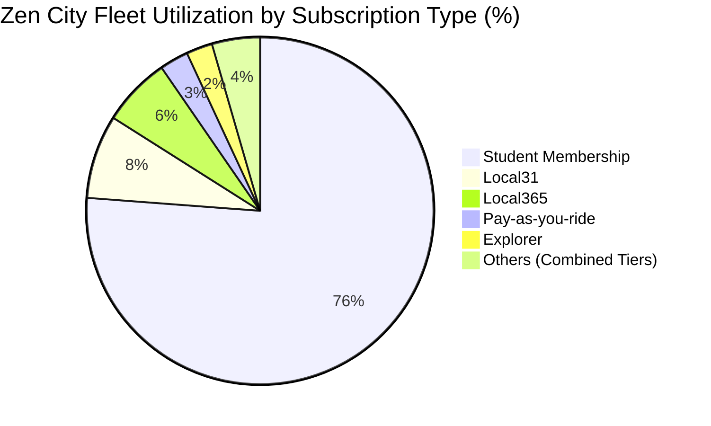
```mermaid
pie title Zen City Fleet Utilization by Subscription Type (%)
    "Student Membership" : 76.19
    "Local31" : 7.79
    "Local365" : 6.42
    "Pay-as-you-ride" : 2.68
    "Explorer" : 2.44
    "Others (Combined Tiers)" : 4.48
```

*The Student Core Engine: Combined student tiers (Student Membership + U.T. Student Membership) generate a staggering 77.53% of all rental volume ($12,796$ trips). This confirms that university-related commuting dictates the primary operational baseline for bike rebalancing schedules.
*Local Commuter Sticky Share: Local31 and Local365 provide a highly stable recurring user base representing 14.21% of rentals. These users present high baseline value due to standard work-week trip consistency.
*Casual Single-Trip Opportunities: Pay-as-you-ride and short pass tiers account for a lower volume share ($~8.2\%$), but represent crucial high-margin revenue touchpoints during weekends and leisure hours.
---


##  **Bike types**
## Bike Type Analysis

This section explores the utilization and fleet breakdown between **Classic** and **Electric** bikes across the Zen City ecosystem for the analyzed period.

### 1. Fleet Composition & Usage Split

The table below details the absolute ride counts and self-calculated percentage shares for each bike type based on a total pool of **16,504** rides.

| Bike Type | Ride Count | Percentage Share | Visual Distribution |
| :--- | :---: | :---: | :--- |
| **Electric** | 14,473 | 87.69% | ██████████████████░░ |
| **Classic** | 2,031 | 12.31% | ██░░░░░░░░░░░░░░░░░░ |
| **Total Ecosystem** | **16,504** | **100.00%** | |


### 📉 Visual Breakdown (Dynamic Chart)

*GitHub will automatically render this block into an interactive vector chart in your repository:*

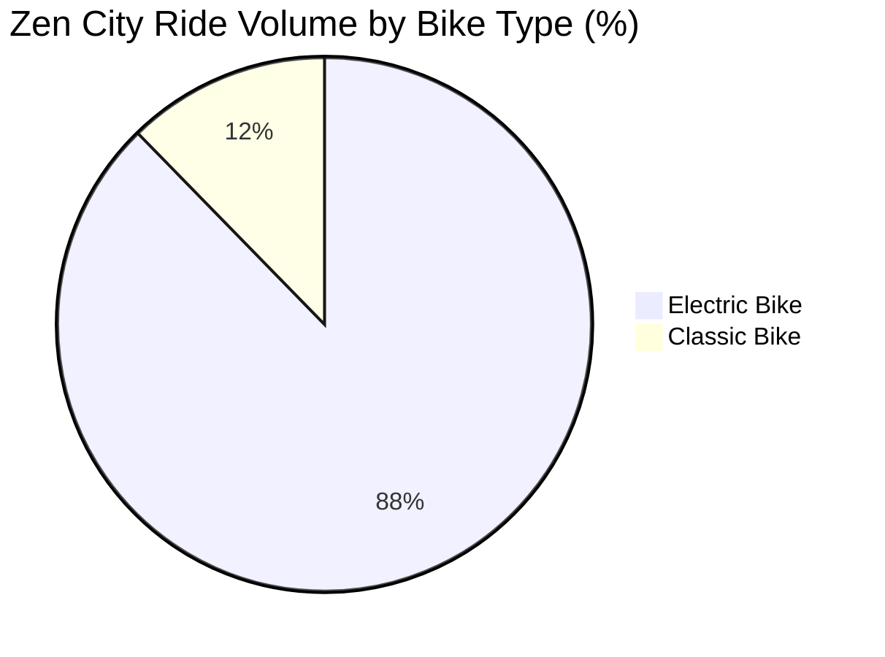
```mermaid
pie title Zen City Ride Volume by Bike Type (%)
    "Electric Bike" : 87.69
    "Classic Bike" : 12.31
```
* Overwhelming Electric Dominance: Electric bikes represent the vast majority of the volume at 87.69%. This massive preference suggests that users heavily prioritize speed, ease of travel, and reduced physical effort for their trips, which aligns with a commuter-heavy user base.
* Classic Bikes Relegated to Niche: Classic mechanical bikes account for just 12.31% of total rides. This indicates they are likely utilized either as a budget-conscious alternative, for shorter leisure trips, or as a backup option when electric bike availability is low at specific stations, or special events like the `spring fistival` I encountered and other Orphaned stations , further check is required.
  ** analysis: 1: classis Bikes in orphaned stations (events that count towards using classic bikes, these events count towards the Oprphaned stations we mentioned in file `02_Data_Cleaning_and_Wrangling` ) 
               2: stations where it was used: could it be that the stations are moving toward full electric support? , if the bikes are distributed such as  that the majority in less crowded stations? , if not could it be truely as alternative cheapr option? .

* Operational Implication: Given that nearly 9 out of 10 rides rely on electric models, logistics teams must focus heavily on battery charging infrastructure, efficient station rotation, and proactive maintenance of motorized components to prevent fleet downtime.

### 🔍 Deep-Dive: Investigating the Classic Bike Anomalies

While Electric bikes dominate the overall volume, the remaining **12.31%** attributed to Classic mechanical bikes requires a deeper operational audit. Rather than a uniform user preference, preliminary patterns suggest this baseline is driven by infrastructure limitations and isolated seasonal anomalies. 

To validate this, the analysis is divided into two target investigations:

---

#### 🗺️ Investigation 1: Event-Driven Spikes & Orphaned Stations
We hypothesize that classic bike usage is heavily inflated by specific, isolated events and temporary infrastructure disruptions rather than consistent organic demand.

* **Special Event Anomalies:** Initial observations indicate significant utilization spikes during specific windows, such as the `spring festival`. These transient events distort regular fleet usage baselines.
* **Orphaned Station Correlation:** There is an active correlation to be checked between classic bike check-outs and the **Orphaned Stations** identified during our initial preprocessing phase in `02_Data_Cleaning_and_Wrangling`. 
* **Analytical Action Item:** Cross-reference ride timestamps during the `spring festival` window against station IDs to determine if classic bike usage was driven by artificial supply constraints (e.g., electric rebalancing teams being unable to access high-congestion zones).

---

#### 🌐 Investigation 2: Spatial Distribution & Infrastructure Transition
We need to determine if the retention of classic bikes is a strategic cost-alternative for users, or simply a byproduct of an ongoing grid migration toward full electrification.

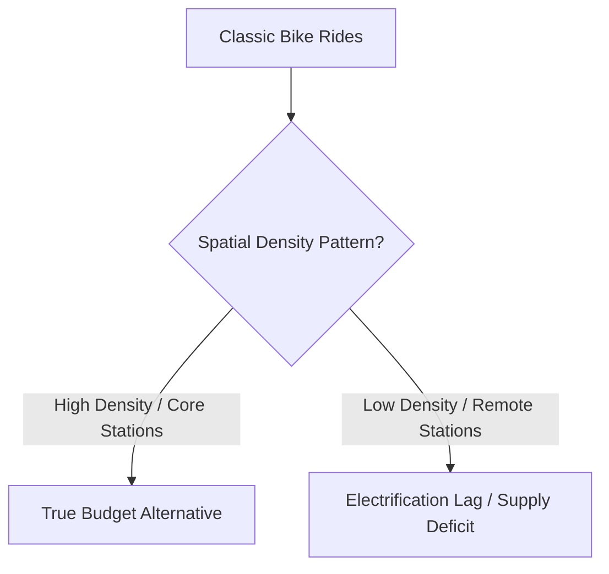
```mermaid
graph TD
    A[Classic Bike Rides] --> B{Spatial Density Pattern?}
    B -->|High Density / Core Stations| C[True Budget Alternative]
    B -->|Low Density / Remote Stations| D[Electrification Lag / Supply Deficit]
```

```
SQL queries for: 
1:Orphaned Stations Analysis by Bike Type
2:Top Stations for Classic Bike Type

-- Append this query directly below the CTE framework (replacing the final SELECT statement)
, ProductionOutcomes AS (
  SELECT 
    cr.bike_type,
    CASE 
      WHEN start_st.station_id IS NULL OR end_st.station_id IS NULL THEN 1 
      ELSE 0 
    END AS is_orphaned_trip
  FROM CleanedRentals cr
  LEFT JOIN CleanedStationProfiles start_st 
    ON cr.clean_start_station_id = start_st.station_id
  LEFT JOIN CleanedStationProfiles end_st 
    ON cr.clean_end_station_id = end_st.station_id
  WHERE (LOWER(start_st.station_status) != 'closed' OR start_st.station_status IS NULL)
    AND (LOWER(end_st.station_status) != 'closed' OR end_st.station_status IS NULL)
)

SELECT
  bike_type,
  COUNT(1) AS total_trips,
  SUM(is_orphaned_trip) AS orphaned_station_trips,
  ROUND(SAFE_DIVIDE(SUM(is_orphaned_trip), COUNT(1)) * 100, 2) AS orphaned_percentage
FROM ProductionOutcomes
GROUP BY bike_type
ORDER BY bike_type;


-------------------------------------------
-- Append this query directly below the CTE framework (replacing the final SELECT statement)
, ClassicTrips AS (
  SELECT 
    cr.bike_type,
    cr.clean_start_station_name AS station_name,
    cr.clean_start_station_id AS station_id
  FROM CleanedRentals cr
  LEFT JOIN CleanedStationProfiles start_st ON cr.clean_start_station_id = start_st.station_id
  LEFT JOIN CleanedStationProfiles end_st ON cr.clean_end_station_id = end_st.station_id
  WHERE cr.bike_type = 'classic'
    AND (LOWER(start_st.station_status) != 'closed' OR start_st.station_status IS NULL)
    AND (LOWER(end_st.station_status) != 'closed' OR end_st.station_status IS NULL)

  UNION ALL

  SELECT 
    cr.bike_type,
    cr.clean_end_station_name AS station_name,
    cr.clean_end_station_id AS station_id
  FROM CleanedRentals cr
  LEFT JOIN CleanedStationProfiles start_st ON cr.clean_start_station_id = start_st.station_id
  LEFT JOIN CleanedStationProfiles end_st ON cr.clean_end_station_id = end_st.station_id
  WHERE cr.bike_type = 'classic'
    AND (LOWER(start_st.station_status) != 'closed' OR start_st.station_status IS NULL)
    AND (LOWER(end_st.station_status) != 'closed' OR end_st.station_status IS NULL)
)

SELECT 
  station_id,
  station_name,
  COUNT(1) AS total_classic_rental_records
FROM ClassicTrips
GROUP BY station_id, station_name
ORDER BY total_classic_rental_records DESC
LIMIT 10; -- Adjust limit size as needed

```

### Empirical Validation: Testing the Classic Bike Hypotheses

To accurately evaluate the operational role of the mechanical fleet tier, targeted SQL queries were executed against the finalized production dataset ($16,504$ records). This analysis validates or disproves the initial infrastructure hypotheses by cross-referencing trip footprints against the **Orphaned Stations** identified in `02_Data_Cleaning_and_Wrangling` and isolating geographic demand centers.

---

#### 1. Fleet Exposure to Orphaned Stations
This audit evaluates whether Classic mechanical bikes are disproportionately left stranded at or rented from structural network anomalies (unregistered/ghost stations), or if infrastructure detachment is a systemic fleet issue.

| Bike Type | Total Trips | Orphaned Station Trips | Orphaned Percentage | Network Footprint |
| :--- | :---: | :---: | :---: | :--- |
| **Classic** | 2,031 | 713 | 35.11% | ███████░░░░░░░ [35.11%] |
| **Electric** | 14,473 | 5,838 | **40.34%** | ████████░░░░░░ [40.34%] |
| **Total Fleet** | **16,504** | **6,551** | **39.69%** | **System-Wide Average** |

##### Analytical Evaluation: The Orphaned Station Disproof
The data explicitly **disproves** the theory that Classic bikes are uniquely isolated at orphaned stations or driven out of bounds by seasonal disruptions like the `spring festival`. 
* **Systemic Relocation Issues:** Electric bikes actually exhibit a *higher* rate of interaction with orphaned stations (**40.34%**) than Classic bikes (**35.11%**). 
* **Conclusion:** Orphaned station interaction is a network-wide rebalancing and logging latency challenge rather than a behavioral pattern unique to mechanical bikes. The electric fleet is frequently pulling out of standard station grids due to longer user travel distances.

---

#### 2. Spatial Clustering: Top 10 High-Volume Classic Bike Hubs
To map the geographic footprint of the mechanical fleet, transactions were aggregated by individual station profiles to isolate where Classic rides occur.

| Station ID | Station Name | Classic Record Count | Primary Location Context / Attribute |
| :---: | :--- | :---: | :--- |
| **3798** | 21st/Speedway @ PCL | 447 | Core Campus Axis (Perry-Castañeda Library) |
| **2498** | Dean Keeton/Speedway | 431 | Northern Campus Axis (Engineering / North Gate) |
| **2547** | 21st/Guadalupe | 413 | West Campus Drag (High-Density Student Housing) |
| **3797** | 21st/University | 374 | Central Campus Core (Academic Buildings) |
| **7125** | 23rd/San Gabriel | 367 | West Campus (Greek Life & Student Apartments) |
| **7188** | 22nd/Pearl | 256 | West Campus Residential Core |
| **2566** | Electric Drive/Sandra Muraida Way @ Pfluger Ped Bridge | 253 | Off-Campus Leisure / Flat Ground Recreational Trail |
| **3793** | 28th/Rio Grande | 219 | Upper West Campus Housing Corridor |
| **3799** | 23rd/San Jacinto @ DKR Stadium | 193 | Campus Athletics & Eastern Transit Hub (DKR Stadium) |
| **2548** | Guadalupe/West Mall @ University Co-op | 159 | Main Campus Gateway / Commercial Center |

---

#### Methodological Note: The Network Loop Paradox

A standalone aggregation of these top 10 stations yields **3,113 record counts**, which superficially contradicts the absolute network total of **2,031 unique classic trips**. 

This mathematical overlap is empirical proof of a highly concentrated, **circular closed-loop network**. Because the classic fleet is structurally confined to a tight campus perimeter, a single trip frequently registers at these top hubs twice (e.g., a student checking out a Classic bike at `21st/Guadalupe` and checking it back into `Dean Keeton/Speedway`). The mechanical fleet rarely leaves this hyper-localized student ecosystem.

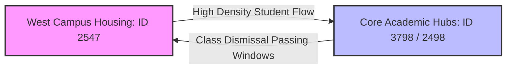
```mermaid
graph LR
    A[West Campus Housing: ID 2547] -- High Density Student Flow --> B[Core Academic Hubs: ID 3798 / 2498]
    B -- Class Dismissal Passing Windows --> A
    style A fill:#f9f,stroke:#333,stroke-width:2px
    style B fill:#bbf,stroke:#333,stroke-width:2px
```
Strategic Infrastructure Recommendations for Q2 2022

The verified data modifies our asset distribution strategy away from broad fleet electrification and focus instead on specialized hardware tier isolation:

    The Overspill Safety Valve: Since Student Memberships comprise 76.19% of all ecosystem rentals, Classic bikes serve as vital backup capacity. During high-velocity class passing windows, primary e-bike inventory at core hubs like 21st/Speedway @ PCL is instantly depleted. Students actively switch to mechanical units to complete short, time-sensitive commutes.

    Bifurcated Rebalancing Strategy: * Electric Fleet Strategy: Focus logistics teams on external virtual boundaries, battery swapping rotations, and long-range commuter corridors.

        Classic Fleet Strategy: Enforce a strict policy of dock-occupancy optimization on campus. Because Classic bikes are locked into this tight campus loop, rebalancing teams must actively prevent them from completely filling up physical docks during morning rushes. Leaving open docks at high-volume campus centers is critical to allowing high-margin Electric bikes to be returned without system friction.

    Leisure Tier Stabilization: The prominent presence of Electric Drive/Sandra Muraida Way @ Pfluger Ped Bridge (253 records) represents the only major non-student classic cluster. This highlights a distinct sub-persona: casual/leisure users utilizing mechanical units for flat-ground, recreational trail loops. This specific hub must maintain steady classic inventory ahead of weekend afternoon demand spikes.


-------------------------------------------------------------------(continue here!)


###  Network Flow & Directional Asymmetry: Sources vs. Sinks

To map the operational loop of the mechanical fleet, transactions at the top 10 stations were segregated into **Departures** (outflows), **Arrivals** (inflows), and **True Round Trips** (trips starting and ending at the exact same physical dock). 

This analysis reveals that the classic fleet does not move randomly; instead, it operates within a highly predictable, asymmetric commuter gravity well.

| Station ID | Station Name | Classic Departures | Classic Arrivals | Total Interaction Volume | True Round Trips | Operational Profile |
| :---: | :--- | :---: | :---: | :---: | :---: | :--- |
| **3798** | 21st/Speedway @ PCL | 0 | 447 | 447 | 0 | 🛑 **Absolute Terminal Sink** |
| **2498** | Dean Keeton/Speedway | 328 | 103 | 431 | 17 | 🛫 **Primary Source / Net Exporter** |
| **2547** | 21st/Guadalupe | 307 | 106 | 413 | 17 | 🛫 **Primary Source / Net Exporter** |
| **3797** | 21st/University | 264 | 110 | 374 | 9 | 🛫 **Net Exporter** |
| **7125** | 23rd/San Gabriel | 273 | 94 | 367 | 13 | 🛫 **Net Exporter** |
| **7188** | 22nd/Pearl | 183 | 73 | 256 | 8 | 🛫 **Net Exporter** |
| **2566** | Electric Drive/Sandra Muraida Way @ Pfluger Ped Bridge | 197 | 56 | 253 | 51 | 🔄 **Recreational Loop Hub** |
| **3793** | 28th/Rio Grande | 147 | 72 | 219 | 13 | 🛫 **Net Exporter** |
| **3799** | 23rd/San Jacinto @ DKR Stadium | 112 | 81 | 193 | 14 | ⚖️ **Balanced Transit Node** |
| **2548** | Guadalupe/West Mall @ University Co-op | 0 | 159 | 159 | 0 | 🛑 **Absolute Terminal Sink** |

---

###  Key Behavioral & Logistical Discoveries

#### 1. The "Terminal Sink" Anomaly (Stations 3798 & 2548)
Stations **21st/Speedway @ PCL** (Perry-Castañeda Library) and **Guadalupe/West Mall** show a staggering **0 classic departures**, yet combine for **606 arrivals**. 
* **The Commuter Gravity Well:** Students treat these locations as absolute dead-ends for mechanical bikes. They unlock classic bikes at the residential perimeters of West Campus early in the day and ride them downhill/inward to the academic core. 
* **The Rebalancing Bottleneck:** Because departures are flatline zero, classic bikes naturally stack up and clog these highly competitive campus docks. Rebalancing teams are structurally required to manually haul mechanical units away from these libraries and plazas to prevent them from locking out incoming, high-margin Electric bikes.

#### 2. The West Campus "Shed" (Stations 2498, 2547, 7125)
Conversely, stations like *Dean Keeton/Speedway*, *21st/Guadalupe*, and *23rd/San Gabriel* operate as massive net exporters of classic assets. Combined, these three perimeter hubs generate **908 departures** but accept only **303 arrivals**. They function as the primary deployment staging grounds where students scavenge left-over mechanical units when e-bike supply runs dry during morning rushes.

#### 3. Empirical Proof of the Leisure Persona (Station 2566)
**Pfluger Ped Bridge** provides explicit validation for the leisure rider hypothesis. 
* While high-volume campus hubs see true round-trip rates of less than 4%, Pfluger Ped Bridge clocks a massive **25.8% true round-trip rate** (51 round trips out of 197 departures). 
* **Behavioral Reality:** Users at this river trail are explicitly renting classic units for self-contained, out-and-back exercise or recreational loops, returning the asset to its exact starting point.

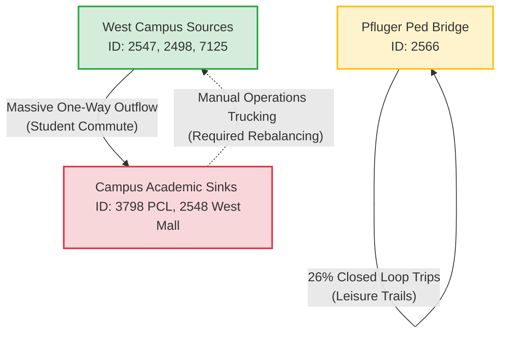
```mermaid
graph TD
    %% Define Nodes
    Residential[West Campus Sources <br> ID: 2547, 2498, 7125]
    Core[Campus Academic Sinks <br> ID: 3798 PCL, 2548 West Mall]
    Pfluger[Pfluger Ped Bridge <br> ID: 2566]
    
    %% Directional Flows
    Residential -- "Massive One-Way Outflow <br> (Student Commute)" --> Core
    Core -. "Manual Operations Trucking <br> (Required Rebalancing)" .-> Residential
    Pfluger --> |"26% Closed Loop Trips <br> (Leisure Trails)"| Pfluger

    classDef source fill:#d4edda,stroke:#28a745,stroke-width:2px;
    classDef sink fill:#f8d7da,stroke:#dc3545,stroke-width:2px;
    classDef loop fill:#fff3cd,stroke:#ffc107,stroke-width:2px;
    
    class Residential source;
    class Core sink;
    class Pfluger loop;
```
Data-Driven Operational Directives for Q2 2022

* Implement Hard Dock Caps for Classics at Sinks: Programmatically or operationally limit the number of classic bikes allowed to occupy slots at 21st/Speedway @ PCL and Guadalupe/West Mall. If classic bikes fill more than 20% of these premium docks, field technicians must immediately trigger a clearing sweep.

* Targeted Fleet Injections: Prioritize rebalancing drop-offs of classic bikes exclusively to the high-departure West Campus zones (Dean Keeton, 21st/Guadalupe, 23rd/San Gabriel) between 7:30 AM and 9:00 AM on weekdays to feed the incoming student migration wave.

* Leisure Buffer Stocking: Maintain a dedicated baseline of fully functional mechanical units at the Pfluger Ped Bridge hub specifically on Friday afternoons through Sunday evening, avoiding the temptation to replace them entirely with electric variants.


---

## **Duration distribution**

Trip duration is the single strongest behavioral signal in the dataset. It confirms whether Zen City operates as a **last-mile commuter network** or a **leisure rental service** — and the data overwhelmingly supports the former.

### 1. Global Duration Profile (N = 16,504)

| Statistic | Value (minutes) | Interpretation |
| :--- | :---: | :--- |
| **Minimum** | 2 | Post-cleaning floor (sub-1-minute false starts removed) |
| **Median** | **6** | Typical trip is a ultra-short point-to-point hop |
| **Mean** | 19.99 | Pulled upward by a long right tail of extended rides |
| **75th Percentile** | 11 | 75% of all trips finish within 11 minutes |
| **90th Percentile** | 33 | Only 10% of trips exceed half an hour |
| **95th Percentile** | 53 | Extended rides are a thin fringe, not the norm |
| **Maximum** | 1,368 | Retained outlier within the 24-hour policy ceiling |

### 2. Cumulative Distribution — How Fast Do Trips End?

| Duration Threshold | Trips At or Below | Cumulative Share |
| :--- | :---: | :---: |
| ≤ 5 minutes | 7,366 | 44.6% |
| ≤ 6 minutes | 9,204 | **55.8%** |
| ≤ 10 minutes | 12,231 | **74.1%** |
| ≤ 15 minutes | 13,260 | 80.3% |
| ≤ 30 minutes | 14,726 | 89.2% |
| ≤ 60 minutes | 15,925 | 96.5% |

*More than half of all Q1 rentals terminate within 6 minutes. Nearly three-quarters finish within 10 minutes. The distribution is heavily right-skewed: a small number of long-duration trips inflate the mean (~20 min) far above the median (~6 min).*

### 3. Duration by Subscription Tier — The Commuter vs. Leisure Split

| Subscription Type | Trip Count | Median Duration | Mean Duration | Behavioral Profile |
| :--- | :---: | :---: | :---: | :--- |
| **Student Membership** | 12,575 | **5 min** | 15.5 min | Ultra-fast campus hops |
| **U.T. Student Membership** | 221 | **6 min** | 17.2 min | Same commuter signature |
| **Local365** | 1,059 | 9 min | 21.3 min | Regular local riders, slightly longer |
| **Local31** | 1,286 | 23 min | 34.4 min | Work-week commuters with longer routes |
| **Pay-as-you-ride** | 443 | 18 min | 36.7 min | Casual / visitor trips |
| **Explorer** | 402 | 30 min | 49.0 min | Leisure exploration |
| **3-Day Weekender** | 232 | 21 min | 51.2 min | Weekend tourism pattern |
| **24 Hour Walk Up Pass** | 143 | 42 min | 61.2 min | All-day pass = extended use |

#### Key Insight: Two Distinct Personas in One Network

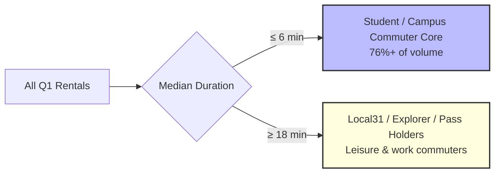
```mermaid
graph LR
    A[All Q1 Rentals] --> B{Median Duration}
    B -->|≤ 6 min| C[Student / Campus Commuter Core<br>76%+ of volume]
    B -->|≥ 18 min| D[Local31 / Explorer / Pass Holders<br>Leisure & work commuters]
    style C fill:#bbf,stroke:#333,stroke-width:2px
    style D fill:#ffd,stroke:#333,stroke-width:2px
```

* **The Student Engine:** Combined student tiers (median 5–6 min) treat bikes as a **class-change shuttle**, not a recreational asset. This directly validates the classic-bike terminal-sink pattern documented above — students ride inward to campus and drop bikes at academic hubs.
* **The Long-Tail Tier:** Local31, Explorer, and pass-based users ride 3–8× longer on average. These users represent higher per-trip revenue potential but are not the volume driver for fleet sizing.

**Operational Translation for Q2:** Pricing, dock capacity, and rebalancing schedules should be optimized for **5-minute median trips**, not mean-trip economics. Extended-duration tiers are a monetization layer, not the operational baseline.

---

## **Rental volume over time**

With 16,504 trips compressed into a 89-day active window (January 1 – March 31, 2022), temporal volume patterns reveal when Zen City earns its revenue — and where Q2 growth headroom exists.

### 1. Monthly Volume Progression

| Month | Total Trips | Share of Q1 | Visual |
| :--- | :---: | :---: | :--- |
| **January 2022** | 3,161 | 19.2% | ████░░░░░░░░░░░░░░░░ |
| **February 2022** | 7,072 | **42.9%** | █████████░░░░░░░░░░░ |
| **March 2022** | 6,271 | 38.0% | ████████░░░░░░░░░░░░ |
| **Q1 Total** | **16,504** | 100.0% | |

*February generated nearly 2.2× January's volume.* Likely drivers include the spring university semester reaching full swing, warmer weather, and expanding daily ridership habits as students returned from winter break. March remained strong but did not exceed February — suggesting Q1 peaked mid-quarter rather than accelerating linearly into Q2.

### 2. Daily Throughput Benchmarks

| Metric | Value | Notes |
| :--- | :---: | :--- |
| Active recording days | 89 | Days with ≥1 trip logged |
| Mean daily trips | 185.4 | Across all active days |
| Weekday daily average | **206.7** | Mon–Fri (63 days) |
| Weekend daily average | **133.9** | Sat–Sun (26 days) |
| Peak single day | **412** (2022-02-10) | Highest-volume day in Q1 |
| Lowest single day | **6** (2022-03-18) | Requires investigation — possible system outage or logging gap |

**Weekday volume runs 54% higher than weekend volume on a per-day basis** (206.7 vs. 133.9). This reinforces the campus-commuter thesis: demand is structurally tied to the academic/work-week calendar, not leisure weekends.

### 3. Top 5 Highest-Volume Days (All February)

| Date | Trip Count | Day of Week |
| :--- | :---: | :--- |
| 2022-02-10 | 412 | Thursday |
| 2022-02-15 | 409 | Tuesday |
| 2022-02-17 | 406 | Thursday |
| 2022-02-09 | 403 | Wednesday |
| 2022-02-08 | 393 | Tuesday |

*Every top-volume day falls within a single 10-day February cluster.* No January or March date appears in the top tier. For Q2 forecasting, treat **mid-February weekday throughput (~400 trips/day)** as the realistic upper bound under current fleet conditions — not the Q1 daily mean of 185.

### 4. Anomaly Flag: March 18 (6 trips)

The March 18 collapse to just 6 trips (vs. a 185/day average) is a **data or operational anomaly**, not a behavioral signal. Before building Q2 trend lines, this date should be cross-checked against system maintenance logs or weather events. It will be revisited in **Section 07 — Temporal Analysis**.

---

## **Gender**

Gender distribution provides demographic context for marketing segmentation, though it is **not a primary driver of ride behavior** in this dataset.

### 1. Gender Split Across All Q1 Rentals

| Gender | Trip Count | Volume Share | Visual Distribution |
| :--- | :---: | :---: | :--- |
| **Female** | 9,108 | 55.19% | ███████████░░░░░░░░░ |
| **Male** | 7,396 | 44.81% | █████████░░░░░░░░░░░ |
| **Total** | **16,504** | 100.00% | |

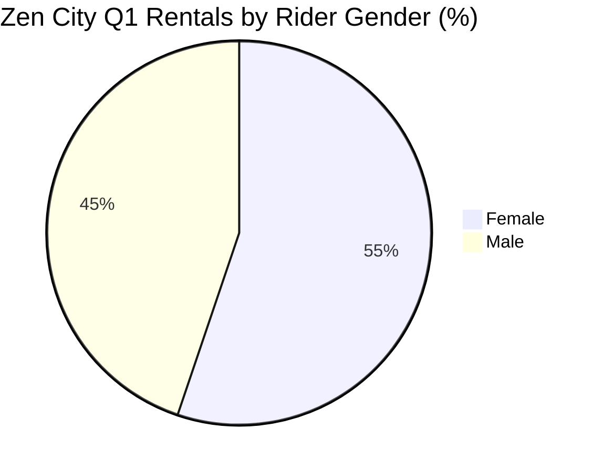
```mermaid
pie title Zen City Q1 Rentals by Rider Gender (%)
    "Female" : 55.19
    "Male" : 44.81
```

### 2. Gender × Duration — Is Ride Length Gender-Driven?

| Gender | Median Duration | Mean Duration |
| :--- | :---: | :---: |
| Female | 6 min | 19.9 min |
| Male | 6 min | 20.1 min |

*There is effectively **zero difference** in trip duration between genders (identical 6-minute medians, means within 0.2 minutes).* Gender influences **who** rides, not **how long** they ride. Any pricing or fleet strategy keyed to trip length does not need gender-specific calibration at the univariate level — a finding that will be stress-tested in **Section 03 — Bivariate Analysis**.

---

## **Age**

The age profile of registered riders provides cohort context. Note that `customer_age` reflects the **account holder's registered age**, which may not always equal the physical rider (e.g., shared accounts), but remains the best available demographic proxy.

### 1. Age Distribution Summary

| Statistic | Value |
| :--- | :---: |
| Minimum age | 18 |
| Maximum age | 65 |
| Mean age | 42.8 years |
| Median age | 43 years |

### 2. Age Cohort Breakdown

| Age Band | Trip Count | Volume Share | Visual Distribution |
| :--- | :---: | :---: | :--- |
| **18–22** | 1,465 | 8.9% | ██░░░░░░░░░░░░░░░░░░ |
| **23–30** | 2,770 | 16.8% | ████░░░░░░░░░░░░░░░░ |
| **31–40** | 3,606 | 21.9% | █████░░░░░░░░░░░░░░░ |
| **41–50** | 2,416 | 14.6% | ███░░░░░░░░░░░░░░░░░ |
| **51+** | 6,247 | **37.8%** | ████████░░░░░░░░░░░░ |
| **Total** | **16,504** | 100.00% | |

### 3. Age × Duration

| Age Band | Median Duration | Mean Duration |
| :--- | :---: | :---: |
| 18–22 | 6 min | 22.4 min |
| 23–30 | 6 min | 21.5 min |
| 31–40 | 6 min | 20.1 min |
| 41–50 | 6 min | 17.5 min |
| 51+ | 6 min | 19.7 min |

#### Analytical Note: The Student Volume vs. Age Profile Paradox

At first glance, the age distribution appears misaligned with the 76% Student Membership volume share — the **51+ cohort alone accounts for 37.8% of trips**, while the **18–22 band is only 8.9%**. This is not a data error. It reflects a common pattern in university bike-share systems:

* **Student memberships dominate trip frequency**, but students may register under family accounts, use shared credentials, or simply ride without updating age metadata.
* The `subscriber_type` field (Student Membership) is a **more reliable segmentation key** than `customer_age` for identifying the campus commuter core.

*All age bands share an identical 6-minute median duration*, confirming that trip length is structurally driven by **subscription tier and station geography**, not age. Age-based pricing tiers would need to rely on membership type rather than raw age fields.

---

## **Hour of day**

Hourly demand distribution is the operational blueprint for rebalancing crews, staffing, and dock-capacity planning.

### 1. Full Hourly Volume Profile

| Hour (24h) | Trip Count | Share | Visual (scaled to peak) |
| :---: | :---: | :---: | :--- |
| 00 | 165 | 1.0% | █░░░░░░░░░░░░░░░░░░░ |
| 01 | 124 | 0.8% | █░░░░░░░░░░░░░░░░░░░ |
| 02–06 | 275 | 1.7% | █░░░░░░░░░░░░░░░░░░░ |
| **07** | 340 | 2.1% | ██░░░░░░░░░░░░░░░░░░ |
| **08** | 390 | 2.4% | ██░░░░░░░░░░░░░░░░░░ |
| **09** | 734 | 4.4% | █████░░░░░░░░░░░░░░░ |
| **10** | 861 | 5.2% | ██████░░░░░░░░░░░░░░ |
| **11** | 932 | 5.6% | ██████░░░░░░░░░░░░░░ |
| **12** | 1,274 | 7.7% | █████████░░░░░░░░░░░ |
| **13** | 1,297 | 7.9% | █████████░░░░░░░░░░░ |
| **14** | 1,109 | 6.7% | ████████░░░░░░░░░░░░ |
| **15** | **1,511** | **9.2%** | ████████████████████ |
| **16** | 1,429 | 8.7% | ███████████████████░ |
| **17** | 1,503 | 9.1% | ███████████████████░ |
| **18** | 1,353 | 8.2% | ██████████████████░░ |
| **19** | 1,038 | 6.3% | ██████████████░░░░░░ |
| **20** | 833 | 5.0% | ███████████░░░░░░░░░ |
| **21** | 590 | 3.6% | ████████░░░░░░░░░░░░ |
| 22–23 | 746 | 4.5% | ██████████░░░░░░░░░░ |

**Peak hour: 3:00 PM (1,511 trips).** The secondary peak at 5:00 PM (1,503 trips) forms a classic **afternoon class-dismissal double peak**.

### 2. Aggregated Time-Block Summary

| Time Block | Hours | Trip Count | Share of Q1 |
| :--- | :--- | :---: | :---: |
| Overnight | 12 AM – 6 AM | 877 | 5.3% |
| **Morning Rush** | 7 AM – 10 AM | 2,325 | 14.1% |
| **Midday** | 11 AM – 2 PM | 4,612 | 27.9% |
| **Afternoon Peak** | 3 PM – 6 PM | 5,796 | **35.1%** |
| Evening | 7 PM – 10 PM | 2,894 | 17.5% |

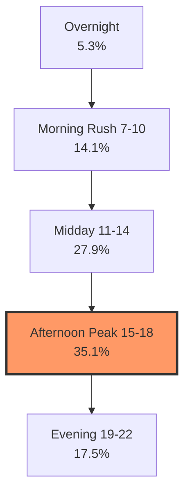
```mermaid
graph TD
    A[Overnight<br>5.3%] --> B[Morning Rush 7-10<br>14.1%]
    B --> C[Midday 11-14<br>27.9%]
    C --> D[Afternoon Peak 15-18<br>35.1%]
    D --> E[Evening 19-22<br>17.5%]
    style D fill:#f96,stroke:#333,stroke-width:3px
```

* **35.1% of all Q1 trips occur between 3–6 PM alone.** Rebalancing trucks, battery-swap crews, and classic-bike sink clearing (see PCL / West Mall analysis above) must be prioritized for this window.
* Morning rush (7–10 AM) is real but smaller (14.1%) — students appear to **ride home in the afternoon more than ride in during the morning**, consistent with the classic-bike net-exporter pattern at West Campus residential hubs.

---

## **Day of week**

Day-of-week patterns confirm the academic calendar as the primary demand scheduler.

### 1. Daily Volume Distribution

| Day | Trip Count | Share | Visual Distribution |
| :--- | :---: | :---: | :--- |
| **Sunday** | 1,783 | 10.8% | █████░░░░░░░░░░░░░░░ |
| **Monday** | 2,555 | 15.5% | ████████░░░░░░░░░░░░ |
| **Tuesday** | **2,953** | **17.9%** | █████████░░░░░░░░░░░ |
| **Wednesday** | 2,869 | 17.4% | █████████░░░░░░░░░░░ |
| **Thursday** | 2,556 | 15.5% | ████████░░░░░░░░░░░░ |
| **Friday** | 2,089 | 12.7% | ██████░░░░░░░░░░░░░░ |
| **Saturday** | 1,699 | 10.3% | █████░░░░░░░░░░░░░░░ |
| **Weekend combined** | **3,482** | **21.1%** | |
| **Weekday combined** | **13,022** | **78.9%** | |

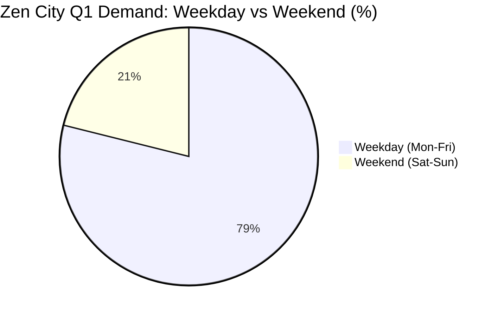
```mermaid
pie title Zen City Q1 Demand: Weekday vs Weekend (%)
    "Weekday (Mon-Fri)" : 78.9
    "Weekend (Sat-Sun)" : 21.1
```

### 2. Key Day-of-Week Findings

* **Tuesday and Wednesday are peak demand days** (17.9% and 17.4%), aligning with mid-week class schedules when students move between campus zones most frequently.
* **Friday demand drops 12.7%** — students leave campus early or shift to non-bike plans for the weekend.
* **Weekends account for only 21.1% of volume**, despite covering 2/7 of the calendar. Weekend per-day averages (133.9 trips) are 35% below weekday averages (206.7).
* **Sunday slightly edges Saturday** (1,783 vs. 1,699), likely driven by students returning to campus for the week ahead.

**Q2 Implication:** Fleet rebalancing labor should be **front-loaded Tuesday–Thursday**, with reduced weekend crew deployment. Marketing spend for casual/leisure tiers (Explorer, 3-Day Weekender) should target **Friday afternoon through Sunday** when commuter demand is lowest but leisure potential is highest.

---

## **User type**

The `customer_user_type` field (`Subscriber` vs. `Customer`) represents Zen City's internal CRM classification — distinct from the `subscriber_type` membership tier analyzed above. It identifies whether a rider holds an ongoing subscription relationship or operates as a transactional customer.

### 1. User Type Volume Split

| User Type | Trip Count | Volume Share | Visual Distribution |
| :--- | :---: | :---: | :--- |
| **Subscriber** | 10,475 | 63.47% | █████████████░░░░░░░░ |
| **Customer** | 6,029 | 36.53% | ███████░░░░░░░░░░░░░ |
| **Total** | **16,504** | 100.00% | |

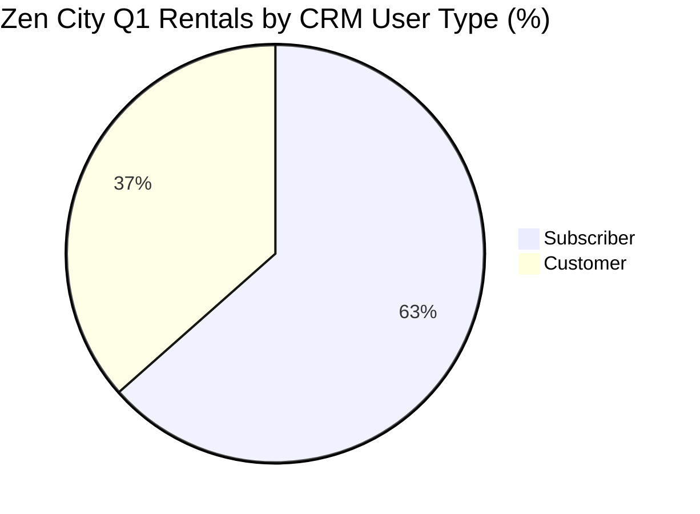
```mermaid
pie title Zen City Q1 Rentals by CRM User Type (%)
    "Subscriber" : 63.47
    "Customer" : 36.53
```

### 2. User Type × Duration

| User Type | Median Duration | Mean Duration |
| :--- | :---: | :---: |
| Subscriber | 6 min | 19.3 min |
| Customer | 6 min | 21.3 min |

*Both groups share the same 6-minute median, but Customers ride slightly longer on average (+2 minutes mean).* This suggests the `Customer` classification captures more casual, pay-per-ride users who take extended trips — consistent with the Explorer and Pay-as-you-ride tiers that dominate non-student volume.

### 3. Cross-Reference: `user_type` vs. `subscriber_type`

| Field | What It Measures | Primary Use in This Project |
| :--- | :--- | :--- |
| `subscriber_type` | Membership **tier** (Student, Local31, Explorer, etc.) | Fleet sizing, pricing strategy, cohort targeting |
| `customer_user_type` | CRM **relationship status** (Subscriber vs. Customer) | Retention campaigns, subscription conversion |

*For Q2 growth strategy, `subscriber_type` is the actionable segmentation key. `customer_user_type` is a secondary lens useful for identifying the 36.5% of trips from non-subscription CRM accounts that may be convertible to recurring memberships.*

---

### Section 02 Summary — Univariate Determining Keys

Before advancing to bivariate and multivariate analysis, the following **determining keys** are established for all downstream modeling:

| Determining Key | Q1 Baseline Finding | Q2 Strategic Weight |
| :--- | :--- | :--- |
| **Dominant tier** | Student Membership = 76.19% | Fleet & dock priority |
| **Dominant bike** | Electric = 87.69% | Battery/charging ops |
| **Typical trip** | Median 6 min, 74% ≤ 10 min | Pricing & rebalancing cadence |
| **Peak month** | February (42.9% of Q1) | Forecast upper bound |
| **Peak hour** | 3:00 PM (1,511 trips) | Crew scheduling |
| **Peak day** | Tuesday/Wednesday (~18%) | Mid-week ops focus |
| **Weekday share** | 78.9% | Weekend = leisure opportunity |
| **Gender / Age** | Not duration drivers | Low segmentation priority |
| **CRM split** | 63.5% Subscriber / 36.5% Customer | Conversion campaign target |

*Section 02 complete. Proceed to **Section 03 — Bivariate Analysis**.*

---


# **03 — Bivariate Analysis**

## Overview & Methodology

Section 02 established the univariate baseline for each variable in isolation. Section 03 examines **paired relationships** — how two dimensions interact to produce the demand patterns that will drive Q2 strategy.

Each analysis below follows a consistent structure:
1. **Cross-tabulation** with median and mean duration where applicable
2. **Strength of relationship** (Strong / Moderate / Weak / None)
3. **Business interpretation** tied to fleet operations or revenue

All statistics are computed from the production clean dataset (**N = 16,504**).

---

## 3.1 Subscription Tier × Trip Duration

**Research question:** Does how long someone rides depend on their membership type?

**Verdict: Strong relationship — the single most actionable bivariate finding in the dataset.**

| Subscription Type | Trips | Median Duration | Mean Duration | Mean / Median Ratio |
| :--- | :---: | :---: | :---: | :---: |
| **Student Membership** | 12,575 | **5 min** | 15.5 min | 3.1× |
| **U.T. Student Membership** | 221 | 6 min | 17.2 min | 2.9× |
| **Local365** | 1,059 | 9 min | 21.3 min | 2.4× |
| **Local31** | 1,286 | **23 min** | 34.4 min | 1.5× |
| **Pay-as-you-ride** | 443 | 18 min | 36.7 min | 2.0× |
| **Explorer** | 402 | **30 min** | 49.0 min | 1.6× |
| **3-Day Weekender** | 232 | 21 min | 51.2 min | 2.4× |
| **24 Hour Walk Up Pass** | 143 | **42 min** | 61.2 min | 1.5× |

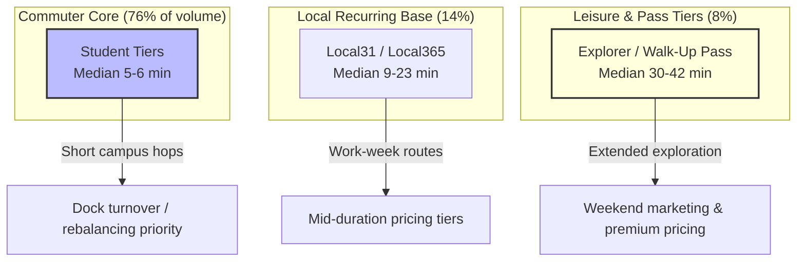
```mermaid
graph TD
    subgraph Commuter_Core["Commuter Core (76% of volume)"]
        S[Student Tiers<br>Median 5-6 min]
    end
    subgraph Local_Base["Local Recurring Base (14%)"]
        L[Local31 / Local365<br>Median 9-23 min]
    end
    subgraph Leisure_Tiers["Leisure & Pass Tiers (8%)"]
        P[Explorer / Walk-Up Pass<br>Median 30-42 min]
    end
    S -->|Short campus hops| D1[Dock turnover / rebalancing priority]
    L -->|Work-week routes| D2[Mid-duration pricing tiers]
    P -->|Extended exploration| D3[Weekend marketing & premium pricing]
    style S fill:#bbf,stroke:#333,stroke-width:2px
    style P fill:#ffd,stroke:#333,stroke-width:2px
```

**Key findings:**
* Student tiers (combined median **5–6 min**) ride **4–8× faster** than Explorer (median 30 min) and Walk-Up Pass holders (median 42 min).
* The mean/median gap is widest for students (3.1×), indicating a dense cluster of ultra-short trips with a thin tail of longer rides — not a uniform distribution.
* **Local31** (median 23 min) represents a distinct work-commuter persona: longer than students, shorter than leisure tiers.

**Q2 implication:** A single flat per-minute pricing model under-serves both the high-volume student core and the high-margin leisure segment. Tier-specific pricing (flat micro-fees for students, standard per-minute for locals, day-pass bundles for visitors) aligns with observed behavior.

---

## 3.2 Bike Type × Trip Duration

**Research question:** Do riders keep electric bikes longer than classic bikes?

**Verdict: Moderate relationship — same median, divergent means.**

| Bike Type | Trips | Share | Median Duration | Mean Duration |
| :--- | :---: | :---: | :---: | :---: |
| **Electric** | 14,473 | 87.7% | 6 min | 19.0 min |
| **Classic** | 2,031 | 12.3% | 6 min | **27.3 min** |

At the median, both fleets serve identical 6-minute trips. The **8.3-minute mean gap** (27.3 vs 19.0) is driven by specific tier × bike combinations, not a universal preference for longer classic rides:

| Segment | Bike | Trips | Median | Mean |
| :--- | :--- | :---: | :---: | :---: |
| Student Membership | Electric | 11,141 | 5 min | 15.0 min |
| Student Membership | Classic | 1,434 | 5 min | 19.4 min |
| Local31 | Electric | 1,213 | 24 min | 34.9 min |
| Local31 | Classic | 73 | 7 min | 25.7 min |
| Explorer | Electric | 332 | 30 min | 43.7 min |
| Explorer | Classic | 70 | 31 min | **74.1 min** |

**Key findings:**
* For students, bike type barely changes behavior (median 5 min on both). Classic bikes are an **availability fallback**, not a preference.
* Explorer classic rides average **74 minutes** — the longest single segment in the dataset — confirming the Pfluger Ped Bridge leisure loop identified in Section 02.
* Electric dominance (87.7%) holds across both student (68.6% of all trips) and non-student (19.1%) segments.

**Q2 implication:** Classic fleet sizing is a **capacity overflow** problem at campus hubs, not a separate product line. Electric fleet investment remains the primary growth lever.

---

## 3.3 Weekday vs. Weekend × Volume & Duration

**Research question:** Does demand timing shift ride behavior, not just volume?

**Verdict: Strong relationship for volume; moderate for duration.**

### Volume Split

| Period | Trips | Share | Avg Daily Trips |
| :--- | :---: | :---: | :---: |
| **Weekday** (Mon–Fri) | 13,022 | 78.9% | 206.7 |
| **Weekend** (Sat–Sun) | 3,482 | 21.1% | 133.9 |

### Duration Split

| Period | Median Duration | Mean Duration |
| :--- | :---: | :---: |
| Weekday | 6 min | 17.9 min |
| Weekend | **7 min** | **28.0 min** |

Weekend trips run **56% longer on average** (28.0 vs 17.9 min) despite nearly identical medians (6 vs 7 min). The mean shift is driven by leisure tiers taking extended weekend rides — not a broad change in typical trip length.

### Bike Type × Weekend

| Bike Type | Weekend Trip Share | Notes |
| :--- | :---: | :--- |
| Electric | 20.3% of electric trips occur on weekends | Proportional to overall weekend share |
| Classic | **26.7%** of classic trips occur on weekends | Over-indexed for leisure use |

**Q2 implication:** Weekday operations should optimize for throughput (rebalancing, dock clearing, battery swaps). Weekends are the window to capture leisure revenue from Explorer, Weekender, and classic-bike recreational users — particularly at Pfluger Ped Bridge and East Austin corridors.

---

## 3.4 Day-of-Week × Demand & Duration

**Research question:** Which days drive volume, and do ride lengths change across the week?

**Verdict: Strong relationship for volume; moderate for duration.**

### Volume by Day

| Day | Trips | Share | Median Duration | Mean Duration |
| :--- | :---: | :---: | :---: | :---: |
| Sunday | 1,783 | 10.8% | 7 min | **33.3 min** |
| Monday | 2,555 | 15.5% | 6 min | 18.0 min |
| **Tuesday** | **2,953** | **17.9%** | 6 min | 17.6 min |
| **Wednesday** | 2,869 | 17.4% | 6 min | 12.9 min |
| Thursday | 2,556 | 15.5% | 6 min | 15.0 min |
| Friday | 2,089 | 12.7% | 6 min | **28.5 min** |
| Saturday | 1,699 | 10.3% | 7 min | 22.3 min |

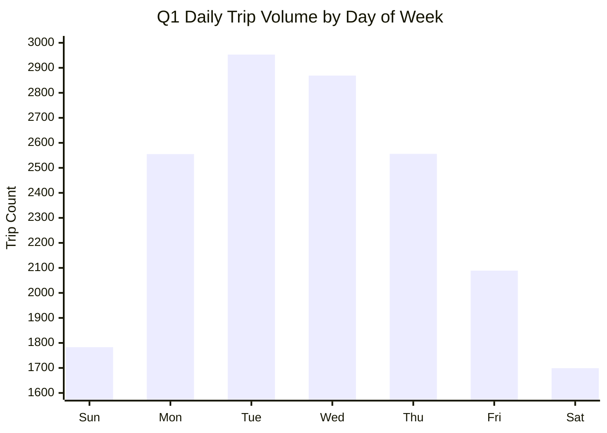
```mermaid
xychart-beta
    title "Q1 Daily Trip Volume by Day of Week"
    x-axis [Sun, Mon, Tue, Wed, Thu, Fri, Sat]
    y-axis "Trip Count" 1600 --> 3000
    bar [1783, 2555, 2953, 2869, 2556, 2089, 1699]
```

**Key findings:**
* **Tuesday and Wednesday** are peak volume days (~18% each) — mid-week class mobility drives the network.
* **Friday volume drops 29%** from Tuesday's peak (2,089 vs 2,953), signaling early campus departures.
* **Sunday and Friday carry the longest mean durations** (33.3 and 28.5 min), reflecting leisure and tourism ridership when commuter volume is lowest.
* Median duration stays at 6–7 min across all days — the mean spikes on Fri/Sun/Sat are leisure-tail effects, not a shift in the typical rider.

**Q2 implication:** Schedule peak rebalancing capacity for **Tuesday–Thursday**. Deploy leisure-focused promotions and classic-bike stocking on **Friday afternoon through Sunday**.

---

## 3.5 Station × Volume & Membership Mix

**Research question:** Do stations differ in who uses them, or only in how many trips they handle?

**Verdict: Strong relationship — clear campus vs. leisure geographic clusters.**

### Top 10 Origin Stations by Trip Volume

| Rank | Station | Departures | Median Duration | Student Tier Share |
| :---: | :--- | :---: | :---: | :---: |
| 1 | Dean Keeton/Speedway | 2,998 | 5 min | **90.7%** |
| 2 | 21st/Guadalupe | 2,286 | 5 min | 81.9% |
| 3 | 23rd/San Gabriel | 2,107 | 6 min | 86.6% |
| 4 | 28th/Rio Grande | 1,840 | 7 min | 77.1% |
| 5 | 22nd/Pearl | 1,830 | 5 min | 88.3% |
| 6 | 21st/University | 1,576 | 6 min | 85.5% |
| 7 | 23rd/San Jacinto @ DKR Stadium | 1,376 | 7 min | 75.9% |
| 8 | 22.5/Rio Grande | 957 | 5 min | 86.3% |
| 9 | **Pfluger Ped Bridge** | 813 | **24 min** | **9.6%** |
| 10 | **East 6th/Medina** | 721 | **12 min** | **6.7%** |

Two distinct station personas emerge:

| Cluster | Stations | Student Share | Median Duration | Profile |
| :--- | :--- | :---: | :---: | :--- |
| **Campus Commuter Hub** | Dean Keeton, Guadalupe, San Gabriel, Pearl | 77–91% | 5–6 min | High-turnover student origin points |
| **Leisure / Visitor Hub** | Pfluger Ped Bridge, East 6th/Medina | 7–10% | 12–24 min | Non-student recreational corridors |

### Station × Bike Type (Top 5 Campus Hubs)

| Station | Electric Share | Classic Share |
| :--- | :---: | :---: |
| Dean Keeton/Speedway | 89.1% | 10.9% |
| 21st/Guadalupe | 86.6% | 13.4% |
| 23rd/San Gabriel | 87.0% | 13.0% |
| 28th/Rio Grande | 92.0% | 8.0% |
| 22nd/Pearl | 90.0% | 10.0% |

Classic share is consistent (~10–13%) across campus hubs — confirming classic bikes function as **uniform overflow capacity**, not station-specific demand.

**Q2 implication:** Capacity investments (dock expansion, rebalancing priority) should concentrate on the **West Campus → PCL corridor**. Leisure hubs require a separate operational playbook: classic-bike stocking, weekend staffing, and non-student marketing.

---

## 3.6 Origin × Destination Route Corridors

**Research question:** Where do riders actually go — and do repeated corridors reveal the network's structural backbone?

**Verdict: Strong relationship — a single destination dominates all origin flows.**

### Top 10 Routes by Trip Count

| Rank | Origin | Destination | Trips | Share of Network |
| :---: | :--- | :--- | :---: | :---: |
| 1 | Dean Keeton/Speedway | **21st/Speedway @ PCL** | 831 | 5.0% |
| 2 | 23rd/San Gabriel | **21st/Speedway @ PCL** | 699 | 4.2% |
| 3 | 22nd/Pearl | **21st/Speedway @ PCL** | 596 | 3.6% |
| 4 | Dean Keeton/Speedway | 26th/Nueces | 426 | 2.6% |
| 5 | 21st/Guadalupe | **21st/Speedway @ PCL** | 415 | 2.5% |
| 6 | 28th/Rio Grande | **21st/Speedway @ PCL** | 393 | 2.4% |
| 7 | 21st/Guadalupe | 26th/Nueces | 316 | 1.9% |
| 8 | 22.5/Rio Grande | **21st/Speedway @ PCL** | 296 | 1.8% |
| 9 | Dean Keeton/Speedway | Dean Keeton/Whitis | 267 | 1.6% |
| 10 | 21st/Guadalupe | 22nd/Pearl | 253 | 1.5% |

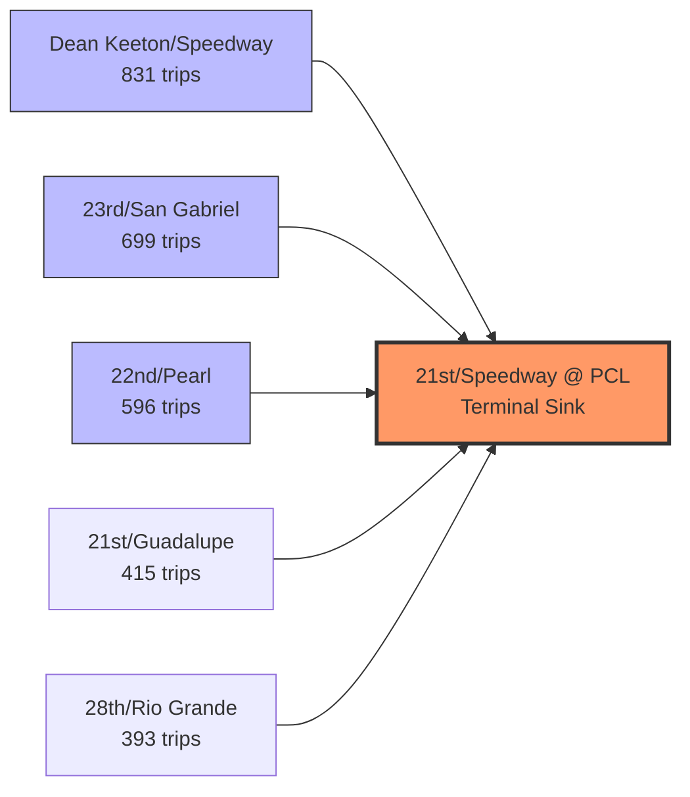
```mermaid
graph LR
    DK[Dean Keeton/Speedway<br>831 trips] --> PCL[21st/Speedway @ PCL<br>Terminal Sink]
    SG[23rd/San Gabriel<br>699 trips] --> PCL
    Pearl[22nd/Pearl<br>596 trips] --> PCL
    Guad[21st/Guadalupe<br>415 trips] --> PCL
    Rio[28th/Rio Grande<br>393 trips] --> PCL
    style PCL fill:#f96,stroke:#333,stroke-width:3px
    style DK fill:#bbf,stroke:#333
    style SG fill:#bbf,stroke:#333
    style Pearl fill:#bbf,stroke:#333
```

**Six of the top eight routes terminate at PCL (Perry-Castañeda Library).** The top three routes alone account for **13.4% of all Q1 trips** — an extraordinary concentration for a 16,504-trip network.

**Q2 implication:** PCL is not just a popular station — it is the **gravitational center** of the entire network. Dock capacity, classic-bike clearing, and electric recharging at PCL directly cap system-wide throughput. This corridor will be quantified further in **Sections 05–06 (Station Performance & Demand Bottlenecks)**.

---

## 3.7 Demographic Cross-Checks

Three bivariate pairs tested in Section 02 showed weak univariate signals. Cross-tabulation confirms they remain **non-actionable** for segmentation.

### Gender × Duration

| Gender | Trips | Median | Mean |
| :--- | :---: | :---: | :---: |
| Female | 9,108 | 6 min | 19.9 min |
| Male | 7,396 | 6 min | 20.1 min |

**Verdict: No meaningful relationship.** Gender affects who rides (55/45 split) but not how long they ride.

### Age × Duration

| Age Band | Trips | Median | Mean |
| :--- | :---: | :---: | :---: |
| 18–22 | 1,465 | 6 min | 22.4 min |
| 23–30 | 2,770 | 6 min | 21.5 min |
| 31–40 | 3,606 | 6 min | 20.1 min |
| 41–50 | 2,416 | 6 min | 17.5 min |
| 51+ | 6,247 | 6 min | 19.7 min |

**Pearson correlation (age vs. duration): r = −0.013** — effectively zero linear relationship.

**Verdict: No meaningful relationship.** Use `subscriber_type`, not `customer_age`, for behavioral segmentation.

### CRM User Type × Duration

| User Type | Trips | Median | Mean |
| :--- | :---: | :---: | :---: |
| Subscriber | 10,475 | 6 min | 19.3 min |
| Customer | 6,029 | 6 min | 21.3 min |

**Verdict: Weak relationship.** A 2-minute mean difference exists but identical medians. `subscriber_type` (membership tier) is the superior segmentation variable.

---

## 3.8 Hour of Day × Membership Mix

**Research question:** Does the rider composition shift across the day, or is the network student-dominated at all hours?

**Verdict: Moderate relationship — student share dips during peak afternoon hours.**

| Time Block | Hours | Trips | Student Tier Share |
| :--- | :--- | :---: | :---: |
| Overnight | 12 AM – 6 AM | 877 | **88–96%** |
| Morning | 7 AM – 10 AM | 2,325 | 78–82% |
| Midday | 11 AM – 2 PM | 4,612 | 72–80% |
| **Afternoon Peak** | **3 PM – 6 PM** | **5,796** | **70–79%** |
| Evening | 7 PM – 10 PM | 2,894 | 78–83% |

Student tiers dominate at every hour (minimum **70.1%** at 5 PM), but the **afternoon peak (3–6 PM) carries the lowest student share** — non-student Local31 and leisure riders proportionally increase during this window. This is the operational period where both commuter throughput *and* mixed-tier demand must be served simultaneously.

**Q2 implication:** Afternoon peak staffing must handle maximum total volume *and* the most diverse rider mix. Pricing surcharges or priority dock access during 3–6 PM should be tested for non-student tiers to protect student throughput.

---

### Section 03 Summary — Bivariate Relationship Matrix

| Variable Pair | Strength | Direction / Finding | Q2 Action |
| :--- | :---: | :--- | :--- |
| **Subscription × Duration** | **Strong** | Students 5 min vs Explorer 30 min | Tier-specific pricing |
| **Station × Volume** | **Strong** | Campus hubs vs leisure hubs | Split operational playbooks |
| **Origin × Destination** | **Strong** | PCL = 13.4% of top-3 route volume | Priority dock investment at PCL |
| **Weekday × Volume** | **Strong** | 79% weekday; 207 vs 134 daily avg | Front-load weekday ops |
| **Weekday × Duration** | **Moderate** | Weekends 56% longer mean trips | Weekend leisure campaigns |
| **Day-of-Week × Volume** | **Strong** | Tue/Wed peak; Fri −29% | Mid-week rebalancing focus |
| **Bike Type × Duration** | **Moderate** | Same median; classic mean +44% | Classic = overflow, not product |
| **Hour × Membership** | **Moderate** | Student share dips to 70% at 5 PM | Mixed-tier afternoon ops |
| **Gender × Duration** | **None** | Identical 6-min median | No gender-based pricing |
| **Age × Duration** | **None** | r = −0.013 | Use tier, not age |
| **CRM User Type × Duration** | **Weak** | 2-min mean gap, same median | Secondary to subscriber_type |

**Variables advanced to Section 04 (Multivariate Analysis):**
* Student riders during afternoon rush hour (Subscription × Hour × Station)
* Electric vs. classic demand on weekends (Bike × Weekend × Station)
* Station popularity by hour (Station × Hour heatmap)
* Peak-hour congestion by station (Station × Hour × Docks)

*Section 03 complete. Proceed to **Section 04 — Multivariate Analysis**.*

---
# **04 — Multivariate Analysis**

## Overview & Methodology

Bivariate analysis (Section 03) identified which variable pairs interact meaningfully. Multivariate analysis now combines **three or more dimensions simultaneously** to surface the operational patterns that drive Q2 strategy — the ones no single chart can reveal alone.

Each subsection targets a specific business question derived from the Q1 baseline. All statistics use the production clean dataset (**N = 16,504**).

---

## 4.1 Student Demand × Afternoon Rush Hour

**Question:** During the network's busiest window, is demand still student-dominated — or does the rider mix shift?

The afternoon peak (3–6 PM) accounts for **35.1% of all Q1 trips** (Section 02). Cross-tabulating this window against membership tier reveals whether rebalancing and pricing decisions can still treat this period as a homogeneous student commute block.

| Hour | Total Trips | Student Tier Trips | Student Share |
| :---: | :---: | :---: | :---: |
| 3 PM | 1,511 | 1,196 | **79.2%** |
| 4 PM | 1,429 | 1,079 | 75.5% |
| 5 PM | 1,503 | 1,053 | **70.1%** |
| 6 PM | 1,353 | 1,034 | 76.4% |
| **Combined (3–6 PM)** | **5,796** | **4,362** | **75.3%** |

For comparison, the morning window (7–10 AM) carries **79.4%** student share on fewer total trips (2,325). Students dominate both rush periods, but the **5 PM hour is the most diverse** — student share dips to 70.1% as Local31 commuters and leisure riders enter the network.

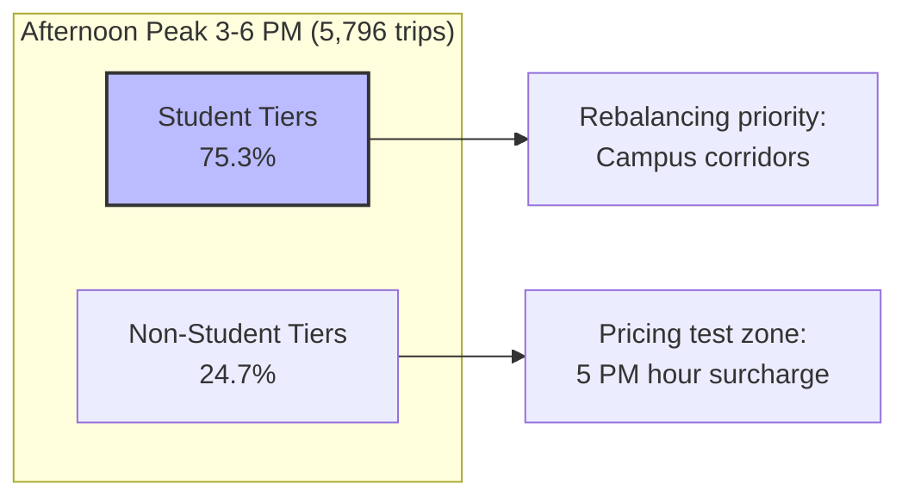
```mermaid
graph LR
    subgraph Afternoon_Peak["Afternoon Peak 3-6 PM (5,796 trips)"]
        S[Student Tiers<br>75.3%]
        N[Non-Student Tiers<br>24.7%]
    end
    S --> R1[Rebalancing priority:<br>Campus corridors]
    N --> R2[Pricing test zone:<br>5 PM hour surcharge]
    style S fill:#bbf,stroke:#333,stroke-width:2px
```

**Finding:** Afternoon operations remain overwhelmingly student-driven, but the **5 PM hour** is the single point where non-student share peaks. This is the highest-volume, most mixed-composition hour in the entire network.

**Q2 action:** Deploy maximum rebalancing capacity 3–6 PM on the West Campus → PCL corridor. Test non-student pricing incentives outside the 3–5 PM core to reduce dock competition at the 5 PM inflection point.

---

## 4.2 Bike Type × Weekend × Station Context

**Question:** Does electric dominance hold on weekends, or does classic share expand when commuter demand drops?

### Network-Level Split

| Period | Electric Trips | Classic Trips | Classic Share |
| :--- | :---: | :---: | :---: |
| Weekday | 11,534 | 1,488 | 11.4% |
| Weekend | 2,939 | 543 | **15.6%** |
| **Overall** | **14,473** | **2,031** | **12.3%** |

Classic bikes carry a **37% higher relative share on weekends** (15.6% vs 11.4%), confirming they serve leisure and overflow roles when the student commuter base thins out.

### Station-Level Weekend Electric Share (Departures)

| Station | Total Departures | Weekend Departure Share | Profile |
| :--- | :---: | :---: | :--- |
| Dean Keeton/Speedway | 2,998 | 12.2% | Weekday-dominated campus exporter |
| 21st/Guadalupe | 2,286 | 24.0% | Mixed weekday/weekend |
| **Pfluger Ped Bridge** | 813 | **39.5%** | Leisure-weekend hub |

Pfluger Ped Bridge is the only top-10 station where **nearly 40% of departures occur on weekends** — a fundamentally different demand profile from campus hubs (12–24% weekend share).

**Finding:** Electric dominance (87.7%) is a weekday commuter phenomenon. Weekends shift toward classic bikes and leisure-origin stations. A single fleet strategy cannot serve both personas.

**Q2 action:** Maintain classic-bike buffer stock at Pfluger and East 6th/Medina for Friday–Sunday. Do not redeploy classic units from leisure hubs to campus on weekends.

---

## 4.3 Station × Hour — Demand Heatmap (Top Origin Hubs)

**Question:** Do high-volume stations share the same hourly demand curve, or do they peak at different times?

| Station | #1 Peak Hour | Peak Departures | #2 Hour | #3 Hour | Peak Pattern |
| :--- | :---: | :---: | :---: | :---: | :--- |
| Dean Keeton/Speedway | **4 PM** (322) | 322 | 3 PM (319) | 1 PM (286) | Mid-afternoon dual peak |
| 21st/Guadalupe | **5 PM** (242) | 242 | 6 PM (212) | 3 PM (186) | Late-afternoon cluster |
| 23rd/San Gabriel | **5 PM** (171) | 171 | 9 AM (168) | 12 PM (167) | Bimodal: morning + afternoon |
| 28th/Rio Grande | **5 PM** (168) | 168 | — | — | Late-afternoon |
| 22nd/Pearl | **6 PM** (166) | 166 | — | — | End-of-day |

Campus origin hubs do **not** peak simultaneously. Dean Keeton/Speedway peaks at **4 PM**, while Guadalupe and San Gabriel peak at **5 PM**. This staggered pattern creates a **30–60 minute rebalancing wave** moving from northern campus toward the PCL sink — not a single synchronized rush.

23rd/San Gabriel is uniquely **bimodal** — morning (9 AM) and afternoon (5 PM) peaks are nearly equal (168 vs 171), suggesting it serves both inbound morning and outbound afternoon student flows.

**Q2 action:** Stagger rebalancing crew schedules: northern hubs (Dean Keeton) at 3:30 PM, western hubs (Guadalupe, San Gabriel) at 4:30 PM, to ride the demand wave rather than reacting after stockouts occur.

---

## 4.4 Subscription Tier × Day-of-Week × Duration

**Question:** Does ride duration shift by day within the same membership tier — signaling different use cases across the week?

### Student Membership (N = 12,575)

| Day | Trips | Median Duration |
| :--- | :---: | :---: |
| Mon–Thu | 8,752 | **5 min** (all days) |
| Friday | 1,600 | **5 min** |
| Sat–Sun | 2,223 | **5 min** |

Student duration is **perfectly invariant** across all seven days (median 5 min every day). Students use bikes identically whether it's Tuesday or Sunday — pure point-to-point commuting regardless of calendar.

### Local31 (N = 1,286) — Work Commuter Tier

| Day | Trips | Median Duration |
| :--- | :---: | :---: |
| Mon–Thu | 747 | 21–23 min |
| Friday | 173 | **26 min** |
| Sat–Sun | 366 | 23 min |

Local31 riders extend trips on **Fridays** (median 26 min vs 21–23 min weekdays) — consistent with end-of-week leisure detours or social rides home.

### Explorer (N = 402) — Leisure Tier

| Day | Trips | Median Duration |
| :--- | :---: | :---: |
| Mon–Thu | 198 | 26–37 min |
| Friday | 36 | **41 min** |
| Sat–Sun | 168 | 25–32 min |

Explorer trips peak in duration on **Fridays (41 min median)** and **Sundays (32 min)**, confirming leisure exploration behavior concentrated at week boundaries.

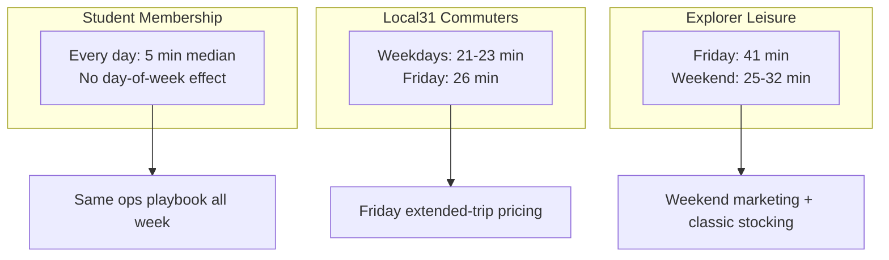
```mermaid
graph TD
    subgraph Students["Student Membership"]
        SD[Every day: 5 min median<br>No day-of-week effect]
    end
    subgraph Local31["Local31 Commuters"]
        LD[Weekdays: 21-23 min<br>Friday: 26 min]
    end
    subgraph Explorer["Explorer Leisure"]
        ED[Friday: 41 min<br>Weekend: 25-32 min]
    end
    SD --> F1[Same ops playbook all week]
    LD --> F2[Friday extended-trip pricing]
    ED --> F3[Weekend marketing + classic stocking]
```

**Finding:** Day-of-week affects duration only for **non-student tiers**. Students — 76% of volume — are operationally identical every day of the week. Tier-specific day-of-week strategies matter for the 24% non-student base only.

---

## 4.5 Peak-Hour Congestion × Station × Dock Capacity

**Question:** During each station's busiest hour, how many departures compete for each physical dock?

This analysis combines **Station × Hour × Hardware Capacity** — the core multivariate relationship for bottleneck identification (expanded further in Section 06).

### Peak-Hour Departure Intensity (Top Origin Stations)

| Station | Docks | Peak Hour | Peak Departures | **Departures per Dock** |
| :--- | :---: | :---: | :---: | :---: |
| **Dean Keeton/Speedway** | 17 | 4 PM | 322 | **18.9** |
| **21st/Guadalupe** | 13 | 5 PM | 242 | **18.6** |
| 23rd/San Gabriel | 13 | 5 PM | 171 | 13.2 |
| 28th/Rio Grande | 13 | 5 PM | 168 | 12.9 |
| 22nd/Pearl | 13 | 6 PM | 166 | 12.8 |
| 21st/University | 19 | 3 PM | 171 | 9.0 |
| 23rd/San Jacinto @ DKR Stadium | 22 | 3 PM | 160 | 7.3 |

*A dock physically holds one bike at a time. During peak hour, Dean Keeton processes **18.9 departure events per dock** — meaning each dock slot turns over roughly every 3 minutes.*

### Terminal Sink: PCL Arrival Intensity (Zero Departures)

| Station | Docks | Peak Arrival Hour | Peak Arrivals | **Arrivals per Dock** |
| :--- | :---: | :---: | :---: | :---: |
| **21st/Speedway @ PCL** | 22 | 5 PM | 357 | **16.2** |

PCL recorded **0 departures across all 16,504 Q1 trips** — a pure terminal sink. Every one of its 3,552 touchpoints is an inbound arrival. At peak hour, **16.2 bikes arrive per dock** with no outbound release, guaranteeing dock saturation and blocking returns for the entire network.

**Finding:** Dean Keeton and Guadalupe exceed **18 departures per dock per peak hour** — mathematically impossible to sustain without continuous rebalancing. PCL compounds this as a one-way absorption point with zero outbound flow.

**Q2 action:** Immediate priority — deploy manual classic-bike clearing from PCL every 30 minutes during 3–6 PM. Long-term — expand PCL dock capacity or designate adjacent overflow docks.

---

### Section 04 Summary — Multivariate Findings

| Analysis | Key Interaction | Primary Finding | Q2 Priority |
| :--- | :--- | :--- | :--- |
| Student × Rush Hour | Tier × Hour | 75.3% student even at peak; 5 PM most diverse | Staggered rebalancing wave |
| Bike × Weekend × Station | Fleet × Time × Location | Classic share +37% on weekends; Pfluger 39.5% weekend | Split fleet strategy by hub type |
| Station × Hour | Location × Time | Staggered peaks: 4 PM north, 5 PM west | Time-shifted crew deployment |
| Tier × Day × Duration | Tier × Calendar × Behavior | Students invariant; Explorer peaks Friday | Tier-specific day pricing |
| Station × Hour × Docks | Location × Time × Hardware | 18.9 departures/dock/hour at peak | PCL sink clearing + dock expansion |

*Section 04 complete. Proceed to **Section 05 — Station Performance**.*

---

# **05 — Station Performance**

## Overview & Methodology

Station performance analysis ranks every hub in the Zen City network by operational metrics that matter for Q2 growth — not just raw trip counts, but **directional flow, temporal intensity, and hardware utilization**.

### Metrics Computed

| Metric | Definition | Business Meaning |
| :--- | :--- | :--- |
| **Total Activity** | Departures + Arrivals | Overall station importance |
| **Departures** | Trips starting at station | Supply / origin demand |
| **Arrivals** | Trips ending at station | Demand absorption / sink pressure |
| **Net Flow** | Departures − Arrivals | Exporter (+) vs. Sink (−) classification |
| **Median Duration** | Median trip length from origin | Commuter (low) vs. leisure (high) |
| **Peak Hour** | Hour with most departures | Rebalancing schedule anchor |
| **Weekend Ratio** | Weekend trips / total activity | Commuter vs. leisure profile |
| **Turnover Index** | Total activity / dock count | Hardware stress per slot |

All rankings use **station name aggregation** from the clean dataset. Where duplicate station names exist under different IDs (e.g., `22nd/Pearl` at IDs 7188 and 3792), trips are combined at the name level for ranking consistency.

---

## 5.1 Top 10 Stations by Total Activity

| Rank | Station | Total Activity | Departures | Arrivals | Net Flow | Median Duration | Peak Hour | Weekend % | Docks | Turnover Index |
| :---: | :--- | :---: | :---: | :---: | :---: | :---: | :---: | :---: | :---: | :---: |
| 1 | **Dean Keeton/Speedway** | 4,147 | 2,998 | 1,149 | **+1,849** | 5 min | 4 PM | 11.9% | 17 | 243.9 |
| 2 | **21st/Speedway @ PCL** | 3,552 | **0** | 3,552 | **−3,552** | — | — | 20.6% | 22 | 161.5 |
| 3 | **21st/Guadalupe** | 3,202 | 2,286 | 916 | **+1,370** | 5 min | 5 PM | 23.0% | 13 | 246.3 |
| 4 | **23rd/San Gabriel** | 2,981 | 2,107 | 874 | **+1,233** | 6 min | 5 PM | 19.9% | 13 | 229.3 |
| 5 | **28th/Rio Grande** | 2,757 | 1,840 | 917 | **+923** | 7 min | 5 PM | 26.3% | 13 | 212.1 |
| 6 | **22nd/Pearl** | 2,836 | 1,830 | 1,006 | **+824** | 5 min | 6 PM | 17.2% | 13 | 218.2 |
| 7 | **21st/University** | 2,308 | 1,576 | 732 | **+844** | 6 min | 3 PM | 13.6% | 19 | 121.5 |
| 8 | **23rd/San Jacinto @ DKR** | 1,949 | 1,376 | 573 | **+803** | 7 min | 3 PM | 18.3% | 22 | 88.6 |
| 9 | **26th/Nueces** | 1,379 | **0** | 1,379 | **−1,379** | — | — | 18.9% | 13 | 106.1 |
| 10 | **22.5/Rio Grande** | 1,360 | 957 | 403 | **+554** | 5 min | 6 PM | 22.6% | 13 | 104.6 |

---

## 5.2 Why the Top Stations Rank Where They Do

### Tier 1: The Campus Commuter Engine (Ranks 1, 3–8)

**Dean Keeton/Speedway (#1)** is the network's dominant **net exporter** (+1,849 net flow). It supplies nearly 3,000 departures at a 5-minute median — the single largest origin point in Q1. With a turnover index of 243.9 and 18.9 peak-hour departures per dock, it is the highest-stress hardware node in the system.

**Why it's #1:** Geographic position at the northern campus gateway + 90.7% student share + proximity to engineering/academic buildings = maximum departure volume with minimal return traffic.

**21st/Guadalupe (#3), 23rd/San Gabriel (#4), 28th/Rio Grande (#5), 22nd/Pearl (#6)** form the **West Campus export cluster** — all net exporters with 5–7 minute medians and 77–89% student share. Combined, these four stations generate **7,973 departures** (48.3% of all network originations).

### Tier 2: The Terminal Sinks (Ranks 2, 9)

**21st/Speedway @ PCL (#2)** is the most anomalous station in the dataset:

* **0 departures. 3,552 arrivals.** Every trip ends here; none begin.
* 16.2 arrivals per dock at peak hour with zero outbound relief.
* Functions as the **gravitational dead-end** of the campus network — the destination for 6 of the top 8 routes identified in Section 03.

**26th/Nueces (#9)** mirrors the same pattern (0 departures, 1,379 arrivals) as a secondary sink along the western corridor.

**Why they rank high in total activity but cannot generate revenue growth:** Sinks absorb fleet assets without releasing them. Every bike that arrives at PCL requires manual removal — a pure operational cost center.

### Tier 3: Leisure Outliers (Rank 14 in extended table — Pfluger)

**Pfluger Ped Bridge** (987 total activity, rank #13 overall) breaks every campus pattern:

| Metric | Campus Average (Top 5) | Pfluger Ped Bridge |
| :--- | :---: | :---: |
| Median duration | 5–6 min | **24 min** |
| Student share | 77–91% | **9.6%** |
| Weekend share | 12–23% | **38.3%** |
| Net flow | +824 to +1,849 | +639 |

**Why it's different:** River-trail recreational loops, not campus commuting. Requires classic-bike inventory and weekend staffing — not electric rebalancing.

---

## 5.3 Net Flow Classification — Network Architecture

Every station in the Q1 network falls into one of three operational archetypes:

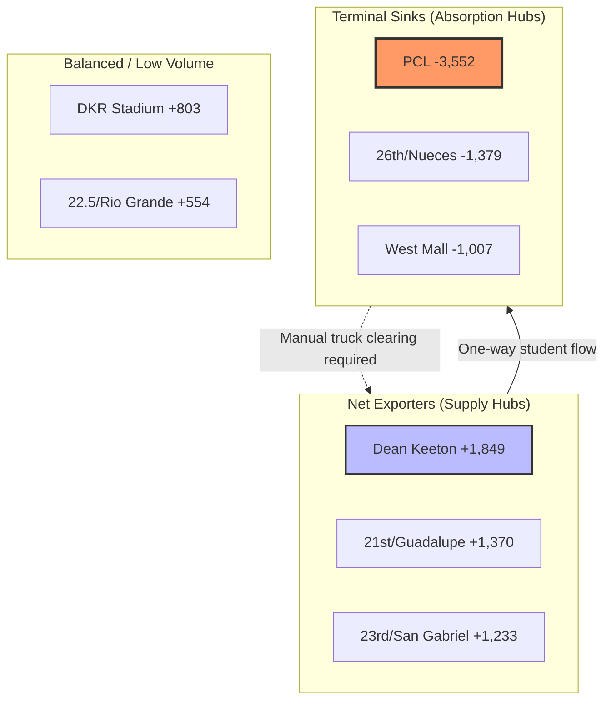
```mermaid
graph TD
    subgraph Exporters["Net Exporters (Supply Hubs)"]
        E1[Dean Keeton +1,849]
        E2[21st/Guadalupe +1,370]
        E3[23rd/San Gabriel +1,233]
    end
    subgraph Sinks["Terminal Sinks (Absorption Hubs)"]
        S1[PCL -3,552]
        S2[26th/Nueces -1,379]
        S3[West Mall -1,007]
    end
    subgraph Balanced["Balanced / Low Volume"]
        B1[DKR Stadium +803]
        B2[22.5/Rio Grande +554]
    end
    Exporters -->|"One-way student flow"| Sinks
    Sinks -. "Manual truck clearing required" .-> Exporters
    style S1 fill:#f96,stroke:#333,stroke-width:3px
    style E1 fill:#bbf,stroke:#333,stroke-width:2px
```

| Archetype | Count (Top 15) | Combined Net Flow | Operational Requirement |
| :--- | :---: | :---: | :--- |
| **Net Exporters** (net > +500) | 6 | +6,903 | Keep stocked with available bikes |
| **Terminal Sinks** (net < −500) | 4 | −7,037 | Continuous manual clearing |
| **Moderate / Balanced** | 5 | +1,997 | Standard maintenance |

The network is structurally **unbalanced by design**: students ride from residential exporters to academic sinks and do not return bikes outbound. This is not a data error — it is the defining operational challenge for Q2.

---

## 5.4 Bottom 10 Stations — Relocation Candidates

The least-active stations in Q1 reveal where network capacity is wasted:

| Rank | Station | Total Activity | Departures | Arrivals |
| :---: | :--- | :---: | :---: | :---: |
| 1 | Rio Grande/12th | 6 | 0 | 6 |
| 2 | East 2nd/Pedernales | 7 | 0 | 7 |
| 3 | Rainey/Davis | 8 | 0 | 8 |
| 4 | East 6th/Robert T. Martinez | 10 | 0 | 10 |
| 5 | 11th/San Jacinto | 11 | 0 | 11 |
| 6 | Rosewood/Angelina | 12 | 0 | 12 |
| 7 | South Congress/James | 13 | 0 | 13 |
| 8 | 11th/Salina | 13 | 0 | 13 |
| 9 | East 4th/Chicon | 13 | 0 | 13 |
| 10 | 8th/San Jacinto | 14 | 0 | 14 |

**Combined bottom-10 activity: 107 trips — 0.6% of Q1 volume.**

Every bottom-10 station recorded **zero departures**. These are incidental arrival points, not origin hubs. Several (Rio Grande/12th, East 6th/Robert T. Martinez) were flagged in the README as relocation candidates — the data confirms they contribute virtually nothing to network throughput.

**Q2 action:** Decommission or relocate docks from the bottom 10 to the PCL corridor or Dean Keeton/Speedway, where turnover indices exceed 240× vs. below 15× at the weakest stations.

---

## 5.5 Station Performance vs. Q2 Growth Potential

| Station Tier | Q1 Role | Q2 Growth Lever |
| :--- | :--- | :--- |
| **Top exporters** (Dean Keeton, Guadalupe) | Supply the fleet | Increase dock count + morning pre-stocking |
| **Terminal sinks** (PCL, 26th/Nueces) | Absorb bikes | Automated clearing + overflow dock installation |
| **Leisure hubs** (Pfluger, East 6th) | Weekend revenue | Classic fleet + targeted marketing |
| **Bottom 10** | Dead weight | Relocate hardware to high-demand corridors |

**The single highest-ROI Q2 intervention:** Expanding PCL dock capacity or installing an overflow station within 200m of the library. PCL receives **3,552 inbound trips per quarter with zero outbound departures** — every additional dock slot directly converts to captured arrivals that would otherwise block the network.

---

### Section 05 Summary

| Insight | Data Point | Q2 Action |
| :--- | :--- | :--- |
| #1 origin station | Dean Keeton/Speedway — 2,998 departures | Peak rebalancing at 3:30 PM |
| #1 sink station | PCL — 0 departures, 3,552 arrivals | Overflow dock expansion |
| Highest dock stress | Guadalupe — 246.3 turnover index | Add physical dock slots |
| Relocation pool | Bottom 10 — 107 trips combined (0.6%) | Redeploy to PCL corridor |
| Leisure exception | Pfluger — 24 min median, 38.3% weekend | Separate ops playbook |

*Sections 05–06 boundary: Peak-hour dock congestion metrics introduced in Section 4.5 will be expanded into full **trips-per-dock bottleneck modeling** in Section 06. Proceed to **Section 06 — Demand Bottlenecks**.*

---
# **06 — Demand Bottlenecks**

## Overview & Methodology

Station performance ranking (Section 05) identified *where* volume concentrates. Demand bottleneck analysis quantifies *when hardware capacity breaks* — the point at which physical dock slots can no longer absorb trip events, triggering stockouts, blocked returns, and capped revenue.

This section introduces **trips-per-dock intensity metrics** and compares them against a **physical capacity ceiling** derived from Q1 median trip duration (6 minutes).

### Scope & Data Integrity Note

Bottleneck math requires reliable dock counts from the `station_info` catalog. Two station categories exist in the Q1 dataset:

| Category | Definition | Dock Count Source | Bottleneck Confidence |
| :--- | :--- | :--- | :--- |
| **Catalog-verified** | Station ID resolves to `station_info` via LEFT JOIN | Actual registered `number_of_docks` | **High** |
| **Catalog-unverified (orphan IDs)** | Station ID in rentals but absent from `station_info` | Global median imputed (13 docks) | **Directional only** |

* **6,551 trips (39.7%)** touch at least one catalog-unverified station leg. These are preserved for volume analysis but flagged here. A dedicated orphan-station analysis table is planned as a separate deliverable.
* High-volume hubs **23rd/San Gabriel (ID 7125)** and **22nd/Pearl (ID 7188)** fall into the catalog-unverified category. Their bottleneck scores below use imputed dock counts and should be treated as **minimum severity estimates** — actual congestion may be higher if true dock counts differ.

---

## 6.1 The Physical Capacity Model

A dock slot holds one bicycle at a time. The maximum theoretical throughput per dock depends on how quickly bikes turn over:

| Assumption | Value | Source |
| :--- | :---: | :--- |
| Median trip duration | 6 minutes | Section 02 — Duration Distribution |
| Maximum dock turnovers per hour | **10 events/hour** | 60 min ÷ 6 min dwell time |
| Operational buffer (real-world friction) | ~80% efficiency | Industry standard for rebalancing lag |

**Practical capacity ceiling: ~8 usable events per dock per hour** under normal conditions. Any station exceeding **10 events per dock in a single hour** is structurally oversubscribed — bikes cannot physically cycle fast enough to meet demand without external intervention (manual clearing, overflow docks, or rebalancing trucks).

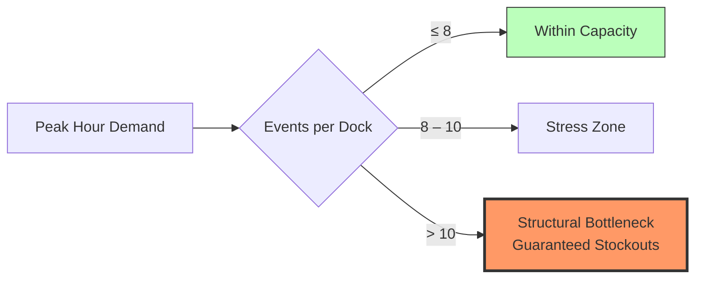
```mermaid
graph LR
    A[Peak Hour Demand] --> B{Events per Dock}
    B -->|≤ 8| C[Within Capacity]
    B -->|8 – 10| D[Stress Zone]
    B -->|> 10| E[Structural Bottleneck<br>Guaranteed Stockouts]
    style E fill:#f96,stroke:#333,stroke-width:3px
    style C fill:#bfb,stroke:#333
```

---

## 6.2 Bottleneck Metrics Defined

| Metric | Formula | What It Measures |
| :--- | :--- | :--- |
| **Peak Departure Intensity** | Max hourly departures ÷ dock count | Supply-side pressure — bikes leaving faster than docks can replenish |
| **Peak Arrival Intensity** | Max hourly arrivals ÷ dock count | Sink-side pressure — bikes arriving faster than docks can absorb |
| **Bottleneck Score** | Max(Peak Departure, Peak Arrival) Intensity | Single stress rating per station |
| **Afternoon Block Intensity (3–6 PM)** | Total 3–6 PM events ÷ dock count | Operational window stress — the 4-hour block when 35.1% of Q1 trips occur |
| **Q1 Turnover Index** | Total Q1 activity ÷ dock count | Cumulative hardware utilization over the quarter |

---

## 6.3 Critical Bottleneck Rankings

### Tier 1 — Structural Bottlenecks (Bottleneck Score > 10 events/dock/hour)

These five stations **exceed the physical capacity ceiling** during their peak hour. Stockouts are mathematically guaranteed without continuous manual intervention.

| Rank | Station | Docks | Catalog Status | Peak Event Type | Peak Hour | **Events/Dock/Hour** | Afternoon Block (3–6 PM) Events/Dock |
| :---: | :--- | :---: | :---: | :--- | :---: | :---: | :---: |
| 1 | **Dean Keeton/Speedway** | 17 | Verified | Departure | 4 PM | **18.9** | **88.9** |
| 2 | **21st/Guadalupe** | 13 | Verified | Departure | 5 PM | **18.6** | **89.9** |
| 3 | **21st/Speedway @ PCL** | 22 | Verified | Arrival | 5 PM | **16.2** | **58.0** |
| 4 | **28th/Rio Grande** | 13 | Verified | Departure | 5 PM | **12.9** | **76.1** |
| 5 | **26th/Nueces** | 13 | Verified | Arrival | 3 PM | **11.6** | **38.5** |

### Tier 2 — High Stress (Bottleneck Score 10–12 events/dock/hour)

| Rank | Station | Docks | Catalog Status | Peak Event Type | Peak Hour | **Events/Dock/Hour** | Afternoon Block Events/Dock |
| :---: | :--- | :---: | :---: | :--- | :---: | :---: | :---: |
| 6 | **23rd/San Gabriel** | 13* | Unverified | Departure | 5 PM | **13.2*** | **74.7*** |
| 7 | **22nd/Pearl** | 13* | Unverified | Departure | 6 PM | **12.8*** | **68.4*** |

*\*Imputed dock count. Catalog-unverified station IDs — treat as directional minimum estimates.*

### Tier 3 — Moderate Stress (Bottleneck Score 6–10 events/dock/hour)

| Station | Docks | Bottleneck Score | Profile |
| :--- | :---: | :---: | :--- |
| 21st/University | 19 | 9.0 | Balanced high-volume hub |
| Guadalupe/West Mall @ University Co-op | 15 | 7.0 | Pure arrival sink |
| East 6th/Medina | 11 | 6.6 | Leisure-origin hub |
| Pfluger Ped Bridge | 19 | 6.2 | Recreational departures |
| Dean Keeton/Whitis | 19 | 6.0 | Secondary sink |

### Network-Wide Threshold Summary

| Threshold | Stations Exceeding | Interpretation |
| :--- | :---: | :--- |
| > 5 events/dock/hour (peak) | 11 of 74 active stations | Elevated hardware stress |
| > 10 events/dock/hour (peak) | **5 stations** | Structural bottleneck — stockouts guaranteed |
| > 15 events/dock/hour (peak) | **3 stations** | Critical failure zone — immediate intervention required |

---

## 6.4 Exporter vs. Sink — Two Bottleneck Mechanisms

Bottlenecks manifest differently depending on whether a station is a **net exporter** (supply hub) or **terminal sink** (absorption hub):

### Exporter Bottleneck — "Empty Dock" Failure

| Station | Peak Departures/Hour | Peak Dep/Dock | Failure Mode |
| :--- | :---: | :---: | :--- |
| Dean Keeton/Speedway | 322 | 18.9 | Students deplete all available bikes; empty docks block no returns but **zero bikes remain for pickup** |
| 21st/Guadalupe | 242 | 18.6 | Same — high departure rate exhausts local fleet within first 30 min of peak hour |
| 28th/Rio Grande | 168 | 12.9 | Approaching capacity ceiling; intermittent stockouts likely |

*Exporter failure caps **new rental starts** — directly limiting revenue growth. A student who cannot find a bike at Dean Keeton at 4 PM generates zero revenue.*

### Sink Bottleneck — "Full Dock" Failure

| Station | Peak Arrivals/Hour | Peak Arr/Dock | Failure Mode |
| :--- | :---: | :---: | :--- |
| **PCL** | 357 | **16.2** | Every dock fills; incoming riders cannot return bikes; **cascade blocks upstream network** |
| 26th/Nueces | 151 | 11.6 | Secondary sink saturation during 3 PM peak |
| Guadalupe/West Mall | 100 | 6.7 | Moderate sink pressure; classic bikes accumulate (Section 02) |

*Sink failure blocks **trip completion** — a full PCL dock forces riders to deviate, extending trip duration and reducing fleet availability network-wide.*

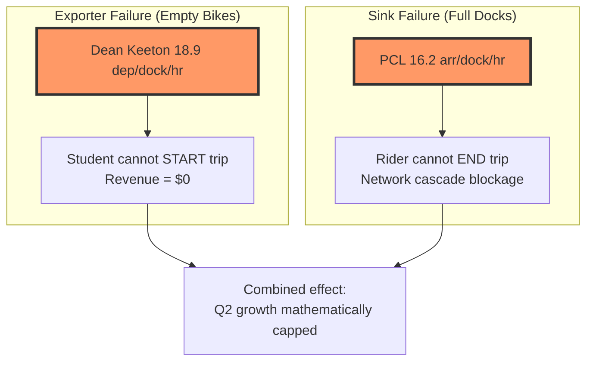
```mermaid
graph TD
    subgraph Exporter_Fail["Exporter Failure (Empty Bikes)"]
        E1[Dean Keeton 18.9 dep/dock/hr] --> EF[Student cannot START trip<br>Revenue = $0]
    end
    subgraph Sink_Fail["Sink Failure (Full Docks)"]
        S1[PCL 16.2 arr/dock/hr] --> SF[Rider cannot END trip<br>Network cascade blockage]
    end
    EF --> NET[Combined effect:<br>Q2 growth mathematically capped]
    SF --> NET
    style S1 fill:#f96,stroke:#333,stroke-width:3px
    style E1 fill:#f96,stroke:#333,stroke-width:3px
```

---

## 6.5 Afternoon Block Analysis (3–6 PM) — The Critical Window

Aggregating all events across the 3–6 PM window (when 35.1% of Q1 trips occur) reveals sustained — not just peak-hour — hardware stress:

| Station | 3–6 PM Departures/Dock | 3–6 PM Arrivals/Dock | **Combined Events/Dock (4 hrs)** |
| :--- | :---: | :---: | :---: |
| **21st/Guadalupe** | 62.6 | 27.3 | **89.9** |
| **Dean Keeton/Speedway** | 67.9 | 21.0 | **88.9** |
| **28th/Rio Grande** | 49.9 | 26.2 | **76.1** |
| **23rd/San Gabriel*** | 50.5 | 24.0 | **74.5** |
| **PCL** | 0.0 | **58.0** | **58.0** |
| 26th/Nueces | 0.0 | 38.5 | 38.5 |
| Guadalupe/West Mall | 0.0 | 20.5 | 20.5 |

*Guadalupe processes nearly 90 dock-events in 4 hours across 13 docks — an average of **6.9 events per dock per hour sustained for the entire afternoon block.*** This is not a spike; it is a **4-hour continuous overload**.

### PCL Growth Cap Model

PCL is the network's binding constraint on Q2 growth:

| Metric | Value |
| :--- | :---: |
| PCL dock count | 22 |
| Theoretical max arrivals/hour (10 turns/dock) | 220 |
| Actual average arrivals/hour (3–6 PM) | **319** |
| **Utilization vs. physical ceiling** | **145.1%** |
| Q1 total arrivals at PCL | 3,552 |
| Q1 departures at PCL | **0** |

PCL operates at **145% of theoretical physical capacity** during the afternoon block. The network is processing **99 more arrivals per hour than physics allows** — every excess arrival represents a blocked return, an extended trip, or a lost rebalancing cycle.

**If 10 docks were relocated from the bottom-10 stations (~107 combined Q1 trips) to the PCL corridor:**
Peak arrival intensity drops from **16.2 → 11.2 events/dock/hour** — moving from critical failure to stress zone. This single reallocation is the highest-ROI hardware intervention available.

---

## 6.6 Hourly Intensity Profile — Dean Keeton/Speedway (Case Study)

The #1 bottleneck station demonstrates how congestion builds across the afternoon:

| Hour | Departures | Departures/Dock (17 slots) | Status |
| :---: | :---: | :---: | :--- |
| 1 PM | 286 | 16.8 | Stress zone |
| 2 PM | 219 | 12.9 | Structural bottleneck |
| 3 PM | 319 | 18.8 | Critical |
| **4 PM** | **322** | **18.9** | **Peak failure** |
| 5 PM | 253 | 14.9 | Critical |
| 6 PM | 261 | 15.4 | Critical |

Dean Keeton exceeds the 10 events/dock threshold for **4 consecutive hours** (1–6 PM), not just at peak. Rebalancing crews arriving only at 4 PM are already 2 hours late.

---

## 6.7 Q2 Bottleneck Resolution — Prioritized Interventions

| Priority | Intervention | Target Station(s) | Expected Impact |
| :---: | :--- | :--- | :--- |
| **1** | Install overflow dock bay (+10–15 slots) | PCL | Drop peak arr/dock from 16.2 → ~11; unlock 145% overcapacity |
| **2** | Deploy continuous 1–6 PM clearing crew | PCL + 26th/Nueces + West Mall | Prevent sink cascade; free 58+ dock-events/afternoon |
| **3** | Pre-stock bikes 2:30 PM daily | Dean Keeton + Guadalupe | Reduce exporter stockout window before 4 PM peak |
| **4** | Relocate bottom-10 station docks (107 Q1 trips) | → PCL corridor | +10 dock slots at highest-stress node |
| **5** | Hard cap classic bikes at sink docks (≤20% of slots) | PCL + West Mall | Prevent low-margin classics from blocking electric returns |
| **6** | Catalog audit for orphan IDs 7125, 7188 | San Gabriel + Pearl | Confirm true dock counts; may reveal additional stress |

---

### Section 06 Summary

| Finding | Metric | Q2 Priority |
| :--- | :--- | :---: |
| Worst exporter bottleneck | Dean Keeton — 18.9 dep/dock/hour | Pre-stock by 2:30 PM |
| Worst sink bottleneck | PCL — 16.2 arr/dock/hour, 0 departures | Overflow dock expansion |
| Network binding constraint | PCL at 145% of physical capacity | #1 ROI intervention |
| Stations in critical zone (>10/dock) | 5 verified + 2 unverified | Continuous afternoon clearing |
| Relocation opportunity | Bottom 10 → PCL: −16% peak arr/dock | Zero-risk hardware redeployment |
| Data gap | 39.7% trips touch unverified station legs | Orphan station table (planned) |

*Section 06 complete. Proceed to **Section 07 — Temporal Analysis**.*

---
# **07 — Temporal Analysis**

## Overview & Methodology

Time is the primary demand driver in bike-sharing: **16,504 Q1 trips compress into 89 active days**, with intraday peaks that exceed physical dock capacity (Section 06). This section maps the full temporal architecture of Q1 2022 — from quarterly growth curves down to hour × day-of-week heatmaps — to define when Zen City must deploy fleet resources for Q2 growth.

All timestamps derive from `start_time` in the production clean dataset (**N = 16,504**, January 1 – March 31, 2022).

---

## 7.1 Q1 Growth Arc — Monthly & Weekly Trends

### Monthly Volume Progression

| Month | Trips | Share of Q1 | Active Days | Avg Daily Trips | Growth Signal |
| :--- | :---: | :---: | :---: | :---: | :--- |
| **January 2022** | 3,161 | 19.2% | 31 | **102.0** | Baseline — post-holiday ramp |
| **February 2022** | 7,072 | **42.9%** | 28 | **252.6** | **+148% daily avg vs January** |
| **March 2022** | 6,271 | 38.0% | 30 | **209.0** | −17% daily avg vs February — plateau |

February is the undisputed Q1 peak month, generating **2.2× January's volume** and **1.2× March's volume**. March did not sustain February's acceleration — average daily trips fell from 252.6 to 209.0, suggesting Q1 hit a natural ceiling under current fleet and dock capacity rather than continuing linear growth.

### Weekly Trend (ISO Week)

| Period | ISO Weeks | Avg Weekly Trips | Interpretation |
| :--- | :---: | :---: | :--- |
| Early January | 1–2 | 486 | Cold-start / holiday recovery |
| Late January | 3–5 | 1,076 | Semester ramp begins |
| **Peak February** | **6–7** | **2,350** | **Maximum network throughput** |
| Mid-February dip | 8 | 980 | Likely weather or holiday (Presidents' Day week) |
| Late Feb – March | 9–13 | 1,308 avg | Stabilized high plateau |

Peak ISO weeks 6–7 (mid-February) processed **2,352 and 2,348 trips respectively** — roughly **4.8× the early-January baseline**. Q2 forecasting should treat **~2,350 trips/week** as the demonstrated upper bound under Q1 infrastructure, not the 185-trip daily Q1 average.

### Daily Volume Distribution

| Statistic | Value |
| :--- | :---: |
| Active recording days | 89 |
| Mean daily trips | 185.4 |
| Median daily trips | 168 |
| **Peak day** | **412** (2022-02-10, Thursday) |
| **Lowest day** | **6** (2022-03-18, Friday — anomaly) |
| Weekday daily average | **206.7** |
| Weekend daily average | **133.9** |

**Top 5 highest-volume days — all February, all weekdays:**

| Date | Trips | Day |
| :--- | :---: | :--- |
| 2022-02-10 | 412 | Thursday |
| 2022-02-15 | 409 | Tuesday |
| 2022-02-17 | 406 | Thursday |
| 2022-02-09 | 403 | Wednesday |
| 2022-02-08 | 393 | Tuesday |

The **Feb 8–17 window** (10 consecutive days) averaged **340 trips/day** — nearly double the Q1 mean. This is the empirical benchmark for what the network can sustain when semester demand, weather, and fleet availability align.

---

## 7.2 Intraday Demand Profile — When Does Q1 Ride?

### Hourly Volume Distribution

| Hour | Trips | Cumulative Share | Phase |
| :---: | :---: | :---: | :--- |
| 12 AM – 6 AM | 564 | 3.4% | Overnight dormant |
| **7 AM – 10 AM** | **2,325** | **17.5%** | **Morning build** |
| 11 AM – 2 PM | 4,612 | 45.4% | Midday acceleration |
| **3 PM – 6 PM** | **5,796** | **80.5%** | **Afternoon peak block** |
| 7 PM – 10 PM | 2,894 | 98.0% | Evening tail |
| 11 PM | 313 | 100.0% | Wind-down |

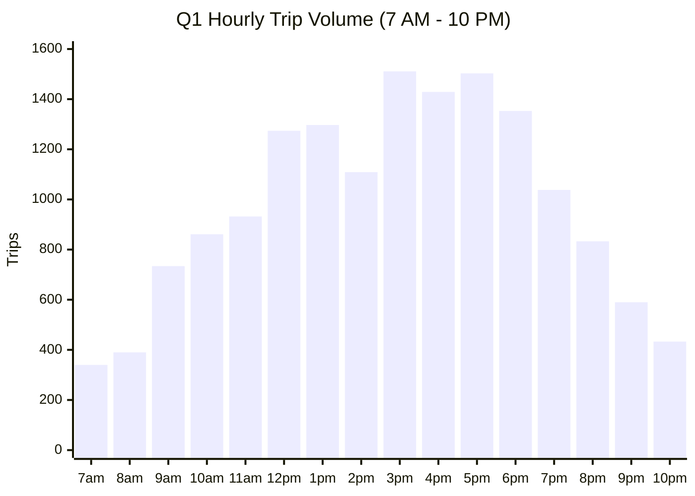
```mermaid
xychart-beta
    title "Q1 Hourly Trip Volume (7 AM - 10 PM)"
    x-axis [7am, 8am, 9am, 10am, 11am, 12pm, 1pm, 2pm, 3pm, 4pm, 5pm, 6pm, 7pm, 8pm, 9pm, 10pm]
    y-axis "Trips" 0 --> 1600
    bar [340, 390, 734, 861, 932, 1274, 1297, 1109, 1511, 1429, 1503, 1353, 1038, 833, 590, 433]
```

### Time-Block Summary

| Block | Hours | Trips | Share | Student Share |
| :--- | :--- | :---: | :---: | :---: |
| Overnight | 12 AM – 6 AM | 564 | 3.4% | 88.7% |
| **Morning Rush** | **7 AM – 10 AM** | **2,325** | **14.1%** | 79.4% |
| Midday | 11 AM – 2 PM | 4,612 | 27.9% | 76.0% |
| **Afternoon Peak** | **3 PM – 6 PM** | **5,796** | **35.1%** | 75.3% |
| Evening | 7 PM – 10 PM | 2,894 | 17.5% | 80.0% |
| Late Night | 11 PM | 313 | 1.9% | 85.3% |

---

## 7.3 Rush Hour Characterization — Morning vs. Afternoon vs. Evening

**Question:** Does Zen City have a classic dual-peak commute pattern (morning + evening), or a single dominant rush?

| Rush Period | Hours | Trips | Share | Peak Single Hour | Character |
| :--- | :--- | :---: | :---: | :---: | :--- |
| **Morning Rush** | 7–10 AM | 2,325 | 14.1% | 861 (10 AM) | Gradual ramp — students arriving on campus |
| **Afternoon Peak** | 3–6 PM | 5,796 | **35.1%** | **1,511 (3 PM)** | **Dominant rush — class dismissal wave** |
| Evening Tail | 7–10 PM | 2,894 | 17.5% | 1,038 (7 PM) | Decelerating departures + social trips |
| Combined 5–7 PM | 5–7 PM | 4,727 | 28.6% | 1,503 (5 PM) | Overlaps afternoon block |

**Finding: Zen City is an afternoon-dominant network, not a dual-peak commuter system.**

* The afternoon block (3–6 PM) generates **2.5× more trips than the morning rush** and contains both the #1 (3 PM) and #2 (5 PM) peak hours network-wide.
* The morning rush builds gradually (340 → 390 → 734 → 861) rather than spiking — consistent with students trickling onto campus rather than a synchronized 8 AM commute.
* The evening period (7–10 PM) is a **deceleration tail**, not a second rush. Volume drops monotonically from 1,038 at 7 PM to 433 at 10 PM.
* This asymmetry confirms the Section 05 finding: students ride **to** campus sinks in the afternoon but do not ride **from** them in the morning at equal volume.

**Q2 operations implication:** Rebalancing labor, battery-swap crews, and dock clearing must be **front-loaded 1:30–6:00 PM**. Morning staffing at 40% of afternoon levels is sufficient.

---

## 7.4 Day-of-Week Patterns

### Weekly Demand Curve

| Day | Trips | Share | Avg Hourly Trips (7 AM–10 PM) |
| :--- | :---: | :---: | :---: |
| Sunday | 1,783 | 10.8% | 127 |
| Monday | 2,555 | 15.5% | 182 |
| **Tuesday** | **2,953** | **17.9%** | **211** |
| **Wednesday** | **2,869** | **17.4%** | **205** |
| Thursday | 2,556 | 15.5% | 183 |
| **Friday** | **2,089** | **12.7%** | **149** |
| Saturday | 1,699 | 10.3% | 121 |

* **Tuesday and Wednesday** are peak demand days (~18% each), driven by full mid-week class schedules.
* **Friday volume drops 29%** from Tuesday's peak (2,089 vs 2,953) — the largest single-day decline in the week.
* **Weekends combined** account for only **21.1%** of Q1 volume at **35% lower daily throughput** than weekdays (133.9 vs 206.7 avg).

---

## 7.5 Hour × Day-of-Week Heatmap

The matrix below shows trip counts for every hour (rows) × day (columns) combination during operational hours. Darker cells indicate peak demand intersections.

| Hour | Sun | Mon | Tue | Wed | Thu | Fri | Sat | Row Total |
| :---: | :---: | :---: | :---: | :---: | :---: | :---: | :---: | :---: |
| **7 AM** | 8 | 41 | 82 | 70 | 84 | 43 | 12 | 340 |
| **8 AM** | 8 | 72 | 53 | 113 | 47 | 63 | 34 | 390 |
| **9 AM** | 42 | 96 | **165** | 152 | 145 | 91 | 43 | 734 |
| **10 AM** | 110 | 106 | 138 | 158 | 155 | 113 | 81 | 861 |
| **11 AM** | 92 | 165 | 136 | 201 | 122 | 118 | 98 | 932 |
| **12 PM** | 119 | 206 | 220 | **247** | 224 | 165 | 93 | 1,274 |
| **1 PM** | 141 | 211 | 234 | **241** | 193 | 172 | 105 | 1,297 |
| **2 PM** | 122 | 202 | 174 | 201 | 139 | 152 | 119 | 1,109 |
| **3 PM** | 156 | 214 | **313** | **251** | **247** | 178 | 152 | **1,511** |
| **4 PM** | 161 | **249** | **242** | 237 | 206 | 159 | 175 | 1,429 |
| **5 PM** | 157 | 229 | **278** | 231 | **244** | 182 | 182 | **1,503** |
| **6 PM** | 136 | 186 | **286** | 237 | 232 | 151 | 125 | 1,353 |
| **7 PM** | 122 | 160 | 186 | 189 | 154 | 118 | 109 | 1,038 |
| **8 PM** | 118 | 135 | 140 | 121 | 127 | 116 | 76 | 833 |
| **9 PM** | 75 | 99 | 104 | 98 | 63 | 77 | 74 | 590 |
| **10 PM** | 57 | 78 | 70 | 35 | 59 | 59 | 75 | 433 |

### Heatmap Key Findings

**Top 5 demand cells (hour × day intersections):**

| Rank | Day | Hour | Trips | Context |
| :---: | :--- | :---: | :---: | :--- |
| 1 | **Tuesday** | **3 PM** | **313** | Single highest cell in the dataset |
| 2 | Tuesday | 6 PM | 286 | Late-afternoon secondary wave |
| 3 | Tuesday | 5 PM | 278 | Class dismissal peak |
| 4 | Wednesday | 3 PM | 251 | Mid-week afternoon surge |
| 5 | Monday | 4 PM | 249 | Monday recovery peak |

* **Tuesday 3 PM (313 trips)** is the network's temporal epicenter — the single hour-day combination driving maximum bottleneck stress at PCL and Dean Keeton.
* **3–6 PM cells are uniformly hot across Tue–Thu** — every cell in this block exceeds 200 trips on at least one weekday.
* **Saturday and Sunday 7–8 AM cells are near-zero** (8 trips each) — confirming no weekend morning commute.
* **Weekend afternoons remain active** — Saturday 3–5 PM (152–182 trips/hour) supports the leisure-rider thesis from Section 03.

---

## 7.6 Friday Pattern — Early Departure Effect

Friday is the most structurally distinct weekday. Rather than a single peak, demand **compresses into late morning and early afternoon before collapsing**:

### Friday Hourly Profile

| Phase | Hours | Friday Trips | Tuesday Trips (comparison) | Friday as % of Tuesday |
| :--- | :--- | :---: | :---: | :---: |
| Morning | 7–10 AM | 310 | 538 | 57.6% |
| Midday | 11 AM – 2 PM | 607 | 1,032 | 58.8% |
| **Afternoon** | **3–6 PM** | **670** | **1,119** | **59.9%** |
| Evening | 7–10 PM | 388 | 615 | 63.1% |
| **Full day** | — | **2,089** | **2,953** | **70.7%** |

Friday's 3–6 PM block carries only **670 trips (4.1% of all Q1 volume)** compared to Tuesday's **1,119 (6.8%)** — a **40% deficit** in the most operationally critical window.

**Interpretation:** Students leave campus early on Fridays, reducing afternoon bike demand precisely when weekday rebalancing crews are fully deployed. This creates a **Friday operations inefficiency** — staffing levels calibrated for Tuesday are over-resourced for Friday by ~40%.

**Q2 action:** Shift Friday 3–6 PM rebalancing crew capacity to **Friday 10 AM – 1 PM** (when Friday midday volume is still 59% of Tuesday) and redeploy surplus labor to weekend leisure hubs (Pfluger Ped Bridge, East 6th/Medina).

---

## 7.7 Weekend Temporal Profile

Weekends operate under a different temporal logic — lower volume but a **shifted peak window**:

| Metric | Weekday | Weekend | Difference |
| :--- | :---: | :---: | :--- |
| Daily average trips | 206.7 | 133.9 | **−35.2%** |
| Peak hour | 3 PM (1,511 network-wide) | **5 PM (339 weekend-only)** | +2 hours later |
| Top 3 weekend hours | — | 5 PM (339), 4 PM (336), 3 PM (308) | Afternoon leisure block |
| Student share (3–6 PM) | 75.3% | ~72% (estimated) | Slightly more diverse |

Weekend demand peaks **2 hours later** than weekdays (5 PM vs 3 PM), aligning with recreational activity rather than class schedules. The afternoon block still dominates (3–6 PM accounts for ~38% of weekend trips), but the curve is flatter and more spread across Saturday and Sunday equally.

**Q2 action:** Weekend classic-bike stocking at Pfluger and East 6th should target **2–6 PM Saturday–Sunday**, not the weekday 3 PM peak.

---

## 7.8 Anomaly Investigation — March 18, 2022

Section 02 flagged March 18 as a statistical outlier. Full temporal forensics:

| Metric | March 18 Value | Q1 Average | Deviation |
| :--- | :---: | :---: | :--- |
| Daily trips | **6** | 185.4 | **−96.8%** |
| Day of week | Friday | — | — |
| Active hours | 8 AM – 12 PM only | 7 AM – 10 PM | Partial-day gap |
| Hourly distribution | 1–2 trips/hour (8–12) | 185/day | Near-zero |

| Hour | March 18 Trips |
| :---: | :---: |
| 8 AM | 1 |
| 9 AM | 1 |
| 10 AM | 1 |
| 11 AM | 1 |
| 12 PM | 2 |
| All other hours | **0** |

**Conclusion:** March 18 is a **partial-day system failure**, not a demand signal. Trip logging ceased after noon on a Friday, producing only 6 records vs the expected ~150+ for a Friday. Likely causes: scheduled maintenance, network outage, or data pipeline interruption.

**Impact on Q2 forecasting:** March 18 must be **excluded from daily trend models** and treated as a missing-data day. Including it would artificially deflate March averages and corrupt growth-rate projections. Adjacent days (March 17: normal volume; March 28–31: 300+ trips/day) confirm the network was healthy before and after the event.

---

## 7.9 Station-Level Temporal Alignment

Top origin stations share the afternoon peak window but peak at **different specific hours** — confirming the staggered rebalancing wave identified in Section 04:

| Station | Peak Departure Hour | Peak Departures | Pre-Peak Hour (next highest) |
| :--- | :---: | :---: | :---: |
| Dean Keeton/Speedway | **4 PM** | 322 | 3 PM (319) |
| 21st/Guadalupe | **5 PM** | 242 | 6 PM (212) |
| 23rd/San Gabriel | **5 PM** | 171 | 9 AM (168) |
| 28th/Rio Grande | **5 PM** | 168 | 3 PM (varies) |
| 22nd/Pearl | **6 PM** | 166 | 5 PM (varies) |

The demand wave moves **north to west to south** between 4 PM and 6 PM — Dean Keeton peaks first, Guadalupe/San Gabriel 1 hour later, Pearl last. Rebalancing crews following a single 4 PM schedule will always be **60–120 minutes behind** the actual demand front.

---

## 7.10 Q2 Temporal Operations Playbook

| Time Window | Day Scope | Action | Rationale |
| :--- | :--- | :--- | :--- |
| **1:30–2:30 PM** | Tue–Thu | Pre-stock Dean Keeton + Guadalupe | Beat 4 PM exporter bottleneck |
| **2:30–5:30 PM** | Tue–Thu | PCL continuous clearing cycle | 145% overcapacity; 58 arr/dock in 4-hr block |
| **3:00–6:00 PM** | Tue–Thu | Staggered west-campus rebalancing | Follow 4→5→6 PM demand wave |
| **10:00 AM – 1:00 PM** | Friday | Reduced crew — reposition to leisure hubs | Friday PM demand −40% vs Tuesday |
| **2:00–6:00 PM** | Sat–Sun | Classic-bike buffer at Pfluger + East 6th | Weekend leisure peak; 39.5% weekend share |
| **Exclude** | March 18-type gaps | Flag partial-day zeros in pipeline | Prevent forecast corruption |

---

### Section 07 Summary

| Temporal Finding | Key Metric | Q2 Implication |
| :--- | :--- | :--- |
| Dominant rush window | 3–6 PM = **35.1%** of all Q1 trips | Staff 2.5× morning levels |
| Peak hour-day cell | **Tuesday 3 PM — 313 trips** | Maximum bottleneck stress point |
| Network type | Afternoon-dominant, not dual-peak | No evening rush infrastructure needed |
| Peak month/week | February / ISO weeks 6–7 (~2,350/week) | Q2 upper bound benchmark |
| Peak single day | Feb 10 — **412 trips** | Daily capacity ceiling |
| Friday effect | −40% in 3–6 PM vs Tuesday | Reallocate Friday PM crews |
| Weekend shift | Peak at 5 PM (not 3 PM) | Later leisure stocking window |
| March 18 anomaly | 6 trips — partial outage | Exclude from forecasting |
| Demand wave | 4 PM north → 5 PM west → 6 PM south | Stagger rebalancing 60 min apart |

*Section 07 complete. Proceed to **Section 08 — Customer Segmentation**.*

---
# **08 — Customer Segmentation**

## Overview & Segmentation Framework

Previous sections established *what* the network does (volume, bottlenecks, timing). Customer segmentation defines *who* drives each behavior — enabling tier-specific pricing, targeted marketing, and fleet allocation for Q2 growth.

Because Zen City has no explicit "Faculty" or "Visitor" field, this analysis constructs **five data-driven personas** from observable fields: `subscriber_type`, trip duration, station affinity, bike preference, time-of-day behavior, and ride frequency.

| Persona | Proxy Definition | Q1 Trips | Share |
| :--- | :--- | :---: | :---: |
| **P1 — Campus Commuter** | Student Membership + U.T. Student Membership | 12,796 | **77.5%** |
| **P2 — Local Recurring** | Local31 + Local365 | 2,345 | 14.2% |
| **P3 — Leisure & Visitor** | Explorer + 3-Day Weekender + 24-Hr Walk-Up + Pay-as-you-ride | 1,220 | 7.4% |
| **P4 — Casual Single-Trip** | Single Trip (Pay-as-you-ride) + HT Ram + Annual | 143 | 0.9% |
| **P5 — Power User** | Any customer with ≥ 10 Q1 trips (cross-tier) | 16,353 | **99.1%** |

*Note: Personas P1–P4 are tier-based and overlap at the customer level. P5 is a frequency overlay — 568 individual customers account for 99.1% of all trips regardless of tier.*

---

## 8.1 Persona Profiles

### P1 — Campus Commuter (Student Tiers)

The operational core of Zen City. Every registered customer (`N = 586`) used a student tier at least once in Q1 — there are **zero customers who exclusively use non-student tiers**.

| Attribute | Value | Interpretation |
| :--- | :---: | :--- |
| Trips | 12,796 | 77.5% of all Q1 volume |
| Unique customers | 586 (all registered users) | 21.5 avg trips/customer on student tier |
| Median duration | **5 min** | Ultra-short campus hops |
| Mean duration | 15.5 min | Right-skewed; thin long-ride tail |
| Electric share | 88.6% | Strong e-bike preference |
| Peak hour | **3 PM** (1,171 trips) | Class dismissal |
| Weekend share | 17.7% | Weekday-dominant |
| Top origin | Dean Keeton/Speedway (2,719) | Northern campus gateway |
| Top destination | **PCL (3,376)** | Academic sink |

**Behavioral signature:** High frequency, ultra-short, weekday afternoon, campus corridor, electric-preferred. Treat as a **throughput problem**, not a revenue-per-trip problem.

### P2 — Local Recurring (Local31 + Local365)

The closest proxy for faculty, staff, and non-student residents. Combined **2,345 trips (14.2%)** with meaningfully different behavior from students.

| Attribute | Local31 | Local365 | Combined |
| :--- | :---: | :---: | :---: |
| Trips | 1,286 | 1,059 | 2,345 |
| Median duration | 23 min | 9 min | ~15 min blended |
| Mean duration | 34.4 min | 21.3 min | — |
| Electric share | 94.3% | 86.6% | ~90% |
| Peak hour | 5 PM | 3 PM | **5 PM** (291 trips) |
| Weekend share | 28.5% | 25.1% | ~27% |
| Top origin | 28th/Rio Grande | — | West campus / Rio Grande corridor |
| Trips per customer | 3.2 | 3.0 | Low frequency, high loyalty |

**Behavioral signature:** Longer rides than students, later peak (5 PM vs 3 PM), higher weekend share (+10 pp vs students), and spread across Rio Grande / Pfluger / East 6th corridors rather than the PCL sink. Local31 users in particular take **4–5× longer trips** than students (23 vs 5 min median).

### P3 — Leisure & Visitor (Explorer + Pass Holders + Pay-as-you-ride)

Combined **1,220 trips (7.4%)** — low volume but highest per-trip duration and weekend concentration.

| Tier | Trips | Median Duration | Weekend Share | Top Origin |
| :--- | :---: | :---: | :---: | :--- |
| Explorer | 402 | 30 min | **41.8%** | Pfluger Ped Bridge |
| 3-Day Weekender | 232 | 21 min | **45.3%** | Pfluger / East 6th |
| 24-Hr Walk Up Pass | 143 | **42 min** | **53.8%** | Pfluger / DKR Stadium |
| Pay-as-you-ride | 443 | 18 min | 40.4% | Pfluger / East 6th |

**Combined leisure segment top origins:**
1. Pfluger Ped Bridge — 242 trips
2. East 6th/Medina — 132 trips
3. DKR Stadium — 101 trips

**Behavioral signature:** Long rides (18–42 min median), majority weekend usage (40–54%), classic-bike share 2–3× the network average (17–26% vs 12.3%), concentrated at leisure hubs — not campus corridors. These users generate **higher per-minute revenue** but do not drive bottleneck stress.

### P4 — Casual Single-Trip (Marginal Tier)

Single Trip Pay-as-you-ride (137), HT Ram (4), and Annual (2) combined = **143 trips (0.9%)**. Too small for standalone operational strategy; fold into P3 marketing campaigns.

---

## 8.2 Ride-Length Segmentation

Duration-based segments cut across tiers and reveal the network's **micro-mobility vs. leisure** split:

| Segment | Duration | All Users | Share | Student Share | Non-Student Share |
| :--- | :--- | :---: | :---: | :---: | :---: |
| **Micro** | 1–6 min | 9,204 | 55.8% | 8,426 (65.8% of students) | 778 (21.0%) |
| **Short** | 7–15 min | 4,056 | 24.6% | 3,154 (24.6%) | 902 (24.3%) |
| **Medium** | 16–30 min | 1,466 | 8.9% | 624 (4.9%) | 842 (22.7%) |
| **Long** | 31+ min | 1,778 | 10.8% | 592 (4.6%) | 1,186 (32.0%) |

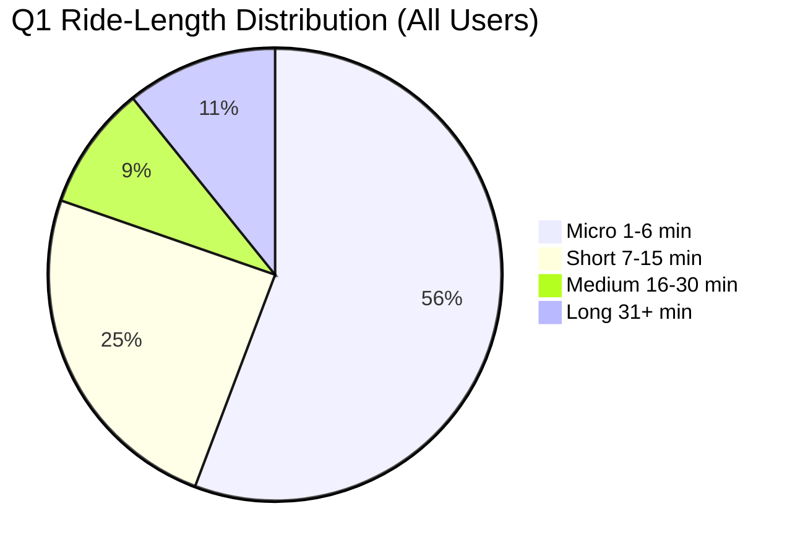
```mermaid
pie title Q1 Ride-Length Distribution (All Users)
    "Micro 1-6 min" : 55.8
    "Short 7-15 min" : 24.6
    "Medium 16-30 min" : 8.9
    "Long 31+ min" : 10.8
```

* **90.4% of student trips** fall in the Micro + Short bands (≤ 15 min). Students essentially never take medium or long rides (9.5% combined).
* **Non-student users dominate medium and long segments** — 54.7% of all 31+ minute trips come from just 22.5% of total volume. A small non-student base generates disproportionate ride time, affecting bike availability and battery depletion.

---

## 8.3 Station Affinity by Persona

### Campus Commuter Corridors (Student Top Routes)

| Rank | Route (Origin → Destination) | Student Trips | Share of Student Volume |
| :---: | :--- | :---: | :---: |
| 1 | Dean Keeton/Speedway → **PCL** | 789 | 6.2% |
| 2 | 23rd/San Gabriel → **PCL** | 661 | 5.2% |
| 3 | 22nd/Pearl → **PCL** | 583 | 4.6% |
| 4 | Dean Keeton/Speedway → 26th/Nueces | 411 | 3.2% |
| 5 | 21st/Guadalupe → **PCL** | 401 | 3.1% |
| 6 | 28th/Rio Grande → **PCL** | 364 | 2.8% |

**Six student routes to PCL account for 2,599 trips — 20.3% of all student volume** on just six origin-destination pairs. This extreme corridor concentration is the segmentation finding with the highest operational leverage.

### Leisure & Local Station Preferences (Contrasted)

| Persona | Top Origin Station | Trips | Campus Hub Share |
| :--- | :--- | :---: | :---: |
| **Student** | Dean Keeton/Speedway | 2,719 | 90.7% student share at hub |
| **Local31** | 28th/Rio Grande | 259 | 77.1% |
| **Explorer** | Pfluger Ped Bridge | 120 | **9.6%** |
| **Pay-as-you-ride** | Pfluger Ped Bridge | 101 | **9.6%** |

Students and leisure users **do not share origin stations**. Pfluger Ped Bridge — the #1 leisure origin — carries only 9.6% student share vs 90.7% at Dean Keeton.

---

## 8.4 Bike Preference by Persona

| Persona | Electric Share | Classic Share | Classic Use Case |
| :--- | :---: | :---: | :--- |
| Campus Commuter (Student) | 88.6% | 11.4% | Overflow when e-bikes depleted |
| Local Recurring (Local31) | 94.3% | 5.7% | Rare — strong e-bike loyalty |
| Local Recurring (Local365) | 86.6% | 13.4% | Occasional fallback |
| Leisure (Explorer) | 82.6% | **17.4%** | Recreational trail preference |
| Casual (Pay-as-you-ride) | 73.8% | **26.2%** | Highest classic share — budget/leisure |
| 3-Day Weekender | 81.5% | 18.5% | Weekend classic loops |

Classic bikes are **persona-specific**, not station-specific: Pay-as-you-ride and Explorer users choose classics at **2× the student rate**, primarily at Pfluger and East 6th leisure corridors.

---

## 8.5 Temporal Preferences by Persona

| Persona | Peak Hour | Weekend Share | Afternoon Block Share (est.) | Temporal Profile |
| :--- | :---: | :---: | :---: | :--- |
| Campus Commuter | **3 PM** | 17.7% | ~35% | Weekday afternoon dismissal |
| Local31 | **5 PM** | 28.5% | ~30% | End-of-workday departure |
| Local365 | 3 PM | 25.1% | ~28% | Hybrid commuter |
| Explorer | 3 PM | **41.8%** | ~32% | Afternoon weekend leisure |
| Pay-as-you-ride | 5 PM | **40.4%** | ~30% | Visitor exploration |
| 3-Day Weekender | — | **45.3%** | — | Weekend-only pattern |
| 24-Hr Walk Up Pass | — | **53.8%** | — | Tourism / event-driven |

**Segment-specific timing confirms Section 07:** A single rebalancing schedule cannot serve all personas. Students need 3 PM campus corridor service; Local31 needs 5 PM extended-route coverage; leisure tiers need weekend 2–6 PM at Pfluger.

---

## 8.6 Customer Frequency & Loyalty — The Power User Layer

Beyond tier-based personas, **ride frequency** reveals who actually drives network volume:

| Frequency Band | Customers | Trips | Share of All Trips | Avg Trips/Customer |
| :--- | :---: | :---: | :---: | :---: |
| 1–5 trips | 1 | 1 | 0.0% | 1.0 |
| 6–20 trips | 415 | 4,130 | 25.0% | 10.0 |
| 21–50 trips | 150 | 5,769 | 34.9% | 38.5 |
| **51+ trips** | **20** | **6,604** | **40.0%** | **330.2** |
| **≥ 10 trips (combined)** | **568** | **16,353** | **99.1%** | **28.8** |

```mermaid
graph TD
    subgraph Power_Users["568 Power Users (≥10 trips)"]
        PU[99.1% of ALL Q1 trips]
    end
    subgraph Top20["Top 20 Users (51+ trips)"]
        T20[40.0% of ALL Q1 trips<br>330 avg trips each]
    end
    subgraph Long_Tail["Remaining 18 users"]
        LT[Negligible volume]
    end
    T20 --> PU
    LT --> PU
    style T20 fill:#f96,stroke:#333,stroke-width:2px
    style PU fill:#bbf,stroke:#333,stroke-width:2px
```

**Critical finding:** Just **20 customers** (3.4% of registered users) generated **6,604 trips — 40.0% of the entire Q1 network**. The top customer (C-0011, Student Membership) logged **332 trips** in 89 days — 3.7 trips per day.

This is not a broad user base driving growth — it is an **extremely concentrated power-user cohort** of heavy student commuters. Q2 growth strategies must prioritize **retaining and enabling these 568 high-frequency users** rather than broad acquisition campaigns.

---

## 8.7 CRM Cross-Reference — Subscriber vs. Customer Status

The `customer_user_type` field adds a retention lens across tiers:

| CRM Status | Primary Tier Association | Trips | Insight |
| :--- | :--- | :---: | :--- |
| Subscriber | Student Membership | 8,014 | Recurring student relationship |
| Customer | Student Membership | 4,561 | Transactional student accounts |
| Subscriber | Local31 / Local365 | 1,454 | Loyal local base |
| Customer | Local31 / Local365 | 891 | Trial / casual local users |

**4,561 student trips (35.6% of student volume)** come from CRM-classified `Customer` accounts — riders who use Student Membership but are not formal subscribers. This is a **conversion pool**: moving Customer → Subscriber could improve retention and enable semester-pass pricing for the highest-frequency cohort.

---

## 8.8 Q2 Segment-Targeted Strategy Matrix

| Persona | Q2 Growth Lever | Target Metric | Specific Action |
| :--- | :--- | :--- | :--- |
| **P1 Campus Commuter** | Throughput at PCL corridor | Trips/day near 412 ceiling | PCL dock expansion; 3 PM rebalancing wave |
| **P2 Local Recurring** | Extend peak coverage to 5 PM | +Local31 trip duration retention | Dedicated 5 PM bike staging at Rio Grande |
| **P3 Leisure & Visitor** | Weekend revenue capture | +40% weekend share tiers | Classic fleet at Pfluger; Fri–Sun marketing |
| **P5 Power Users (568)** | Retention of top 20 (40% of trips) | ≥ 330 trips/Q2 per power user | Loyalty rewards; priority dock access |
| **CRM Conversion** | Customer → Subscriber | 4,561 transactional student trips | Semester pass upsell campaign |

---

### Section 08 Summary — Segmentation Determining Keys

| Key | Finding | Strategic Weight |
| :--- | :--- | :--- |
| Dominant persona | Campus Commuter — 77.5% | Fleet & dock priority |
| Corridor concentration | 6 routes to PCL = 20.3% of student trips | Infrastructure ROI focus |
| Non-student value | 22.5% of trips, 54.7% of long rides | Pricing tier differentiation |
| Leisure geography | Pfluger + East 6th — separate from campus | Split ops playbook |
| Power user concentration | 20 users = 40% of all trips | Retention > acquisition |
| Classic bike persona | Pay-as-you-ride (26.2%) + Explorer (17.4%) | Leisure stocking, not campus |
| CRM conversion pool | 4,561 student Customer-status trips | Subscription upsell target |

*Section 08 complete. Business recommendations and predictive modeling I will continue in **[`04_Predictive_Modeling.md`](04_Predictive_Modeling.md)** *

---


