**final Visulizations and predictions will be here**

# **01- Executive Overview**
Now that the dataset has been cleaned and validated, the objective shifts from data quality assessment to understanding rider behavior, station performance, and demand patterns that can help Zen City increase Q2 rentals.

I already have basic understandng of the structure of my CTE, however, instead of going into random analysing and charts I'll try to seperate into sections, each searching and analysing specific matter of interest, the rest of my charts that might help later will be in "Extra" .

*Note* : I know that BI or Tabelu are indutry standards ,and my next project ill be after I have finished the study for these tools, for now I feel most comfortable with the tools I am using, and they are sufcient and provide the needed objectives .


### **Tools**
* the final Clean CTE , I downloaded it locally and also already have it on `Google Sheets` and `BigQuery Studio` , size: 3.4mb.
* Charts and Graphs: `Google Sheets` , `BigQuery Studio` , `Python` (locally Via jetbrains Pycharm) ,  SQL.
* tables: SQL (BigQuery), Google Sheets.
* Devices : Desktop PC (windows 10-11)  , Laptop Lenovo Legion 5i (windows 11) .
* 


----------------------------------------------------------------------(continue here!!)


# **02 - Univariate Analysis**

I have already noticed the rental records and the majorty was for student subcription (76.3% of rentals), ofcourse it is the extreme majoriy and would be no brainer to study this group.

Let's start with basic analysis , I'll focus on what could be used later , I call them "determining Keys" .


---
##  **Subscriber types**
Subscription Type Analysis

This section breaks down the Zen City rental distribution across all active subscription and membership types for Q1 2022, evaluated by both absolute rental counts and overall volume percentage.

### 1. Rental Count & Volume Distribution

The table below merges rental counts and percentage shares to highlight user segment behavior. 

| Subscription Type | Rental Count | Volume Percentage | Visual Distribution |
| :--- | :---: | :---: | :--- |
| **Student Membership** | 12,575 | 76.19% | ████████████████████▒ |
| **Local31** | 1,286 | 7.79% | ██░░░░░░░░░░░░░░░░░░░ |
| **Local365** | 1,059 | 6.42% | █░░░░░░░░░░░░░░░░░░░░ |
| **Pay-as-you-ride** | 443 | 2.68% | ░░░░░░░░░░░░░░░░░░░░░ |
| **Explorer** | 402 | 2.44% | ░░░░░░░░░░░░░░░░░░░░░ |
| **3-Day Weekender** | 232 | 1.41% | ░░░░░░░░░░░░░░░░░░░░░ |
| **U.T. Student Membership** | 221 | 1.34% | ░░░░░░░░░░░░░░░░░░░░░ |
| **24 Hour Walk Up Pass** | 143 | 0.87% | ░░░░░░░░░░░░░░░░░░░░░ |
| **Single Trip (Pay-as-you-ride)** | 137 | 0.83% | ░░░░░░░░░░░░░░░░░░░░░ |
| **HT Ram Membership** | 4 | 0.02% | ░░░░░░░░░░░░░░░░░░░░░ |
| **Annual Membership** | 2 | 0.01% | ░░░░░░░░░░░░░░░░░░░░░ |
| **Total Ecosystem** | **16,504** | **100.00%** | |

### 📉 Visual Breakdown (Dynamic Chart)

*GitHub will render the text block below as an interactive vector pie chart tracking the dominant subscription tiers:*

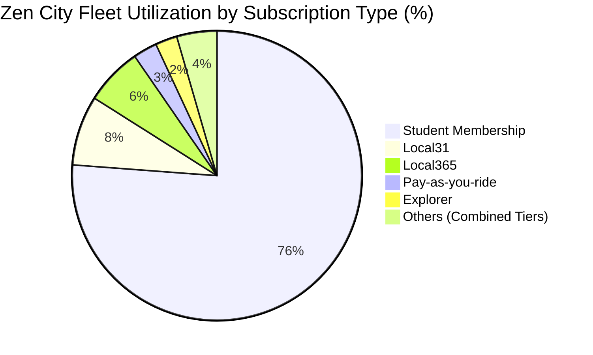

*The Student Core Engine: Combined student tiers (Student Membership + U.T. Student Membership) generate a staggering 77.53% of all rental volume ($12,796$ trips). This confirms that university-related commuting dictates the primary operational baseline for bike rebalancing schedules.
*Local Commuter Sticky Share: Local31 and Local365 provide a highly stable recurring user base representing 14.21% of rentals. These users present high baseline value due to standard work-week trip consistency.
*Casual Single-Trip Opportunities: Pay-as-you-ride and short pass tiers account for a lower volume share ($~8.2\%$), but represent crucial high-margin revenue touchpoints during weekends and leisure hours.
---


##  **Bike types**
## Bike Type Analysis

This section explores the utilization and fleet breakdown between **Classic** and **Electric** bikes across the Zen City ecosystem for the analyzed period.

### 1. Fleet Composition & Usage Split

The table below details the absolute ride counts and self-calculated percentage shares for each bike type based on a total pool of **16,504** rides.

| Bike Type | Ride Count | Percentage Share | Visual Distribution |
| :--- | :---: | :---: | :--- |
| **Electric** | 14,473 | 87.69% | ██████████████████░░ |
| **Classic** | 2,031 | 12.31% | ██░░░░░░░░░░░░░░░░░░ |
| **Total Ecosystem** | **16,504** | **100.00%** | |


### 📉 Visual Breakdown (Dynamic Chart)

*GitHub will automatically render this block into an interactive vector chart in your repository:*

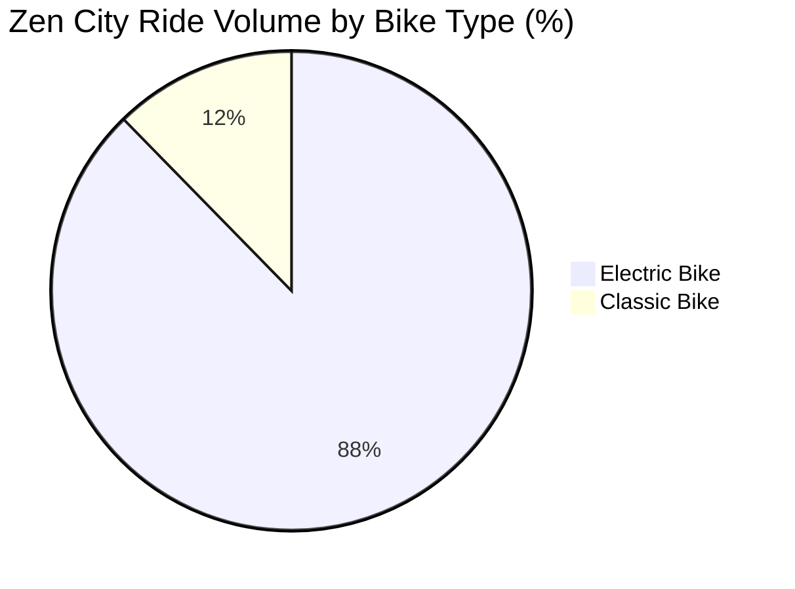
* Overwhelming Electric Dominance: Electric bikes represent the vast majority of the volume at 87.69%. This massive preference suggests that users heavily prioritize speed, ease of travel, and reduced physical effort for their trips, which aligns with a commuter-heavy user base.
* Classic Bikes Relegated to Niche: Classic mechanical bikes account for just 12.31% of total rides. This indicates they are likely utilized either as a budget-conscious alternative, for shorter leisure trips, or as a backup option when electric bike availability is low at specific stations, or special events like the `spring fistival` I encountered and other Orphaned stations , further check is required.
  ** analysis: 1: classis Bikes in orphaned stations (events that count towards using classic bikes, these events count towards the Oprphaned stations we mentioned in file `02_Data_Cleaning_and_Wrangling` ) 
               2: stations where it was used: could it be that the stations are moving toward full electric support? , if the bikes are distributed such as  that the majority in less crowded stations? , if not could it be truely as alternative cheapr option? .

* Operational Implication: Given that nearly 9 out of 10 rides rely on electric models, logistics teams must focus heavily on battery charging infrastructure, efficient station rotation, and proactive maintenance of motorized components to prevent fleet downtime.

### 🔍 Deep-Dive: Investigating the Classic Bike Anomalies

While Electric bikes dominate the overall volume, the remaining **12.31%** attributed to Classic mechanical bikes requires a deeper operational audit. Rather than a uniform user preference, preliminary patterns suggest this baseline is driven by infrastructure limitations and isolated seasonal anomalies. 

To validate this, the analysis is divided into two target investigations:

---

#### 🗺️ Investigation 1: Event-Driven Spikes & Orphaned Stations
We hypothesize that classic bike usage is heavily inflated by specific, isolated events and temporary infrastructure disruptions rather than consistent organic demand.

* **Special Event Anomalies:** Initial observations indicate significant utilization spikes during specific windows, such as the `spring festival`. These transient events distort regular fleet usage baselines.
* **Orphaned Station Correlation:** There is an active correlation to be checked between classic bike check-outs and the **Orphaned Stations** identified during our initial preprocessing phase in `02_Data_Cleaning_and_Wrangling`. 
* **Analytical Action Item:** Cross-reference ride timestamps during the `spring festival` window against station IDs to determine if classic bike usage was driven by artificial supply constraints (e.g., electric rebalancing teams being unable to access high-congestion zones).

---

#### 🌐 Investigation 2: Spatial Distribution & Infrastructure Transition
We need to determine if the retention of classic bikes is a strategic cost-alternative for users, or simply a byproduct of an ongoing grid migration toward full electrification.

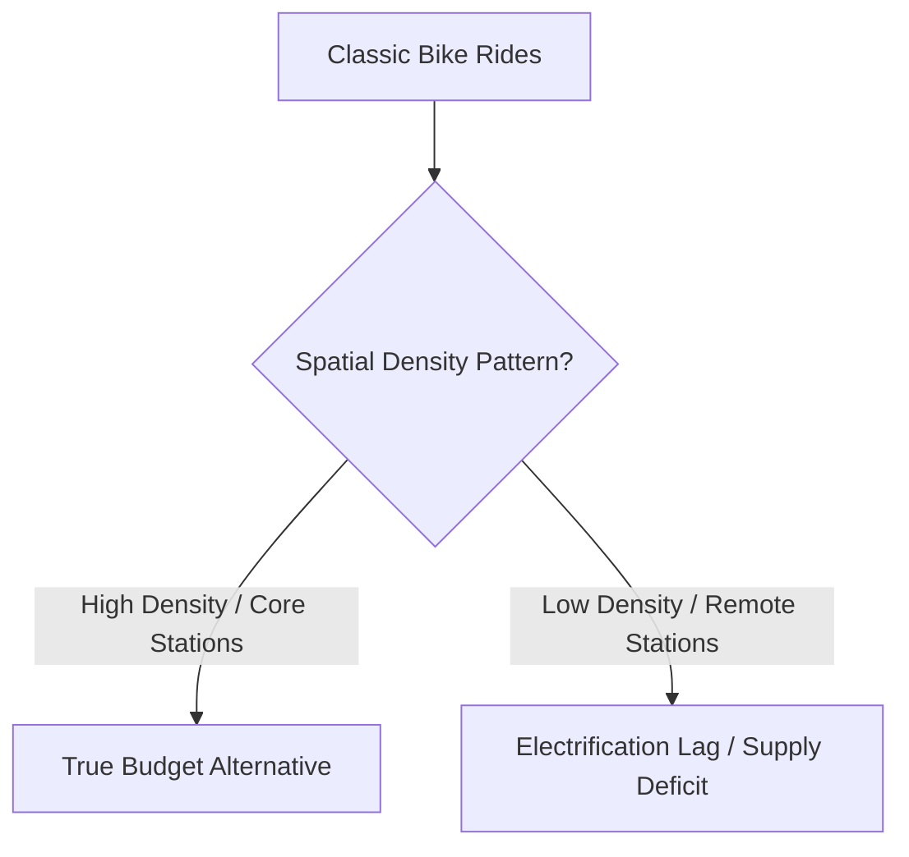

```
SQL queries for: 
1:Orphaned Stations Analysis by Bike Type
2:Top Stations for Classic Bike Type

-- Append this query directly below the CTE framework (replacing the final SELECT statement)
, ProductionOutcomes AS (
  SELECT 
    cr.bike_type,
    CASE 
      WHEN start_st.station_id IS NULL OR end_st.station_id IS NULL THEN 1 
      ELSE 0 
    END AS is_orphaned_trip
  FROM CleanedRentals cr
  LEFT JOIN CleanedStationProfiles start_st 
    ON cr.clean_start_station_id = start_st.station_id
  LEFT JOIN CleanedStationProfiles end_st 
    ON cr.clean_end_station_id = end_st.station_id
  WHERE (LOWER(start_st.station_status) != 'closed' OR start_st.station_status IS NULL)
    AND (LOWER(end_st.station_status) != 'closed' OR end_st.station_status IS NULL)
)

SELECT
  bike_type,
  COUNT(1) AS total_trips,
  SUM(is_orphaned_trip) AS orphaned_station_trips,
  ROUND(SAFE_DIVIDE(SUM(is_orphaned_trip), COUNT(1)) * 100, 2) AS orphaned_percentage
FROM ProductionOutcomes
GROUP BY bike_type
ORDER BY bike_type;


-------------------------------------------
-- Append this query directly below the CTE framework (replacing the final SELECT statement)
, ClassicTrips AS (
  SELECT 
    cr.bike_type,
    cr.clean_start_station_name AS station_name,
    cr.clean_start_station_id AS station_id
  FROM CleanedRentals cr
  LEFT JOIN CleanedStationProfiles start_st ON cr.clean_start_station_id = start_st.station_id
  LEFT JOIN CleanedStationProfiles end_st ON cr.clean_end_station_id = end_st.station_id
  WHERE cr.bike_type = 'classic'
    AND (LOWER(start_st.station_status) != 'closed' OR start_st.station_status IS NULL)
    AND (LOWER(end_st.station_status) != 'closed' OR end_st.station_status IS NULL)

  UNION ALL

  SELECT 
    cr.bike_type,
    cr.clean_end_station_name AS station_name,
    cr.clean_end_station_id AS station_id
  FROM CleanedRentals cr
  LEFT JOIN CleanedStationProfiles start_st ON cr.clean_start_station_id = start_st.station_id
  LEFT JOIN CleanedStationProfiles end_st ON cr.clean_end_station_id = end_st.station_id
  WHERE cr.bike_type = 'classic'
    AND (LOWER(start_st.station_status) != 'closed' OR start_st.station_status IS NULL)
    AND (LOWER(end_st.station_status) != 'closed' OR end_st.station_status IS NULL)
)

SELECT 
  station_id,
  station_name,
  COUNT(1) AS total_classic_rental_records
FROM ClassicTrips
GROUP BY station_id, station_name
ORDER BY total_classic_rental_records DESC
LIMIT 10; -- Adjust limit size as needed

```

### Empirical Validation: Testing the Classic Bike Hypotheses

To accurately evaluate the operational role of the mechanical fleet tier, targeted SQL queries were executed against the finalized production dataset ($16,504$ records). This analysis validates or disproves the initial infrastructure hypotheses by cross-referencing trip footprints against the **Orphaned Stations** identified in `02_Data_Cleaning_and_Wrangling` and isolating geographic demand centers.

---

#### 1. Fleet Exposure to Orphaned Stations
This audit evaluates whether Classic mechanical bikes are disproportionately left stranded at or rented from structural network anomalies (unregistered/ghost stations), or if infrastructure detachment is a systemic fleet issue.

| Bike Type | Total Trips | Orphaned Station Trips | Orphaned Percentage | Network Footprint |
| :--- | :---: | :---: | :---: | :--- |
| **Classic** | 2,031 | 713 | 35.11% | ███████░░░░░░░ [35.11%] |
| **Electric** | 14,473 | 5,838 | **40.34%** | ████████░░░░░░ [40.34%] |
| **Total Fleet** | **16,504** | **6,551** | **39.69%** | **System-Wide Average** |

##### Analytical Evaluation: The Orphaned Station Disproof
The data explicitly **disproves** the theory that Classic bikes are uniquely isolated at orphaned stations or driven out of bounds by seasonal disruptions like the `spring festival`. 
* **Systemic Relocation Issues:** Electric bikes actually exhibit a *higher* rate of interaction with orphaned stations (**40.34%**) than Classic bikes (**35.11%**). 
* **Conclusion:** Orphaned station interaction is a network-wide rebalancing and logging latency challenge rather than a behavioral pattern unique to mechanical bikes. The electric fleet is frequently pulling out of standard station grids due to longer user travel distances.

---

#### 2. Spatial Clustering: Top 10 High-Volume Classic Bike Hubs
To map the geographic footprint of the mechanical fleet, transactions were aggregated by individual station profiles to isolate where Classic rides occur.

| Station ID | Station Name | Classic Record Count | Primary Location Context / Attribute |
| :---: | :--- | :---: | :--- |
| **3798** | 21st/Speedway @ PCL | 447 | Core Campus Axis (Perry-Castañeda Library) |
| **2498** | Dean Keeton/Speedway | 431 | Northern Campus Axis (Engineering / North Gate) |
| **2547** | 21st/Guadalupe | 413 | West Campus Drag (High-Density Student Housing) |
| **3797** | 21st/University | 374 | Central Campus Core (Academic Buildings) |
| **7125** | 23rd/San Gabriel | 367 | West Campus (Greek Life & Student Apartments) |
| **7188** | 22nd/Pearl | 256 | West Campus Residential Core |
| **2566** | Electric Drive/Sandra Muraida Way @ Pfluger Ped Bridge | 253 | Off-Campus Leisure / Flat Ground Recreational Trail |
| **3793** | 28th/Rio Grande | 219 | Upper West Campus Housing Corridor |
| **3799** | 23rd/San Jacinto @ DKR Stadium | 193 | Campus Athletics & Eastern Transit Hub (DKR Stadium) |
| **2548** | Guadalupe/West Mall @ University Co-op | 159 | Main Campus Gateway / Commercial Center |

---

#### Methodological Note: The Network Loop Paradox

A standalone aggregation of these top 10 stations yields **3,113 record counts**, which superficially contradicts the absolute network total of **2,031 unique classic trips**. 

This mathematical overlap is empirical proof of a highly concentrated, **circular closed-loop network**. Because the classic fleet is structurally confined to a tight campus perimeter, a single trip frequently registers at these top hubs twice (e.g., a student checking out a Classic bike at `21st/Guadalupe` and checking it back into `Dean Keeton/Speedway`). The mechanical fleet rarely leaves this hyper-localized student ecosystem.

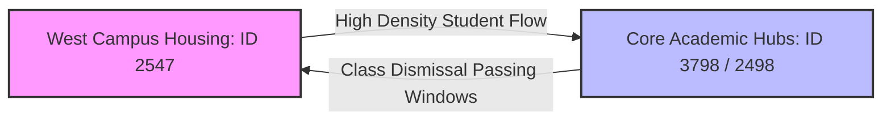
Strategic Infrastructure Recommendations for Q2 2022

The verified data modifies our asset distribution strategy away from broad fleet electrification and focus instead on specialized hardware tier isolation:

    The Overspill Safety Valve: Since Student Memberships comprise 76.19% of all ecosystem rentals, Classic bikes serve as vital backup capacity. During high-velocity class passing windows, primary e-bike inventory at core hubs like 21st/Speedway @ PCL is instantly depleted. Students actively switch to mechanical units to complete short, time-sensitive commutes.

    Bifurcated Rebalancing Strategy: * Electric Fleet Strategy: Focus logistics teams on external virtual boundaries, battery swapping rotations, and long-range commuter corridors.

        Classic Fleet Strategy: Enforce a strict policy of dock-occupancy optimization on campus. Because Classic bikes are locked into this tight campus loop, rebalancing teams must actively prevent them from completely filling up physical docks during morning rushes. Leaving open docks at high-volume campus centers is critical to allowing high-margin Electric bikes to be returned without system friction.

    Leisure Tier Stabilization: The prominent presence of Electric Drive/Sandra Muraida Way @ Pfluger Ped Bridge (253 records) represents the only major non-student classic cluster. This highlights a distinct sub-persona: casual/leisure users utilizing mechanical units for flat-ground, recreational trail loops. This specific hub must maintain steady classic inventory ahead of weekend afternoon demand spikes.


-------------------------------------------------------------------(continue here!)


###  Network Flow & Directional Asymmetry: Sources vs. Sinks

To map the operational loop of the mechanical fleet, transactions at the top 10 stations were segregated into **Departures** (outflows), **Arrivals** (inflows), and **True Round Trips** (trips starting and ending at the exact same physical dock). 

This analysis reveals that the classic fleet does not move randomly; instead, it operates within a highly predictable, asymmetric commuter gravity well.

| Station ID | Station Name | Classic Departures | Classic Arrivals | Total Interaction Volume | True Round Trips | Operational Profile |
| :---: | :--- | :---: | :---: | :---: | :---: | :--- |
| **3798** | 21st/Speedway @ PCL | 0 | 447 | 447 | 0 | 🛑 **Absolute Terminal Sink** |
| **2498** | Dean Keeton/Speedway | 328 | 103 | 431 | 17 | 🛫 **Primary Source / Net Exporter** |
| **2547** | 21st/Guadalupe | 307 | 106 | 413 | 17 | 🛫 **Primary Source / Net Exporter** |
| **3797** | 21st/University | 264 | 110 | 374 | 9 | 🛫 **Net Exporter** |
| **7125** | 23rd/San Gabriel | 273 | 94 | 367 | 13 | 🛫 **Net Exporter** |
| **7188** | 22nd/Pearl | 183 | 73 | 256 | 8 | 🛫 **Net Exporter** |
| **2566** | Electric Drive/Sandra Muraida Way @ Pfluger Ped Bridge | 197 | 56 | 253 | 51 | 🔄 **Recreational Loop Hub** |
| **3793** | 28th/Rio Grande | 147 | 72 | 219 | 13 | 🛫 **Net Exporter** |
| **3799** | 23rd/San Jacinto @ DKR Stadium | 112 | 81 | 193 | 14 | ⚖️ **Balanced Transit Node** |
| **2548** | Guadalupe/West Mall @ University Co-op | 0 | 159 | 159 | 0 | 🛑 **Absolute Terminal Sink** |

---

###  Key Behavioral & Logistical Discoveries

#### 1. The "Terminal Sink" Anomaly (Stations 3798 & 2548)
Stations **21st/Speedway @ PCL** (Perry-Castañeda Library) and **Guadalupe/West Mall** show a staggering **0 classic departures**, yet combine for **606 arrivals**. 
* **The Commuter Gravity Well:** Students treat these locations as absolute dead-ends for mechanical bikes. They unlock classic bikes at the residential perimeters of West Campus early in the day and ride them downhill/inward to the academic core. 
* **The Rebalancing Bottleneck:** Because departures are flatline zero, classic bikes naturally stack up and clog these highly competitive campus docks. Rebalancing teams are structurally required to manually haul mechanical units away from these libraries and plazas to prevent them from locking out incoming, high-margin Electric bikes.

#### 2. The West Campus "Shed" (Stations 2498, 2547, 7125)
Conversely, stations like *Dean Keeton/Speedway*, *21st/Guadalupe*, and *23rd/San Gabriel* operate as massive net exporters of classic assets. Combined, these three perimeter hubs generate **908 departures** but accept only **303 arrivals**. They function as the primary deployment staging grounds where students scavenge left-over mechanical units when e-bike supply runs dry during morning rushes.

#### 3. Empirical Proof of the Leisure Persona (Station 2566)
**Pfluger Ped Bridge** provides explicit validation for the leisure rider hypothesis. 
* While high-volume campus hubs see true round-trip rates of less than 4%, Pfluger Ped Bridge clocks a massive **25.8% true round-trip rate** (51 round trips out of 197 departures). 
* **Behavioral Reality:** Users at this river trail are explicitly renting classic units for self-contained, out-and-back exercise or recreational loops, returning the asset to its exact starting point.

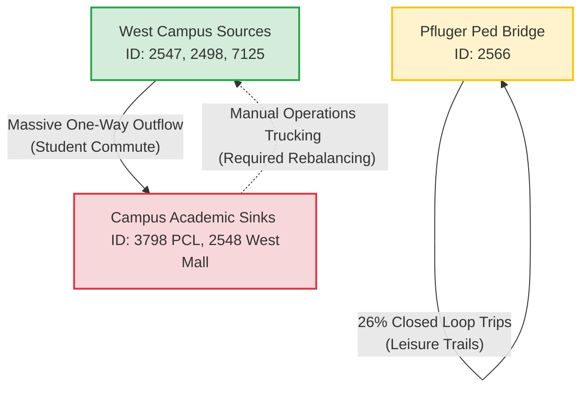
Data-Driven Operational Directives for Q2 2022

* Implement Hard Dock Caps for Classics at Sinks: Programmatically or operationally limit the number of classic bikes allowed to occupy slots at 21st/Speedway @ PCL and Guadalupe/West Mall. If classic bikes fill more than 20% of these premium docks, field technicians must immediately trigger a clearing sweep.

* Targeted Fleet Injections: Prioritize rebalancing drop-offs of classic bikes exclusively to the high-departure West Campus zones (Dean Keeton, 21st/Guadalupe, 23rd/San Gabriel) between 7:30 AM and 9:00 AM on weekdays to feed the incoming student migration wave.

* Leisure Buffer Stocking: Maintain a dedicated baseline of fully functional mechanical units at the Pfluger Ped Bridge hub specifically on Friday afternoons through Sunday evening, avoiding the temptation to replace them entirely with electric variants.


---

## **Duration distribution**

Trip duration is the single strongest behavioral signal in the dataset. It confirms whether Zen City operates as a **last-mile commuter network** or a **leisure rental service** — and the data overwhelmingly supports the former.

### 1. Global Duration Profile (N = 16,504)

| Statistic | Value (minutes) | Interpretation |
| :--- | :---: | :--- |
| **Minimum** | 2 | Post-cleaning floor (sub-1-minute false starts removed) |
| **Median** | **6** | Typical trip is a ultra-short point-to-point hop |
| **Mean** | 19.99 | Pulled upward by a long right tail of extended rides |
| **75th Percentile** | 11 | 75% of all trips finish within 11 minutes |
| **90th Percentile** | 33 | Only 10% of trips exceed half an hour |
| **95th Percentile** | 53 | Extended rides are a thin fringe, not the norm |
| **Maximum** | 1,368 | Retained outlier within the 24-hour policy ceiling |

### 2. Cumulative Distribution — How Fast Do Trips End?

| Duration Threshold | Trips At or Below | Cumulative Share |
| :--- | :---: | :---: |
| ≤ 5 minutes | 7,366 | 44.6% |
| ≤ 6 minutes | 9,204 | **55.8%** |
| ≤ 10 minutes | 12,231 | **74.1%** |
| ≤ 15 minutes | 13,260 | 80.3% |
| ≤ 30 minutes | 14,726 | 89.2% |
| ≤ 60 minutes | 15,925 | 96.5% |

*More than half of all Q1 rentals terminate within 6 minutes. Nearly three-quarters finish within 10 minutes. The distribution is heavily right-skewed: a small number of long-duration trips inflate the mean (~20 min) far above the median (~6 min).*

### 3. Duration by Subscription Tier — The Commuter vs. Leisure Split

| Subscription Type | Trip Count | Median Duration | Mean Duration | Behavioral Profile |
| :--- | :---: | :---: | :---: | :--- |
| **Student Membership** | 12,575 | **5 min** | 15.5 min | Ultra-fast campus hops |
| **U.T. Student Membership** | 221 | **6 min** | 17.2 min | Same commuter signature |
| **Local365** | 1,059 | 9 min | 21.3 min | Regular local riders, slightly longer |
| **Local31** | 1,286 | 23 min | 34.4 min | Work-week commuters with longer routes |
| **Pay-as-you-ride** | 443 | 18 min | 36.7 min | Casual / visitor trips |
| **Explorer** | 402 | 30 min | 49.0 min | Leisure exploration |
| **3-Day Weekender** | 232 | 21 min | 51.2 min | Weekend tourism pattern |
| **24 Hour Walk Up Pass** | 143 | 42 min | 61.2 min | All-day pass = extended use |

#### Key Insight: Two Distinct Personas in One Network

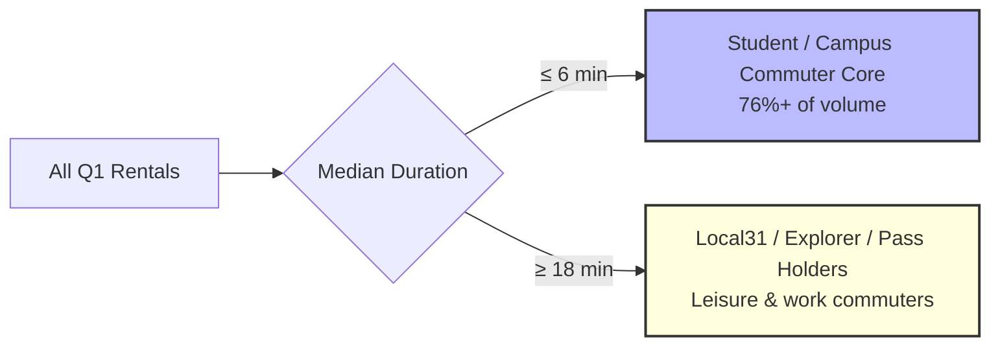

* **The Student Engine:** Combined student tiers (median 5–6 min) treat bikes as a **class-change shuttle**, not a recreational asset. This directly validates the classic-bike terminal-sink pattern documented above — students ride inward to campus and drop bikes at academic hubs.
* **The Long-Tail Tier:** Local31, Explorer, and pass-based users ride 3–8× longer on average. These users represent higher per-trip revenue potential but are not the volume driver for fleet sizing.

**Operational Translation for Q2:** Pricing, dock capacity, and rebalancing schedules should be optimized for **5-minute median trips**, not mean-trip economics. Extended-duration tiers are a monetization layer, not the operational baseline.

---

## **Rental volume over time**

With 16,504 trips compressed into a 89-day active window (January 1 – March 31, 2022), temporal volume patterns reveal when Zen City earns its revenue — and where Q2 growth headroom exists.

### 1. Monthly Volume Progression

| Month | Total Trips | Share of Q1 | Visual |
| :--- | :---: | :---: | :--- |
| **January 2022** | 3,161 | 19.2% | ████░░░░░░░░░░░░░░░░ |
| **February 2022** | 7,072 | **42.9%** | █████████░░░░░░░░░░░ |
| **March 2022** | 6,271 | 38.0% | ████████░░░░░░░░░░░░ |
| **Q1 Total** | **16,504** | 100.0% | |

*February generated nearly 2.2× January's volume.* Likely drivers include the spring university semester reaching full swing, warmer weather, and expanding daily ridership habits as students returned from winter break. March remained strong but did not exceed February — suggesting Q1 peaked mid-quarter rather than accelerating linearly into Q2.

### 2. Daily Throughput Benchmarks

| Metric | Value | Notes |
| :--- | :---: | :--- |
| Active recording days | 89 | Days with ≥1 trip logged |
| Mean daily trips | 185.4 | Across all active days |
| Weekday daily average | **206.7** | Mon–Fri (63 days) |
| Weekend daily average | **133.9** | Sat–Sun (26 days) |
| Peak single day | **412** (2022-02-10) | Highest-volume day in Q1 |
| Lowest single day | **6** (2022-03-18) | Requires investigation — possible system outage or logging gap |

**Weekday volume runs 54% higher than weekend volume on a per-day basis** (206.7 vs. 133.9). This reinforces the campus-commuter thesis: demand is structurally tied to the academic/work-week calendar, not leisure weekends.

### 3. Top 5 Highest-Volume Days (All February)

| Date | Trip Count | Day of Week |
| :--- | :---: | :--- |
| 2022-02-10 | 412 | Thursday |
| 2022-02-15 | 409 | Tuesday |
| 2022-02-17 | 406 | Thursday |
| 2022-02-09 | 403 | Wednesday |
| 2022-02-08 | 393 | Tuesday |

*Every top-volume day falls within a single 10-day February cluster.* No January or March date appears in the top tier. For Q2 forecasting, treat **mid-February weekday throughput (~400 trips/day)** as the realistic upper bound under current fleet conditions — not the Q1 daily mean of 185.

### 4. Anomaly Flag: March 18 (6 trips)

The March 18 collapse to just 6 trips (vs. a 185/day average) is a **data or operational anomaly**, not a behavioral signal. Before building Q2 trend lines, this date should be cross-checked against system maintenance logs or weather events. It will be revisited in **Section 07 — Temporal Analysis**.

---

## **Gender**

Gender distribution provides demographic context for marketing segmentation, though it is **not a primary driver of ride behavior** in this dataset.

### 1. Gender Split Across All Q1 Rentals

| Gender | Trip Count | Volume Share | Visual Distribution |
| :--- | :---: | :---: | :--- |
| **Female** | 9,108 | 55.19% | ███████████░░░░░░░░░ |
| **Male** | 7,396 | 44.81% | █████████░░░░░░░░░░░ |
| **Total** | **16,504** | 100.00% | |

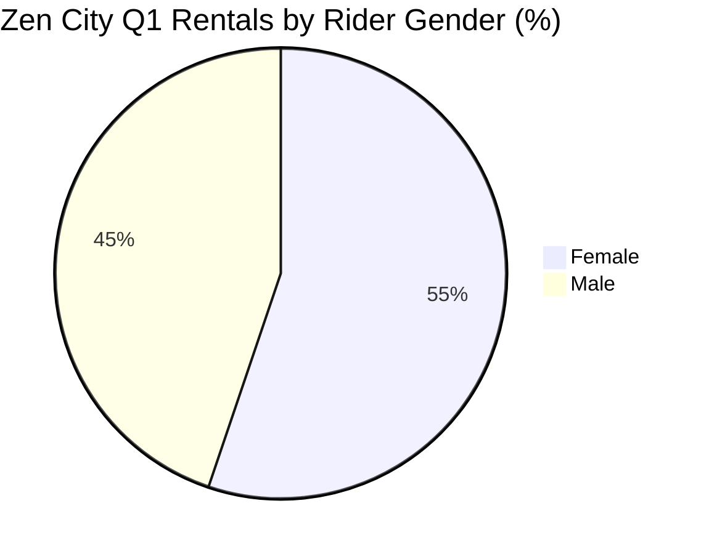

### 2. Gender × Duration — Is Ride Length Gender-Driven?

| Gender | Median Duration | Mean Duration |
| :--- | :---: | :---: |
| Female | 6 min | 19.9 min |
| Male | 6 min | 20.1 min |

*There is effectively **zero difference** in trip duration between genders (identical 6-minute medians, means within 0.2 minutes).* Gender influences **who** rides, not **how long** they ride. Any pricing or fleet strategy keyed to trip length does not need gender-specific calibration at the univariate level — a finding that will be stress-tested in **Section 03 — Bivariate Analysis**.

---

## **Age**

The age profile of registered riders provides cohort context. Note that `customer_age` reflects the **account holder's registered age**, which may not always equal the physical rider (e.g., shared accounts), but remains the best available demographic proxy.

### 1. Age Distribution Summary

| Statistic | Value |
| :--- | :---: |
| Minimum age | 18 |
| Maximum age | 65 |
| Mean age | 42.8 years |
| Median age | 43 years |

### 2. Age Cohort Breakdown

| Age Band | Trip Count | Volume Share | Visual Distribution |
| :--- | :---: | :---: | :--- |
| **18–22** | 1,465 | 8.9% | ██░░░░░░░░░░░░░░░░░░ |
| **23–30** | 2,770 | 16.8% | ████░░░░░░░░░░░░░░░░ |
| **31–40** | 3,606 | 21.9% | █████░░░░░░░░░░░░░░░ |
| **41–50** | 2,416 | 14.6% | ███░░░░░░░░░░░░░░░░░ |
| **51+** | 6,247 | **37.8%** | ████████░░░░░░░░░░░░ |
| **Total** | **16,504** | 100.00% | |

### 3. Age × Duration

| Age Band | Median Duration | Mean Duration |
| :--- | :---: | :---: |
| 18–22 | 6 min | 22.4 min |
| 23–30 | 6 min | 21.5 min |
| 31–40 | 6 min | 20.1 min |
| 41–50 | 6 min | 17.5 min |
| 51+ | 6 min | 19.7 min |

#### Analytical Note: The Student Volume vs. Age Profile Paradox

At first glance, the age distribution appears misaligned with the 76% Student Membership volume share — the **51+ cohort alone accounts for 37.8% of trips**, while the **18–22 band is only 8.9%**. This is not a data error. It reflects a common pattern in university bike-share systems:

* **Student memberships dominate trip frequency**, but students may register under family accounts, use shared credentials, or simply ride without updating age metadata.
* The `subscriber_type` field (Student Membership) is a **more reliable segmentation key** than `customer_age` for identifying the campus commuter core.

*All age bands share an identical 6-minute median duration*, confirming that trip length is structurally driven by **subscription tier and station geography**, not age. Age-based pricing tiers would need to rely on membership type rather than raw age fields.

---

## **Hour of day**

Hourly demand distribution is the operational blueprint for rebalancing crews, staffing, and dock-capacity planning.

### 1. Full Hourly Volume Profile

| Hour (24h) | Trip Count | Share | Visual (scaled to peak) |
| :---: | :---: | :---: | :--- |
| 00 | 165 | 1.0% | █░░░░░░░░░░░░░░░░░░░ |
| 01 | 124 | 0.8% | █░░░░░░░░░░░░░░░░░░░ |
| 02–06 | 275 | 1.7% | █░░░░░░░░░░░░░░░░░░░ |
| **07** | 340 | 2.1% | ██░░░░░░░░░░░░░░░░░░ |
| **08** | 390 | 2.4% | ██░░░░░░░░░░░░░░░░░░ |
| **09** | 734 | 4.4% | █████░░░░░░░░░░░░░░░ |
| **10** | 861 | 5.2% | ██████░░░░░░░░░░░░░░ |
| **11** | 932 | 5.6% | ██████░░░░░░░░░░░░░░ |
| **12** | 1,274 | 7.7% | █████████░░░░░░░░░░░ |
| **13** | 1,297 | 7.9% | █████████░░░░░░░░░░░ |
| **14** | 1,109 | 6.7% | ████████░░░░░░░░░░░░ |
| **15** | **1,511** | **9.2%** | ████████████████████ |
| **16** | 1,429 | 8.7% | ███████████████████░ |
| **17** | 1,503 | 9.1% | ███████████████████░ |
| **18** | 1,353 | 8.2% | ██████████████████░░ |
| **19** | 1,038 | 6.3% | ██████████████░░░░░░ |
| **20** | 833 | 5.0% | ███████████░░░░░░░░░ |
| **21** | 590 | 3.6% | ████████░░░░░░░░░░░░ |
| 22–23 | 746 | 4.5% | ██████████░░░░░░░░░░ |

**Peak hour: 3:00 PM (1,511 trips).** The secondary peak at 5:00 PM (1,503 trips) forms a classic **afternoon class-dismissal double peak**.

### 2. Aggregated Time-Block Summary

| Time Block | Hours | Trip Count | Share of Q1 |
| :--- | :--- | :---: | :---: |
| Overnight | 12 AM – 6 AM | 877 | 5.3% |
| **Morning Rush** | 7 AM – 10 AM | 2,325 | 14.1% |
| **Midday** | 11 AM – 2 PM | 4,612 | 27.9% |
| **Afternoon Peak** | 3 PM – 6 PM | 5,796 | **35.1%** |
| Evening | 7 PM – 10 PM | 2,894 | 17.5% |

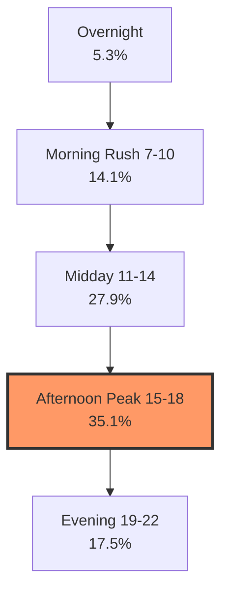

* **35.1% of all Q1 trips occur between 3–6 PM alone.** Rebalancing trucks, battery-swap crews, and classic-bike sink clearing (see PCL / West Mall analysis above) must be prioritized for this window.
* Morning rush (7–10 AM) is real but smaller (14.1%) — students appear to **ride home in the afternoon more than ride in during the morning**, consistent with the classic-bike net-exporter pattern at West Campus residential hubs.

---

## **Day of week**

Day-of-week patterns confirm the academic calendar as the primary demand scheduler.

### 1. Daily Volume Distribution

| Day | Trip Count | Share | Visual Distribution |
| :--- | :---: | :---: | :--- |
| **Sunday** | 1,783 | 10.8% | █████░░░░░░░░░░░░░░░ |
| **Monday** | 2,555 | 15.5% | ████████░░░░░░░░░░░░ |
| **Tuesday** | **2,953** | **17.9%** | █████████░░░░░░░░░░░ |
| **Wednesday** | 2,869 | 17.4% | █████████░░░░░░░░░░░ |
| **Thursday** | 2,556 | 15.5% | ████████░░░░░░░░░░░░ |
| **Friday** | 2,089 | 12.7% | ██████░░░░░░░░░░░░░░ |
| **Saturday** | 1,699 | 10.3% | █████░░░░░░░░░░░░░░░ |
| **Weekend combined** | **3,482** | **21.1%** | |
| **Weekday combined** | **13,022** | **78.9%** | |

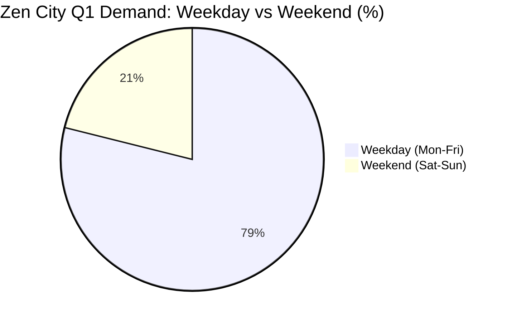

### 2. Key Day-of-Week Findings

* **Tuesday and Wednesday are peak demand days** (17.9% and 17.4%), aligning with mid-week class schedules when students move between campus zones most frequently.
* **Friday demand drops 12.7%** — students leave campus early or shift to non-bike plans for the weekend.
* **Weekends account for only 21.1% of volume**, despite covering 2/7 of the calendar. Weekend per-day averages (133.9 trips) are 35% below weekday averages (206.7).
* **Sunday slightly edges Saturday** (1,783 vs. 1,699), likely driven by students returning to campus for the week ahead.

**Q2 Implication:** Fleet rebalancing labor should be **front-loaded Tuesday–Thursday**, with reduced weekend crew deployment. Marketing spend for casual/leisure tiers (Explorer, 3-Day Weekender) should target **Friday afternoon through Sunday** when commuter demand is lowest but leisure potential is highest.

---

## **User type**

The `customer_user_type` field (`Subscriber` vs. `Customer`) represents Zen City's internal CRM classification — distinct from the `subscriber_type` membership tier analyzed above. It identifies whether a rider holds an ongoing subscription relationship or operates as a transactional customer.

### 1. User Type Volume Split

| User Type | Trip Count | Volume Share | Visual Distribution |
| :--- | :---: | :---: | :--- |
| **Subscriber** | 10,475 | 63.47% | █████████████░░░░░░░░ |
| **Customer** | 6,029 | 36.53% | ███████░░░░░░░░░░░░░ |
| **Total** | **16,504** | 100.00% | |

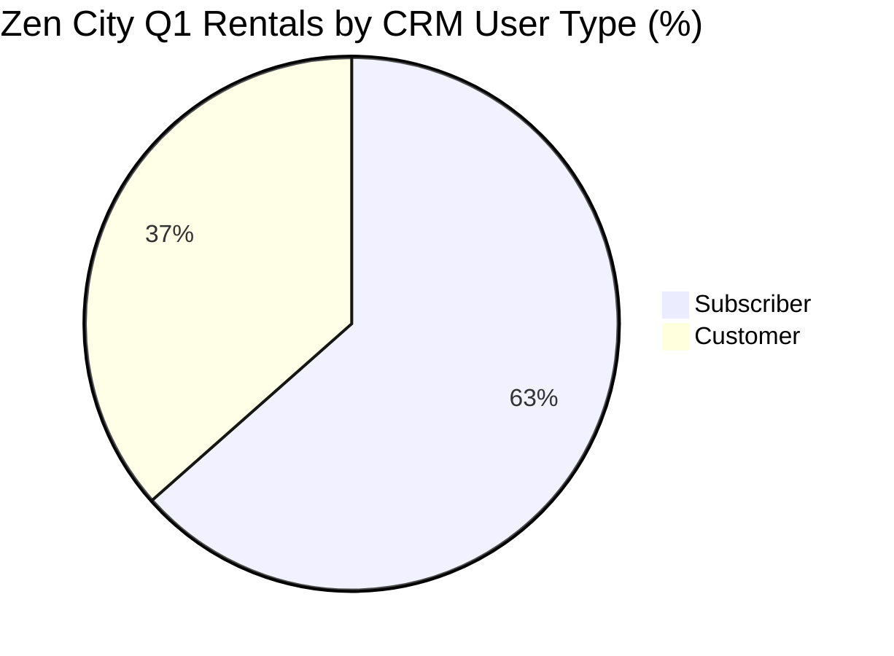

### 2. User Type × Duration

| User Type | Median Duration | Mean Duration |
| :--- | :---: | :---: |
| Subscriber | 6 min | 19.3 min |
| Customer | 6 min | 21.3 min |

*Both groups share the same 6-minute median, but Customers ride slightly longer on average (+2 minutes mean).* This suggests the `Customer` classification captures more casual, pay-per-ride users who take extended trips — consistent with the Explorer and Pay-as-you-ride tiers that dominate non-student volume.

### 3. Cross-Reference: `user_type` vs. `subscriber_type`

| Field | What It Measures | Primary Use in This Project |
| :--- | :--- | :--- |
| `subscriber_type` | Membership **tier** (Student, Local31, Explorer, etc.) | Fleet sizing, pricing strategy, cohort targeting |
| `customer_user_type` | CRM **relationship status** (Subscriber vs. Customer) | Retention campaigns, subscription conversion |

*For Q2 growth strategy, `subscriber_type` is the actionable segmentation key. `customer_user_type` is a secondary lens useful for identifying the 36.5% of trips from non-subscription CRM accounts that may be convertible to recurring memberships.*

---

### Section 02 Summary — Univariate Determining Keys

Before advancing to bivariate and multivariate analysis, the following **determining keys** are established for all downstream modeling:

| Determining Key | Q1 Baseline Finding | Q2 Strategic Weight |
| :--- | :--- | :--- |
| **Dominant tier** | Student Membership = 76.19% | Fleet & dock priority |
| **Dominant bike** | Electric = 87.69% | Battery/charging ops |
| **Typical trip** | Median 6 min, 74% ≤ 10 min | Pricing & rebalancing cadence |
| **Peak month** | February (42.9% of Q1) | Forecast upper bound |
| **Peak hour** | 3:00 PM (1,511 trips) | Crew scheduling |
| **Peak day** | Tuesday/Wednesday (~18%) | Mid-week ops focus |
| **Weekday share** | 78.9% | Weekend = leisure opportunity |
| **Gender / Age** | Not duration drivers | Low segmentation priority |
| **CRM split** | 63.5% Subscriber / 36.5% Customer | Conversion campaign target |

*Section 02 complete. Proceed to **Section 03 — Bivariate Analysis**.*

---


# **03 — Bivariate Analysis**

## Overview & Methodology

Section 02 established the univariate baseline for each variable in isolation. Section 03 examines **paired relationships** — how two dimensions interact to produce the demand patterns that will drive Q2 strategy.

Each analysis below follows a consistent structure:
1. **Cross-tabulation** with median and mean duration where applicable
2. **Strength of relationship** (Strong / Moderate / Weak / None)
3. **Business interpretation** tied to fleet operations or revenue

All statistics are computed from the production clean dataset (**N = 16,504**).

---

## 3.1 Subscription Tier × Trip Duration

**Research question:** Does how long someone rides depend on their membership type?

**Verdict: Strong relationship — the single most actionable bivariate finding in the dataset.**

| Subscription Type | Trips | Median Duration | Mean Duration | Mean / Median Ratio |
| :--- | :---: | :---: | :---: | :---: |
| **Student Membership** | 12,575 | **5 min** | 15.5 min | 3.1× |
| **U.T. Student Membership** | 221 | 6 min | 17.2 min | 2.9× |
| **Local365** | 1,059 | 9 min | 21.3 min | 2.4× |
| **Local31** | 1,286 | **23 min** | 34.4 min | 1.5× |
| **Pay-as-you-ride** | 443 | 18 min | 36.7 min | 2.0× |
| **Explorer** | 402 | **30 min** | 49.0 min | 1.6× |
| **3-Day Weekender** | 232 | 21 min | 51.2 min | 2.4× |
| **24 Hour Walk Up Pass** | 143 | **42 min** | 61.2 min | 1.5× |

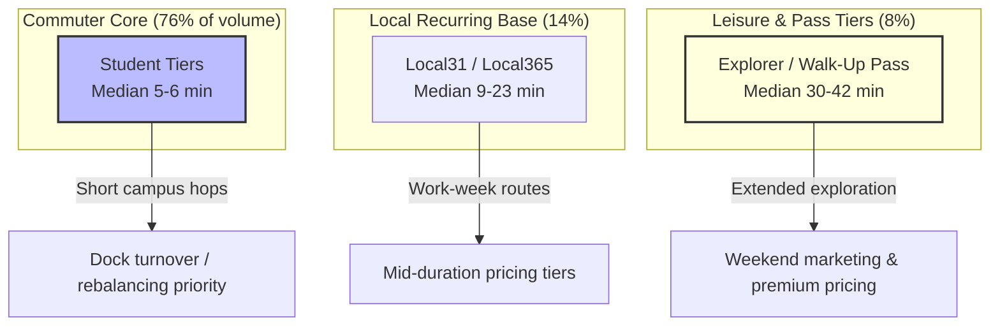

**Key findings:**
* Student tiers (combined median **5–6 min**) ride **4–8× faster** than Explorer (median 30 min) and Walk-Up Pass holders (median 42 min).
* The mean/median gap is widest for students (3.1×), indicating a dense cluster of ultra-short trips with a thin tail of longer rides — not a uniform distribution.
* **Local31** (median 23 min) represents a distinct work-commuter persona: longer than students, shorter than leisure tiers.

**Q2 implication:** A single flat per-minute pricing model under-serves both the high-volume student core and the high-margin leisure segment. Tier-specific pricing (flat micro-fees for students, standard per-minute for locals, day-pass bundles for visitors) aligns with observed behavior.

---

## 3.2 Bike Type × Trip Duration

**Research question:** Do riders keep electric bikes longer than classic bikes?

**Verdict: Moderate relationship — same median, divergent means.**

| Bike Type | Trips | Share | Median Duration | Mean Duration |
| :--- | :---: | :---: | :---: | :---: |
| **Electric** | 14,473 | 87.7% | 6 min | 19.0 min |
| **Classic** | 2,031 | 12.3% | 6 min | **27.3 min** |

At the median, both fleets serve identical 6-minute trips. The **8.3-minute mean gap** (27.3 vs 19.0) is driven by specific tier × bike combinations, not a universal preference for longer classic rides:

| Segment | Bike | Trips | Median | Mean |
| :--- | :--- | :---: | :---: | :---: |
| Student Membership | Electric | 11,141 | 5 min | 15.0 min |
| Student Membership | Classic | 1,434 | 5 min | 19.4 min |
| Local31 | Electric | 1,213 | 24 min | 34.9 min |
| Local31 | Classic | 73 | 7 min | 25.7 min |
| Explorer | Electric | 332 | 30 min | 43.7 min |
| Explorer | Classic | 70 | 31 min | **74.1 min** |

**Key findings:**
* For students, bike type barely changes behavior (median 5 min on both). Classic bikes are an **availability fallback**, not a preference.
* Explorer classic rides average **74 minutes** — the longest single segment in the dataset — confirming the Pfluger Ped Bridge leisure loop identified in Section 02.
* Electric dominance (87.7%) holds across both student (68.6% of all trips) and non-student (19.1%) segments.

**Q2 implication:** Classic fleet sizing is a **capacity overflow** problem at campus hubs, not a separate product line. Electric fleet investment remains the primary growth lever.

---

## 3.3 Weekday vs. Weekend × Volume & Duration

**Research question:** Does demand timing shift ride behavior, not just volume?

**Verdict: Strong relationship for volume; moderate for duration.**

### Volume Split

| Period | Trips | Share | Avg Daily Trips |
| :--- | :---: | :---: | :---: |
| **Weekday** (Mon–Fri) | 13,022 | 78.9% | 206.7 |
| **Weekend** (Sat–Sun) | 3,482 | 21.1% | 133.9 |

### Duration Split

| Period | Median Duration | Mean Duration |
| :--- | :---: | :---: |
| Weekday | 6 min | 17.9 min |
| Weekend | **7 min** | **28.0 min** |

Weekend trips run **56% longer on average** (28.0 vs 17.9 min) despite nearly identical medians (6 vs 7 min). The mean shift is driven by leisure tiers taking extended weekend rides — not a broad change in typical trip length.

### Bike Type × Weekend

| Bike Type | Weekend Trip Share | Notes |
| :--- | :---: | :--- |
| Electric | 20.3% of electric trips occur on weekends | Proportional to overall weekend share |
| Classic | **26.7%** of classic trips occur on weekends | Over-indexed for leisure use |

**Q2 implication:** Weekday operations should optimize for throughput (rebalancing, dock clearing, battery swaps). Weekends are the window to capture leisure revenue from Explorer, Weekender, and classic-bike recreational users — particularly at Pfluger Ped Bridge and East Austin corridors.

---

## 3.4 Day-of-Week × Demand & Duration

**Research question:** Which days drive volume, and do ride lengths change across the week?

**Verdict: Strong relationship for volume; moderate for duration.**

### Volume by Day

| Day | Trips | Share | Median Duration | Mean Duration |
| :--- | :---: | :---: | :---: | :---: |
| Sunday | 1,783 | 10.8% | 7 min | **33.3 min** |
| Monday | 2,555 | 15.5% | 6 min | 18.0 min |
| **Tuesday** | **2,953** | **17.9%** | 6 min | 17.6 min |
| **Wednesday** | 2,869 | 17.4% | 6 min | 12.9 min |
| Thursday | 2,556 | 15.5% | 6 min | 15.0 min |
| Friday | 2,089 | 12.7% | 6 min | **28.5 min** |
| Saturday | 1,699 | 10.3% | 7 min | 22.3 min |

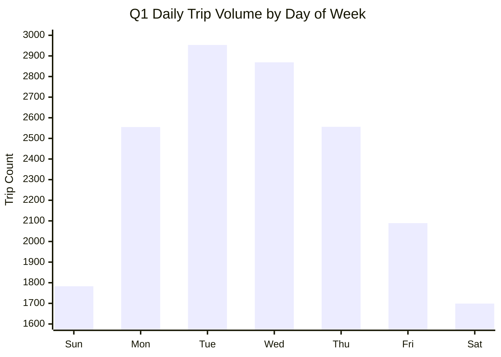

**Key findings:**
* **Tuesday and Wednesday** are peak volume days (~18% each) — mid-week class mobility drives the network.
* **Friday volume drops 29%** from Tuesday's peak (2,089 vs 2,953), signaling early campus departures.
* **Sunday and Friday carry the longest mean durations** (33.3 and 28.5 min), reflecting leisure and tourism ridership when commuter volume is lowest.
* Median duration stays at 6–7 min across all days — the mean spikes on Fri/Sun/Sat are leisure-tail effects, not a shift in the typical rider.

**Q2 implication:** Schedule peak rebalancing capacity for **Tuesday–Thursday**. Deploy leisure-focused promotions and classic-bike stocking on **Friday afternoon through Sunday**.

---

## 3.5 Station × Volume & Membership Mix

**Research question:** Do stations differ in who uses them, or only in how many trips they handle?

**Verdict: Strong relationship — clear campus vs. leisure geographic clusters.**

### Top 10 Origin Stations by Trip Volume

| Rank | Station | Departures | Median Duration | Student Tier Share |
| :---: | :--- | :---: | :---: | :---: |
| 1 | Dean Keeton/Speedway | 2,998 | 5 min | **90.7%** |
| 2 | 21st/Guadalupe | 2,286 | 5 min | 81.9% |
| 3 | 23rd/San Gabriel | 2,107 | 6 min | 86.6% |
| 4 | 28th/Rio Grande | 1,840 | 7 min | 77.1% |
| 5 | 22nd/Pearl | 1,830 | 5 min | 88.3% |
| 6 | 21st/University | 1,576 | 6 min | 85.5% |
| 7 | 23rd/San Jacinto @ DKR Stadium | 1,376 | 7 min | 75.9% |
| 8 | 22.5/Rio Grande | 957 | 5 min | 86.3% |
| 9 | **Pfluger Ped Bridge** | 813 | **24 min** | **9.6%** |
| 10 | **East 6th/Medina** | 721 | **12 min** | **6.7%** |

Two distinct station personas emerge:

| Cluster | Stations | Student Share | Median Duration | Profile |
| :--- | :--- | :---: | :---: | :--- |
| **Campus Commuter Hub** | Dean Keeton, Guadalupe, San Gabriel, Pearl | 77–91% | 5–6 min | High-turnover student origin points |
| **Leisure / Visitor Hub** | Pfluger Ped Bridge, East 6th/Medina | 7–10% | 12–24 min | Non-student recreational corridors |

### Station × Bike Type (Top 5 Campus Hubs)

| Station | Electric Share | Classic Share |
| :--- | :---: | :---: |
| Dean Keeton/Speedway | 89.1% | 10.9% |
| 21st/Guadalupe | 86.6% | 13.4% |
| 23rd/San Gabriel | 87.0% | 13.0% |
| 28th/Rio Grande | 92.0% | 8.0% |
| 22nd/Pearl | 90.0% | 10.0% |

Classic share is consistent (~10–13%) across campus hubs — confirming classic bikes function as **uniform overflow capacity**, not station-specific demand.

**Q2 implication:** Capacity investments (dock expansion, rebalancing priority) should concentrate on the **West Campus → PCL corridor**. Leisure hubs require a separate operational playbook: classic-bike stocking, weekend staffing, and non-student marketing.

---

## 3.6 Origin × Destination Route Corridors

**Research question:** Where do riders actually go — and do repeated corridors reveal the network's structural backbone?

**Verdict: Strong relationship — a single destination dominates all origin flows.**

### Top 10 Routes by Trip Count

| Rank | Origin | Destination | Trips | Share of Network |
| :---: | :--- | :--- | :---: | :---: |
| 1 | Dean Keeton/Speedway | **21st/Speedway @ PCL** | 831 | 5.0% |
| 2 | 23rd/San Gabriel | **21st/Speedway @ PCL** | 699 | 4.2% |
| 3 | 22nd/Pearl | **21st/Speedway @ PCL** | 596 | 3.6% |
| 4 | Dean Keeton/Speedway | 26th/Nueces | 426 | 2.6% |
| 5 | 21st/Guadalupe | **21st/Speedway @ PCL** | 415 | 2.5% |
| 6 | 28th/Rio Grande | **21st/Speedway @ PCL** | 393 | 2.4% |
| 7 | 21st/Guadalupe | 26th/Nueces | 316 | 1.9% |
| 8 | 22.5/Rio Grande | **21st/Speedway @ PCL** | 296 | 1.8% |
| 9 | Dean Keeton/Speedway | Dean Keeton/Whitis | 267 | 1.6% |
| 10 | 21st/Guadalupe | 22nd/Pearl | 253 | 1.5% |

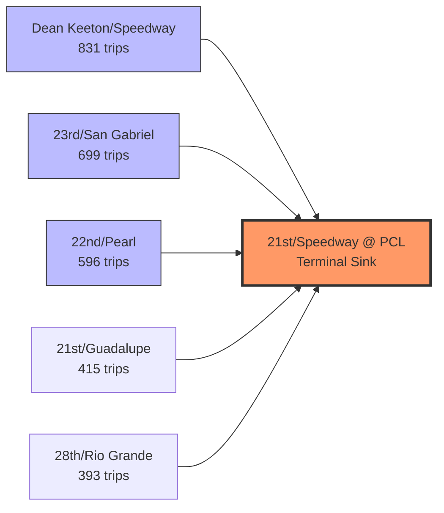

**Six of the top eight routes terminate at PCL (Perry-Castañeda Library).** The top three routes alone account for **13.4% of all Q1 trips** — an extraordinary concentration for a 16,504-trip network.

**Q2 implication:** PCL is not just a popular station — it is the **gravitational center** of the entire network. Dock capacity, classic-bike clearing, and electric recharging at PCL directly cap system-wide throughput. This corridor will be quantified further in **Sections 05–06 (Station Performance & Demand Bottlenecks)**.

---

## 3.7 Demographic Cross-Checks

Three bivariate pairs tested in Section 02 showed weak univariate signals. Cross-tabulation confirms they remain **non-actionable** for segmentation.

### Gender × Duration

| Gender | Trips | Median | Mean |
| :--- | :---: | :---: | :---: |
| Female | 9,108 | 6 min | 19.9 min |
| Male | 7,396 | 6 min | 20.1 min |

**Verdict: No meaningful relationship.** Gender affects who rides (55/45 split) but not how long they ride.

### Age × Duration

| Age Band | Trips | Median | Mean |
| :--- | :---: | :---: | :---: |
| 18–22 | 1,465 | 6 min | 22.4 min |
| 23–30 | 2,770 | 6 min | 21.5 min |
| 31–40 | 3,606 | 6 min | 20.1 min |
| 41–50 | 2,416 | 6 min | 17.5 min |
| 51+ | 6,247 | 6 min | 19.7 min |

**Pearson correlation (age vs. duration): r = −0.013** — effectively zero linear relationship.

**Verdict: No meaningful relationship.** Use `subscriber_type`, not `customer_age`, for behavioral segmentation.

### CRM User Type × Duration

| User Type | Trips | Median | Mean |
| :--- | :---: | :---: | :---: |
| Subscriber | 10,475 | 6 min | 19.3 min |
| Customer | 6,029 | 6 min | 21.3 min |

**Verdict: Weak relationship.** A 2-minute mean difference exists but identical medians. `subscriber_type` (membership tier) is the superior segmentation variable.

---

## 3.8 Hour of Day × Membership Mix

**Research question:** Does the rider composition shift across the day, or is the network student-dominated at all hours?

**Verdict: Moderate relationship — student share dips during peak afternoon hours.**

| Time Block | Hours | Trips | Student Tier Share |
| :--- | :--- | :---: | :---: |
| Overnight | 12 AM – 6 AM | 877 | **88–96%** |
| Morning | 7 AM – 10 AM | 2,325 | 78–82% |
| Midday | 11 AM – 2 PM | 4,612 | 72–80% |
| **Afternoon Peak** | **3 PM – 6 PM** | **5,796** | **70–79%** |
| Evening | 7 PM – 10 PM | 2,894 | 78–83% |

Student tiers dominate at every hour (minimum **70.1%** at 5 PM), but the **afternoon peak (3–6 PM) carries the lowest student share** — non-student Local31 and leisure riders proportionally increase during this window. This is the operational period where both commuter throughput *and* mixed-tier demand must be served simultaneously.

**Q2 implication:** Afternoon peak staffing must handle maximum total volume *and* the most diverse rider mix. Pricing surcharges or priority dock access during 3–6 PM should be tested for non-student tiers to protect student throughput.

---

### Section 03 Summary — Bivariate Relationship Matrix

| Variable Pair | Strength | Direction / Finding | Q2 Action |
| :--- | :---: | :--- | :--- |
| **Subscription × Duration** | **Strong** | Students 5 min vs Explorer 30 min | Tier-specific pricing |
| **Station × Volume** | **Strong** | Campus hubs vs leisure hubs | Split operational playbooks |
| **Origin × Destination** | **Strong** | PCL = 13.4% of top-3 route volume | Priority dock investment at PCL |
| **Weekday × Volume** | **Strong** | 79% weekday; 207 vs 134 daily avg | Front-load weekday ops |
| **Weekday × Duration** | **Moderate** | Weekends 56% longer mean trips | Weekend leisure campaigns |
| **Day-of-Week × Volume** | **Strong** | Tue/Wed peak; Fri −29% | Mid-week rebalancing focus |
| **Bike Type × Duration** | **Moderate** | Same median; classic mean +44% | Classic = overflow, not product |
| **Hour × Membership** | **Moderate** | Student share dips to 70% at 5 PM | Mixed-tier afternoon ops |
| **Gender × Duration** | **None** | Identical 6-min median | No gender-based pricing |
| **Age × Duration** | **None** | r = −0.013 | Use tier, not age |
| **CRM User Type × Duration** | **Weak** | 2-min mean gap, same median | Secondary to subscriber_type |

**Variables advanced to Section 04 (Multivariate Analysis):**
* Student riders during afternoon rush hour (Subscription × Hour × Station)
* Electric vs. classic demand on weekends (Bike × Weekend × Station)
* Station popularity by hour (Station × Hour heatmap)
* Peak-hour congestion by station (Station × Hour × Docks)

*Section 03 complete. Proceed to **Section 04 — Multivariate Analysis**.*

---
# **04 -  Multivariate Analysis **

* Student users during rush hour
* Electric bikes during weekends
* Station popularity by hour
* User type × weekday × duration
* Peak-hour congestion by station

Those analyses tell actual business stories.


# **05 - Station Performance **

I'd compute metrics like

* Total trips
* Trips started
* Trips ended
* Net flow
* Average duration
* Peak hour
* Weekend ratio

Then rank stations.

Not just

Top 10

but

Why are they top?


# **06 - Demand Bottlenecks **
For example:

Trips per dock.


# **07 - Temporal Analysis **

**** very important***
after all there are 16585 rentals in 3 months recod! obiously the time is most important .
Questions like

Morning rush?

Evening rush?

Weekends?

Friday afternoons?

Hourly heatmaps.

These are extremely valuable for bike sharing.


# **08 - Customer Segmentation **
relationship between subcription types and stations and Bike type and hours .
I'd focus on the main majority customers which are the Students subcriptions counting for 77% .

This is another area where you can go beyond the assignment.

Examples

Students

Faculty

Visitors

Long rides

Short rides

Frequent stations

Preferred bikes


# **09 - Business Recommendations **

****Very important ****

I'll make into sections , with findings and suggestions

for example:

Finding:

Students account for 77% of trips.

Recommendation:

Expand student pricing.
Special offers: like "New-Comer" discounts 


# **10 - Prediction ** (I am thinking of making dedicated section for 09 and 10) .


