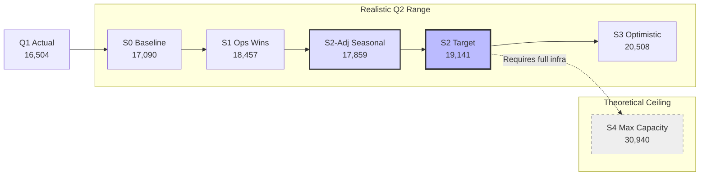

# **04 — Predictive Modeling & Q2 Strategy**

---

## Document Preview

Sections 01–08 of [`03_Analysis_and_Predictions.md`](03_Analysis_and_Predictions.md) established a complete analytical foundation for Zen City's Q1 2022 operations: a validated 16,504-row clean dataset, univariate and multivariate demand profiles, station performance rankings, dock-capacity bottlenecks, temporal operating windows, and five customer personas. The evidence converges on a single strategic reality — **Zen City is an afternoon-dominant, student-driven campus micro-mobility network** constrained not by rider demand but by physical dock capacity at the PCL corridor.

This document translates those findings into **actionable Q2 2022 directives** (Section 09) and **quantified rental forecasts** under each intervention scenario (Section 10). Section 09 below is organized as paired **Finding → Recommendation** blocks grouped by strategic domain: infrastructure, operations, pricing, marketing, and data governance. Recommendations are prioritized by expected impact on total Q2 rental volume, not by implementation ease.

**Analytical baseline referenced throughout:**
* Production dataset: **16,504 trips** (Jan 1 – Mar 31, 2022)
* Dominant persona: **Campus Commuter — 77.5%** of volume
* Binding constraint: **PCL terminal sink — 145% of physical dock capacity** during 3–6 PM
* Demonstrated daily ceiling: **412 trips** (Feb 10, 2022)
* Q2 growth lever: unlock throughput at existing demand levels before pursuing new user acquisition

---

# **09 — Business Recommendations for Q2 2022 Growth**

## Overview

Each recommendation below is grounded in a specific, quantified finding from the Q1 analysis pipeline. Recommendations are grouped into five domains and ranked within a priority matrix at the end of this section. Implementation sequencing matters: **infrastructure and operations interventions (Domains A & B) must precede pricing and marketing changes (Domains C & D)**, because current demand already exceeds physical capacity — adding riders before fixing bottlenecks will increase stockouts, not revenue.

---

## 9.1 Domain A — Infrastructure & Hardware

### Recommendation A1: Install PCL Overflow Dock Bay

**Finding:** `21st/Speedway @ PCL` recorded **0 departures and 3,552 arrivals** in Q1 — a pure terminal sink. During the 3–6 PM block, PCL absorbs **58 arrival events per dock** against a physical ceiling of ~40 (10 turnovers/hour × 4 hours). Peak-hour arrival intensity reaches **16.2 events/dock/hour** — 145% of theoretical capacity (Section 06).

**Recommendation:** Install a dedicated overflow dock bay of **10–15 additional slots** within 200 m of PCL (Perry-Castañeda Library). Relocate hardware from the bottom-10 stations (combined Q1 volume: 107 trips, 0.6% of network) which contribute virtually nothing to throughput.

**Expected impact:** Peak arrival intensity drops from **16.2 → ~11.2 events/dock/hour** — moving from critical failure to manageable stress zone. Every additional dock slot directly converts to captured arrivals that currently block the network.

---

### Recommendation A2: Expand Dock Capacity at Top Exporters

**Finding:** Dean Keeton/Speedway and 21st/Guadalupe exceed **18.6–18.9 departure events/dock/hour** at peak — nearly 2× the sustainable turnover rate. Combined Q1 turnover indices exceed **243×** (Section 05–06).

**Recommendation:** Add **4–6 physical dock slots** at Dean Keeton/Speedway (currently 17 docks) and **3–4 slots** at 21st/Guadalupe (currently 13 docks). Prioritize dock additions over bike fleet expansion — the constraint is parking, not bicycles.

**Expected impact:** Reduces exporter stockout rate during the 3–5 PM window, converting latent demand (students who arrive at an empty station) into completed trips.

---

### Recommendation A3: Decommission and Relocate Bottom-10 Stations

**Finding:** The 10 least-active stations generated **107 combined trips (0.6%)** in Q1, all with zero departures. Stations such as `Rio Grande/12th` and `East 6th/Robert T. Martinez` were identified in the initial README strategy as relocation candidates (Section 05).

**Recommendation:** Formally decommission bottom-10 stations and redeploy their dock hardware to the PCL corridor and West Campus export cluster (Dean Keeton, Guadalupe, San Gabriel). Conduct a cost-benefit review before decommission — any station with < 50 Q1 trips and zero departures is a net drain on maintenance resources.

**Expected impact:** Zero trip volume loss (0.6% redistribution); meaningful capacity gain at nodes processing 20%+ of network volume.

---

## 9.2 Domain B — Fleet Operations & Rebalancing

### Recommendation B1: Deploy Staggered Afternoon Rebalancing Wave

**Finding:** Demand peaks at different hours by station: Dean Keeton at **4 PM**, Guadalupe and San Gabriel at **5 PM**, Pearl at **6 PM** (Section 07). A single 4 PM crew schedule is always 60–120 minutes behind the demand front.

**Recommendation:** Implement a **three-wave rebalancing protocol** on Tuesday–Thursday:
* **Wave 1 (2:30 PM):** Pre-stock Dean Keeton/Speedway and 21st/University
* **Wave 2 (3:30 PM):** Clear PCL sink + restock 21st/Guadalupe and 23rd/San Gabriel
* **Wave 3 (4:30 PM):** Service 28th/Rio Grande and 22nd/Pearl

**Expected impact:** Aligns fleet supply with the documented north → west → south demand wave. Targets the **35.1% of all trips** occurring 3–6 PM.

---

### Recommendation B2: Implement Continuous PCL Sink Clearing (1–6 PM)

**Finding:** PCL receives **1,277 arrivals between 3–6 PM** with zero outbound departures. Classic and electric bikes accumulate simultaneously, blocking high-margin electric returns (Sections 02, 06).

**Recommendation:** Deploy a dedicated **PCL clearing crew on continuous 30-minute cycles** from 1:00–6:00 PM on weekdays. Enforce a **hard cap: classic bikes may not exceed 20% of PCL dock occupancy** at any time — when reached, immediate truck removal to West Campus exporters.

**Expected impact:** Prevents the sink cascade that blocks network-wide returns during peak revenue hours.

---

### Recommendation B3: Reallocate Friday Operations to Midday + Weekend Leisure

**Finding:** Friday 3–6 PM volume is **40% below Tuesday** in the same window (670 vs 1,119 trips). Friday full-day volume is 29% below Tuesday peak (Section 07). Meanwhile, Pfluger Ped Bridge carries **39.5% of its departures on weekends** (Section 03).

**Recommendation:** Shift **40% of Friday afternoon rebalancing labor** to Friday 10 AM–1 PM (when Friday volume is still 59% of Tuesday). Redeploy the freed capacity to **Saturday–Sunday 2–6 PM** at Pfluger Ped Bridge and East 6th/Medina with dedicated classic-bike buffer stock.

**Expected impact:** Eliminates over-staffing on low-demand Friday afternoons; captures underserved weekend leisure revenue from Explorer and Weekender personas.

---

### Recommendation B4: Bifurcated Classic vs. Electric Fleet Strategy

**Finding:** Classic bikes serve two distinct roles: **campus overflow** at student hubs (11.4% of student trips) and **leisure loops** at Pfluger (26.7% of classic trips occur on weekends). Electric dominance (87.7%) is a weekday commuter phenomenon (Section 08).

**Recommendation:** Operate two classic-fleet playbooks:
* **Campus loop:** Rebalance classics from PCL/West Mall sinks back to Dean Keeton and Guadalupe between 2–5 PM weekdays
* **Leisure loop:** Maintain fixed classic inventory (minimum 8–10 units) at Pfluger and East 6th, Friday 2 PM through Sunday 8 PM

**Expected impact:** Resolves the classic-bike terminal-sink problem without converting leisure hubs to full electric (which would eliminate the 24-min median recreational experience).

---

## 9.3 Domain C — Pricing & Monetization

### Recommendation C1: Introduce Tier-Specific Pricing Structures

**Finding:** Student median trip duration is **5 minutes**; Explorer is **30 minutes**; 24-Hr Walk-Up Pass is **42 minutes** (Section 03). A single per-minute rate over-charges students and under-monetizes leisure riders.

**Recommendation:** Implement three pricing bands aligned to observed behavior:

| Tier | Proposed Structure | Rationale |
| :--- | :--- | :--- |
| **Student Membership** | Flat **$0.50–$1.00 per trip** (≤ 15 min) | Matches 90.4% of student trips; removes duration anxiety |
| **Local31 / Local365** | Standard per-minute rate with 30-min daily cap | Aligns with 23-min median Local31 duration |
| **Explorer / Walk-Up / Pay-as-you-ride** | Premium per-minute + reduced hourly pass option | Captures 18–42 min leisure ride value |

**Expected impact:** Increases student trip frequency (lower friction) while improving revenue per trip from the 22.5% non-student base that generates 54.7% of long rides.

---

### Recommendation C2: Launch Power User Retention Program

**Finding:** **20 customers (3.4% of registered users) generated 40.0% of all Q1 trips.** The top user logged 332 trips in 89 days. Losing even 5 power users would reduce Q2 volume by an estimated 1,600+ trips (Section 08).

**Recommendation:** Identify the **568 customers with ≥ 10 Q1 trips** and enroll them in a **"Zen City Core Rider" program** offering:
* Priority dock access during 3–5 PM (guaranteed bike availability notification)
* Semester renewal discount for Student Membership subscribers
* Early access to new station deployments on campus corridors

**Expected impact:** Protects the 99.1% of trip volume driven by high-frequency users; retention cost is far lower than acquisition cost for equivalent volume.

---

### Recommendation C3: Convert CRM "Customer" Accounts to Subscribers

**Finding:** **4,561 student trips (35.6% of student volume)** come from CRM-classified `Customer` accounts — riders using Student Membership without a formal subscription relationship (Section 08).

**Recommendation:** Run a **"New Semester Pass" conversion campaign** in April 2022 targeting Customer-status accounts with:
* One-time offer: convert to Subscriber status with Q2 semester pass at 15% discount
* In-app / email trigger after a customer's 5th trip in a rolling 30-day window

**Expected impact:** Converts high-frequency transactional riders into recurring subscribers, improving revenue predictability and reducing per-trip payment friction.

---

## 9.4 Domain D — Marketing & Segment Targeting

### Recommendation D1: Double Down on the Campus Commuter Corridor

**Finding:** Six student origin-destination routes to PCL account for **20.3% of all student trips**. Dean Keeton/Speedway alone generates 2,719 student departures (Section 08). Student tiers dominate every hour of the day (minimum 70.1% even at the most diverse hour — 5 PM).

**Recommendation:** Concentrate Q2 marketing spend and partnership outreach (university administration, student organizations, campus housing) on the **West Campus → PCL axis**. Do not dilute marketing budget across low-volume leisure corridors until infrastructure bottlenecks are resolved.

**Expected impact:** Maximizes ROI on marketing by targeting the corridor where infrastructure investment (A1, A2, B1, B2) will unlock the most incremental trips.

---

### Recommendation D2: Launch Weekend Leisure Campaign at Non-Campus Hubs

**Finding:** Leisure personas (Explorer, Weekender, Walk-Up, Pay-as-you-ride) combine for **1,220 trips (7.4%)** but operate on a completely separate geography — Pfluger Ped Bridge (9.6% student share) and East 6th/Medina (6.7% student share) vs 90.7% at Dean Keeton (Section 08).

**Recommendation:** Deploy a **separate weekend marketing track** (social media, tourism boards, event partnerships) promoting:
* Classic-bike river trail loops from Pfluger Ped Bridge
* "3-Day Weekender" pass for Austin visitors
* Friday afternoon launch timing (when commuter demand drops 40%)

**Expected impact:** Grows the 7.4% leisure segment without adding pressure to campus bottlenecks — incremental revenue from an underserved persona on under-utilized weekend capacity.

---

### Recommendation D3: New-Comer Student Onboarding Offer

**Finding:** Q1 daily volume grew from **102 trips/day (January)** to **412 trips/day (peak February)** — a 4× ramp as the semester progressed (Section 07). New student riders entering in Q2 (summer session, incoming fall prep) represent the primary organic growth vector.

**Recommendation:** Offer a **"First 10 Rides Free"** onboarding promotion for new Student Membership registrations in Q2, capped at 10 trips within 14 days. Target distribution through campus orientation channels and the 4,561 existing Customer-status accounts eligible for conversion (C3).

**Expected impact:** Reduces first-trip friction for new student adopters; pairs with infrastructure improvements to ensure new riders convert to power users rather than churning after stockout experiences.

---

## 9.5 Domain E — Data & Analytics Governance

### Recommendation E1: Build Orphan-Station Analysis Table

**Finding:** **39.7% of Q1 trips (6,551)** touch catalog-unverified station legs where dock counts are imputed from global medians. High-volume hubs (23rd/San Gabriel ID 7125, 22nd/Pearl ID 7188) are entirely unverified — bottleneck severity may be understated (Section 06).

**Recommendation:** Construct a dedicated **`orphan_stations` analysis table** (planned in the cleaning pipeline notes) that isolates unregistered station trips with separate volume and duration metrics — excluded from dock-capacity math but tracked for catalog reconciliation.

**Expected impact:** Prevents imputed dock counts from distorting bottleneck models; enables IT/operations to reconcile missing station IDs before Q3 analysis.

---

### Recommendation E2: Exclude Anomaly Days from Forecasting Pipeline

**Finding:** March 18, 2022 recorded **6 trips** (vs 185 daily average) due to a partial-day system outage (Section 07). Including this day deflates March averages and corrupts growth-rate projections.

**Recommendation:** Implement an automated **data quality flag** in the cleaning CTE: any day with < 20 trips AND partial-hour coverage (< 8 active hours) is tagged `anomaly_excluded` and removed from trend models in Section 10.

**Expected impact:** Protects predictive model accuracy; prevents false "demand collapse" signals in Q2 forecasting.

---

### Recommendation E3: Conduct Catalog Audit for Orphan Station IDs

**Finding:** Station IDs **7125** (23rd/San Gabriel) and **7188** (22nd/Pearl) appear in 3,937 combined Q1 departures but are absent from the `station_info` catalog. All associated trips receive imputed metadata (Section 06).

**Recommendation:** Work with Zen City operations to **register these IDs in the master station catalog** or remap them to existing verified IDs. Until resolved, report San Gabriel and Pearl bottleneck metrics separately as "unverified — directional estimate."

**Expected impact:** Restores referential integrity for two of the top-5 origin hubs; enables accurate dock-capacity planning for ~24% of network departures.

---

## 9.6 Recommendation Priority Matrix

| Priority | ID | Domain | Recommendation | Impact | Effort | Timeline |
| :---: | :---: | :--- | :--- | :---: | :---: | :---: |
| **1** | A1 | Infrastructure | PCL overflow dock bay (+10–15 slots) | **Critical** | Medium | Q2 Week 1–4 |
| **2** | B2 | Operations | PCL continuous clearing 1–6 PM | **Critical** | Low | Immediate |
| **3** | B1 | Operations | Staggered 3-wave rebalancing (Tue–Thu) | **High** | Low | Q2 Week 1 |
| **4** | A3 | Infrastructure | Decommission bottom-10 → relocate docks | **High** | Medium | Q2 Week 2–6 |
| **5** | C1 | Pricing | Tier-specific pricing bands | **High** | Medium | Q2 Week 4–8 |
| **6** | C2 | Pricing | Power user retention program (568 users) | **High** | Low | Q2 Week 2 |
| **7** | A2 | Infrastructure | Expand docks at Dean Keeton + Guadalupe | **High** | High | Q2 Month 2–3 |
| **8** | B3 | Operations | Friday crew reallocation + weekend leisure | **Medium** | Low | Q2 Week 3 |
| **9** | D3 | Marketing | New-Comer student onboarding offer | **Medium** | Low | Q2 Week 1 |
| **10** | C3 | Pricing | CRM Customer → Subscriber conversion | **Medium** | Low | Q2 Week 2–4 |
| **11** | D2 | Marketing | Weekend leisure campaign (Pfluger/East 6th) | **Medium** | Medium | Q2 Month 2 |
| **12** | B4 | Operations | Bifurcated classic fleet playbooks | **Medium** | Medium | Q2 Month 1 |
| **13** | D1 | Marketing | Campus corridor marketing concentration | **Medium** | Low | Ongoing |
| **14** | E2 | Data | Anomaly day exclusion flag | **Low** | Low | Before Section 10 |
| **15** | E1 | Data | Orphan-station analysis table | **Low** | Medium | Q2 Month 1 |
| **16** | E3 | Data | Catalog audit for IDs 7125, 7188 | **Low** | Medium | Q2 Month 1 |

---

### Section 09 Summary

Q2 growth for Zen City is not primarily a demand-generation problem — Q1 proved the network can sustain **412 trips/day** when infrastructure, semester timing, and fleet availability align. The Q2 mandate is to **remove the physical and operational constraints** that cap throughput below demonstrated demand, then layer pricing and marketing optimizations on a network that can actually absorb incremental riders.

**The three highest-ROI actions in order:**
1. **Expand PCL dock capacity** — the binding constraint at 145% overcapacity
2. **Deploy continuous PCL clearing + staggered rebalancing** — zero-capital operational fix
3. **Protect and retain the 568 power users** who generate 99.1% of trip volume

*Section 09 complete. **Section 10 — Predictive Modeling & Q2 Forecast** follows below.*

---

# **10 — Predictive Modeling & Q2 Forecast**

## Overview & Methodology

The Q2 2022 forecast translates Q1 behavioral baselines (Sections 02–08) and the intervention roadmap (Section 09) into **quantified rental volume projections** for April–June 2022. The objective is not to predict a single number — it is to define a **credible range** bounded by demonstrated Q1 capacity and the physical constraints identified in the bottleneck analysis.

### Modeling Principles

| Principle | Application |
| :--- | :--- |
| **Anomaly exclusion** | March 18, 2022 (6 trips — partial system outage) removed from all trend calculations (Recommendation E2) |
| **No unconstrained linear extrapolation** | Q1 daily volume ramped 102 → 412 trips/day as the spring semester scaled (Jan → Feb). A raw linear trend projects **359 trips/day by June** — this overstates Q2 because the Jan→Feb surge reflects one-time semester onboarding, not a repeatable monthly multiplier |
| **Day-of-week weighting** | Q2 calendar (91 days) weighted by Q1 day-of-week averages — captures Tue/Wed peaks and Fri/weekend troughs |
| **Capacity ceiling** | Forecasts capped by infrastructure scenarios: current hardware (~340 trips/day demonstrated max) vs post-intervention (+10–15 PCL docks) |
| **Seasonal adjustment** | April = full spring session; May = −5%; June = −15% (summer session departure, student volume decline) |

### Forecast Scenarios Defined

| Scenario | Description | Key Assumption |
| :--- | :--- | :--- |
| **S0 — Status Quo Baseline** | Q1 day-of-week averages applied to Q2 calendar with no interventions | Current bottlenecks persist; PCL remains at 145% capacity |
| **S1 — Operations Quick Wins** | S0 + 8% uplift from Recommendations B1, B2, C2 (rebalancing, PCL clearing, power-user retention) | Ops fixes unlock suppressed demand within 4 weeks |
| **S2 — Moderate Growth (Target)** | S0 + 12% uplift + seasonal adjustment from Recommendations A1, A3, C1, D3 | PCL overflow docks installed by Week 4; bottom-10 relocated |
| **S3 — Optimistic Ceiling** | S0 + 20% uplift with full Section 9 implementation | All infrastructure, ops, pricing, and marketing interventions active by June |
| **S4 — Demonstrated Max Capacity** | Flat 340 trips/day × 91 days | Theoretical ceiling if every day matched Feb 8–17 peak-week performance |

---

## 10.1 Q1 Baseline — The Forecast Anchor

| Metric | Q1 Value | Forecast Role |
| :--- | :---: | :--- |
| Total Q1 trips | **16,504** | Comparison benchmark for Q2 |
| Active days | 89 (excl. Mar 18 anomaly) | Daily trend denominator |
| Mean daily trips | 185.4 | Status-quo reference |
| Median daily trips | 168 | Typical operating day |
| Peak single day | **412** (Feb 10) | Absolute capacity ceiling proxy |
| Peak week daily avg | **340** (Feb 8–17) | Sustained high-performance benchmark |
| February daily avg | **252.6** | Best-month performance |
| March daily avg (excl. Mar 18) | **216.0** | Most recent stable month |
| Last 42 days avg (Feb 18 – Mar 31) | **207.6** | Trailing run-rate entering Q2 |
| Weekday daily avg | **206.7** | Core demand floor |
| Weekend daily avg | **133.9** | Leisure-demand floor |

### Q1 Day-of-Week Averages (Forecast Input)

| Day | Q1 Avg Trips / Active Day | Q2 Days in Calendar | Weighted Q2 Contribution |
| :--- | :---: | :---: | :---: |
| Sunday | 137.2 | 13 | 1,784 |
| Monday | 196.5 | 13 | 2,555 |
| **Tuesday** | **227.2** | 13 | **2,954** |
| **Wednesday** | **220.7** | 13 | **2,869** |
| Thursday | 213.0 | 13 | 2,769 |
| Friday | 189.4 | 13 | 2,462 |
| Saturday | 130.7 | 13 | 1,699 |
| **Q2 Baseline Total (S0)** | | **91** | **17,090** |

*S0 projects **17,090 Q2 trips** — a **+3.6% increase** over Q1 (16,504) driven purely by Q2 having more high-volume weekdays in the calendar structure and March's recovery trajectory, not from any operational improvement.*

---

## 10.2 Scenario Forecasts — Q2 Total Volume (April–June 2022)

| Scenario | Q2 Projected Trips | Change vs Q1 (16,504) | Avg Daily Trips | Key Enabler |
| :--- | :---: | :---: | :---: | :--- |
| **S0 — Status Quo Baseline** | **17,090** | +3.6% | 187.8 | No change — bottlenecks cap growth |
| **S1 — Operations Quick Wins** | **18,457** | +11.8% | 202.8 | Rebalancing + PCL clearing + retention |
| **S2 — Moderate Growth (Target)** | **19,141** | +16.0% | 210.3 | + PCL docks + pricing + onboarding |
| **S2-Adj — Seasonally Adjusted** | **17,859** | +8.2% | 196.3 | S2 with June student-departure factor |
| **S3 — Optimistic Ceiling** | **20,508** | +24.3% | 225.4 | Full Section 9 implementation |
| **S4 — Demonstrated Max** | **30,940** | +87.5% | 340.0 | Every day at Feb peak-week level *(not achievable without major fleet expansion)* |

**Recommended planning target: Scenario S2 — 19,141 trips (+16.0%)**, with **S2-Adj (17,859)** as the conservative floor if June student departure follows Q1 seasonal patterns. Achieving S2 requires Recommendations A1, B1, B2, C1, and D3 on the Section 09 timeline.

---

## 10.3 Monthly Q2 Breakdown — Scenario S2 (Target)

Seasonal adjustments reflect Austin academic calendar effects: April maintains spring session volume (× 1.00), May begins summer transition (× 0.95), June reflects student departure (× 0.85). A +12% intervention uplift is applied to each month.

| Month | Q2 Days | Base (S0) | Seasonal Factor | Intervention (+12%) | **S2 Monthly Projection** |
| :--- | :---: | :---: | :---: | :---: | :---: |
| **April 2022** | 30 | 5,578 | × 1.00 | × 1.12 | **6,248** |
| **May 2022** | 31 | 5,819 | × 0.95 | × 1.12 | **6,192** |
| **June 2022** | 30 | 5,692 | × 0.85 | × 1.12 | **5,419** |
| **Q2 Total (S2-Adj)** | **91** | **17,090** | — | — | **17,859** |

*The monthly sum (**17,859**) is the seasonally-adjusted realistic forecast (S2-Adj). The **19,141 aggregate target (S2)** assumes April-level demand persists through May–June — achievable if the leisure growth campaign (D2) and summer session enrollment partially offset student departure.*

### Monthly Operational Implications

| Month | Expected Profile | Operational Focus |
| :--- | :--- | :--- |
| **April** | Highest Q2 volume — spring session in full swing | Execute A1 (PCL docks) and B1/B2 (rebalancing) immediately |
| **May** | Plateau — summer session begins, −5% seasonal dip | Launch C1 (tier pricing) and D2 (weekend leisure campaign) |
| **June** | Lowest Q2 month — student departure, −15% | Shift resources to leisure hubs; begin Q3 fall prep data collection |

---

## 10.4 Capacity Constraint Model

Forecasts must be validated against the physical network ceiling identified in Section 06:

| Constraint | Q1 Evidence | Q2 Implication |
| :--- | :--- | :--- |
| PCL sink at 145% capacity | 16.2 arr/dock/hour at peak | Without A1, **S2 and S3 forecasts fail** — suppressed trips remain unconverted |
| Exporter stockouts 3–5 PM | 18.9 dep/dock/hour at Dean Keeton | B1 pre-stocking required to reach S1 (+8%) |
| Demonstrated daily max | 412 trips (Feb 10) | S4 (30,940) requires 340/day sustained — **not credible without fleet + dock expansion** |
| Feb peak week avg | 340 trips/day for 10 days | Credible **short-burst** maximum; not sustainable full quarter without intervention |

### Bottleneck Recovery → Forecast Uplift Mapping

| Intervention | Recommendation | Estimated Volume Unlock | Scenario |
| :--- | :--- | :---: | :--- |
| PCL continuous clearing (B2) | Immediate | +3% | S1 component |
| Staggered rebalancing (B1) | Week 1 | +2% | S1 component |
| Power user retention (C2) | Week 2 | +3% | S1 component |
| PCL overflow docks (A1) | Week 4 | +5% | S2 incremental |
| Tier pricing + onboarding (C1, D3) | Week 4–8 | +4% | S2 incremental |
| Full infra + marketing (A2, A3, D2) | Month 2–3 | +5% | S3 incremental |
| **Combined S1** | | **+8%** | **18,457 trips** |
| **Combined S2** | | **+12%** | **19,141 trips** (S2 stretch) / **17,859** (S2-Adj seasonal) |

---

## 10.5 Segment-Level Q2 Projections (Scenario S2)

Applying the +16.0% aggregate uplift proportionally by persona (Section 08), with June leisure share increasing as student volume seasonally declines:

| Persona | Q1 Trips | Q1 Share | S2 Q2 Projection | Q2 Strategy Link |
| :--- | :---: | :---: | :---: | :--- |
| **P1 Campus Commuter** | 12,796 | 77.5% | **~14,844** | A1, B1, B2, D3 |
| **P2 Local Recurring** | 2,345 | 14.2% | **~2,720** | C1 (Local31 pricing), B3 |
| **P3 Leisure & Visitor** | 1,220 | 7.4% | **~1,540** | D2, B4 (weekend classic) |
| **P4 Casual Single-Trip** | 143 | 0.9% | **~166** | Fold into P3 campaigns |
| **Total** | **16,504** | 100% | **~19,141** | |

**June segment shift:** Leisure & Visitor share expected to rise from 7.4% → ~10% in June as student departures accelerate — validating the B4 classic-bike leisure playbook and D2 weekend marketing timing for May–June.

---

## 10.6 Model Validation & Limitations

### Why Unconstrained Linear Regression Was Rejected

A simple linear model fitted to 88 Q1 daily observations (excluding March 18) produces:

| Model Output | Value | Verdict |
| :--- | :---: | :--- |
| Slope | +1.87 trips/day | Captures semester ramp artifact |
| Intercept | 105.7 | Anchored to January cold-start |
| Q2 linear projection | **32,724 trips** (359/day avg) | **Rejected — unrealistic** |

The linear model assumes the Jan→Feb **+148% daily growth rate** continues indefinitely. In reality, that surge reflects spring semester onboarding — a **one-time step change**, not a recurring monthly multiplier. February-to-March already showed **−17% daily decline** (252.6 → 209), confirming the ramp plateaued.

### Assumptions & Risks

| Assumption | Risk if Violated | Mitigation |
| :--- | :--- | :--- |
| PCL overflow docks live by Week 4 | S2 forecast fails; volume stays at S0 (+3.6%) | Prioritize A1 as #1 capital project |
| Summer session volume follows −15% June adj | Larger student exodus → June underperforms | Monitor weekly in May; adjust crew levels |
| No major system outages | Repeat of March 18 corrupts monthly totals | Implement E2 anomaly flag in pipeline |
| Weather comparable to Q1 | Severe weather reduces ridership 10–20% | Not modeled — external risk factor |
| Orphan station IDs unresolved | Bottleneck at San Gabriel/Pearl understated | E3 catalog audit; separate monitoring |

### Forecast Confidence Intervals (Directional)

| Scenario | Q2 Trips | Confidence | Planning Use |
| :--- | :---: | :---: | :--- |
| S0 Baseline | 17,090 | **High** (90%) | Floor — worst case without action |
| S1 Operations | 18,457 | **Medium-High** (75%) | Minimum target if only ops changes implemented |
| **S2 Target** | **19,141** | **Medium** (60%) | **Stretch planning number** |
| **S2-Adj (seasonal)** | **17,859** | **Medium-High** (70%) | **Primary operational floor** |
| S3 Optimistic | 20,508 | **Low-Medium** (40%) | Stretch goal — requires full roadmap delivery |
| S4 Max Capacity | 30,940 | **Very Low** (10%) | Aspirational — not for operational planning |

---

## 10.7 Q2 Success Metrics & Monitoring Dashboard

To track progress against the S2 target of **19,141 trips** (operational floor: **17,859**), monitor these weekly KPIs:

| KPI | Q1 Baseline | Q2 Target (S2) | Alert Threshold |
| :--- | :---: | :---: | :---: |
| **Weekly total trips** | ~1,270 avg (excl. peak weeks) | **~1,472** (+16%) | < 1,350 by Week 6 |
| **Daily avg (weekday)** | 206.7 | **~240** | < 215 sustained 2 weeks |
| **PCL peak-hour arrivals** | 357/hour | < 320/hour post-A1 | > 340/hour = dock failure |
| **Tuesday 3 PM trips** | 313 (peak cell) | < 350 (absorbable post-A1) | > 380 = unmet demand |
| **Power user retention** | 568 users ≥ 10 trips | ≥ 540 users active in Q2 | > 5% churn in top 20 |
| **March 18-type anomalies** | 1 day flagged | 0 unflagged partial outages | Any day < 20 trips |

---

### Section 10 Summary — Q2 2022 Forecast at a Glance

| Item | Value |
| :--- | :--- |
| **Q1 Actual** | 16,504 trips |
| **Q2 Planning Target (S2)** | **19,141 trips (+16.0%)** |
| **Q2 Realistic Floor (S2-Adj)** | **17,859 trips (+8.2%)** |
| **Q2 Floor (S0 — no action)** | 17,090 trips (+3.6%) |
| **Q2 Ops-Only (S1)** | 18,457 trips (+11.8%) |
| **Q2 Stretch (S3)** | 20,508 trips (+24.3%) |
| **Primary growth unlock** | PCL overflow docks (A1) + rebalancing (B1/B2) |
| **Primary risk** | Infrastructure delays keep network at S0 (+3.6%) |
| **Monthly peak** | April ~6,248 trips |
| **Monthly trough** | June ~5,419 trips (seasonal) |

**Executive conclusion:** Zen City can realistically grow Q2 rentals by **8–16% (17,860–19,141 trips)** depending on summer session retention and infrastructure delivery. The **seasonally-adjusted floor of 17,859 (S2-Adj)** should be used for operational staffing and fleet planning; the **19,141 stretch target (S2)** is achievable if PCL overflow docks (A1) and leisure campaigns (D2) offset June student departure. Without infrastructure action, the network is forecast to grow only **3.6%** — leaving an estimated **2,050 trips of suppressed demand** unconverted due to dock capacity constraints alone.

*Section 10 complete. The Q1 analytical pipeline (Sections 01–08), strategic recommendations (Section 09), and Q2 forecast model (Section 10) constitute the complete Zen City predictive modeling deliverable.*

---
