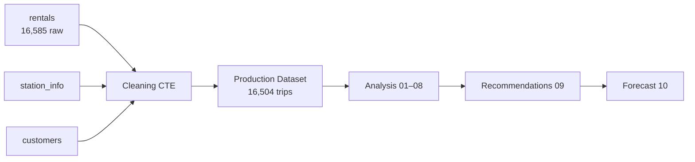
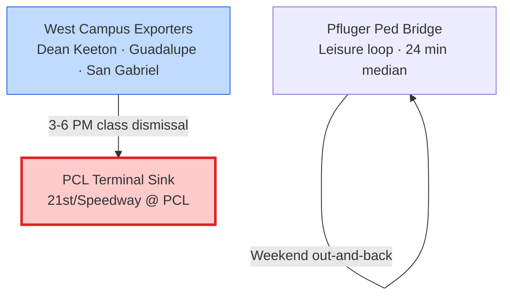

<!-- _class: lead -->

# Zen City
## Data-Driven Q2 2022 Rental Growth Strategy

**An expanded portfolio capstone** · Q1 2022 baseline → Q2 forecast

*Google-Reichman Data Analyst Program · Independent scope expansion*

<!--
SPEAKER: Open with the business mandate — Zen City needs actionable Q2 growth, not just descriptive stats. This deck summarizes the full pipeline: audit, cleaning, analysis, recommendations, and forecast.
-->

---

## The Business Question

**How can Zen City increase total bike rentals in Q2 2022 (April–June)?**

| Stakeholder need | Analytical response |
| :--- | :--- |
| Where is demand? | Q1 telemetry — 16,504 validated trips |
| What blocks growth? | Physical dock capacity, not rider interest |
| What should we do? | 16 prioritized interventions across 5 domains |
| How much can we grow? | **+8% to +16%** (17,859–19,141 trips) |

> Q2 is a **throughput problem**, not an acquisition problem.

<!--
SPEAKER: Frame the entire project around one question. The surprising answer — demand exists but docks don't absorb it — is the narrative thread.
-->

---

## Program Origin vs. Portfolio Scope

| Google-Reichman baseline | This repository (expanded) |
| :--- | :--- |
| Descriptive statistics | Full CTE cleaning pipeline (99.5% retention) |
| Single-station analysis | Network-wide station performance + flow archetypes |
| Basic prediction | Multi-scenario Q2 forecast with capacity constraints |
| — | Customer segmentation (5 personas) |
| — | Bottleneck model (trips/dock/hour ceiling) |
| — | 16 business recommendations + KPI dashboard |

**Data source:** Real BigQuery tables — `rentals`, `customers`, `station_info`

<!--
SPEAKER: Acknowledge program origin, then differentiate your portfolio expansion. Reviewers should see this as capstone-quality work that exceeds the rubric minimum.
-->

---

## Data Foundation



| Table | Role |
| :--- | :--- |
| **rentals** | Trip timestamps, duration, bike type, station legs |
| **customers** | Membership tier, age, gender, subscriber status |
| **station_info** | Dock count, location, operational status |

<!--
SPEAKER: One-minute architecture slide. Point to repo files 01→04 for depth.
-->

---

## Cleaning Strategy — Why 99.5% Matters

A naive **INNER JOIN** on station catalog would **drop 40% of trips** (16,585 → ~10,007).

**Our approach:**
- `LEFT JOIN` + imputation — preserve genuine rides with missing metadata
- Ghost station filter (ID 1007) — prevent join fan-outs
- Duration bounds — remove < 1 min and > 24 hr anomalies
- Lavaca & 6th ID remap — resolve duplicate station IDs

| Metric | Value |
| :--- | :--- |
| Raw Q1 trips | 16,585 |
| **Production dataset** | **16,504 (99.51%)** |
| Excluded | 81 (incomplete station keys, outliers) |

<!--
SPEAKER: This is the data-engineering credibility slide. The Springfest single-trip edge case is documented in 02 but excluded from production by design.
-->

---

## Finding 1 — The Student Commuter Engine

| Metric | Value |
| :--- | :--- |
| Student membership share | **76.2%** of all trips |
| Median trip duration (students) | **6 minutes** |
| Electric vs Classic | **87.7% / 12.3%** |

**Zen City is a last-mile campus micro-mobility network** — high frequency, short distance, afternoon-heavy.

*Chart: `Visualizations/index.html` → Subscription Tier Mix*

<!--
SPEAKER: Use Visualizations/index.html doughnut chart for live demo, or import subscription_mix.csv into slides. Students aren't touring the city — they're moving between class and housing.
-->

---

## Finding 2 — Afternoon-Dominant, Not Dual-Peak

| Time block | Trips | Share |
| :--- | :---: | :---: |
| Morning rush (7–10 AM) | 2,325 | 14.1% |
| **Afternoon peak (3–6 PM)** | **5,796** | **35.1%** |
| Evening tail (7–10 PM) | 2,894 | 17.5% |

- **#1 peak hour:** 3 PM (1,511 trips)
- **Tuesday & Wednesday** = highest volume days (~18% each)
- **Friday drops 29%** from Tuesday — early weekend departure

> Staff rebalancing for **1:30–6:00 PM**, not 7–9 AM.

<!--
SPEAKER: This contradicts the "morning commute" intuition. Show hourly chart from Visualizations/index.html.
-->

---

## Finding 3 — The PCL Corridor Is the Binding Constraint

| Station | Role | Q1 signal |
| :--- | :--- | :--- |
| **21st/Speedway @ PCL** | Terminal sink | **0 departures · 3,552 arrivals** |
| Dean Keeton/Speedway | Net exporter | 2,998 departures · turnover 244× |
| 21st/Guadalupe | West Campus hub | 2,286 departures · 81.9% student |

**Peak-hour PCL intensity:** 16.2 arrival events/dock/hour vs **~10 physical ceiling** → **145% overcapacity**

Students ride **into** campus sinks in the afternoon; bikes don't flow back out.

<!--
SPEAKER: This is the "aha" slide. PCL is the gravitational center — six student corridors = 20.3% of all student trips terminate here.
-->

---

## Network Flow — Exporters vs. Sinks



| Failure mode | Station type | Symptom |
| :--- | :--- | :--- |
| Empty bikes | Exporter | Student can't start trip |
| Full docks | Sink (PCL) | Student can't end trip — **network lock** |

<!--
SPEAKER: Two different bottleneck types require two different ops playbooks.
-->

---

## Customer Segmentation — Five Personas

| Persona | Share | Profile | Q2 lever |
| :--- | :---: | :--- | :--- |
| **P1 Campus Commuter** | 77.5% | 6-min trips, PCL corridor | Dock expansion + clearing |
| **P2 Local Recurring** | 14.2% | Local31/365, weekday loyal | Tier pricing |
| **P3 Leisure & Visitor** | 7.4% | Pfluger, East 6th, long rides | Weekend campaigns |
| **P4 Casual Single-Trip** | 0.9% | One-off payers | Fold into P3 |
| **P5 Power Users** | 568 users | ≥10 trips; top 20 = **40%** of volume | Retention > acquisition |

<!--
SPEAKER: 568 power users generate 99.1% of trip volume concentration at the top. Losing 20 users hurts more than acquiring 200 casual riders.
-->

---

## Strategic Diagnosis

<blockquote>
Q1 proved Zen City can sustain <strong>412 trips/day</strong> (Feb 10 peak).
Growth is capped by <strong>hardware throughput</strong>, not marketing reach.
</blockquote>

| If we… | Q2 outcome |
| :--- | :--- |
| Do nothing (S0) | **+3.6%** — bottlenecks absorb demand |
| Ops fixes only (S1) | **+11.8%** |
| **Target plan (S2)** | **+16.0%** stretch / **+8.2%** seasonal floor |
| Full roadmap (S3) | **+24.3%** — requires all interventions |

**~2,050 trips** of Q2 demand likely suppressed by dock constraints alone.

<!--
SPEAKER: Bridge from analysis to recommendations. Linear regression projected 32,724 trips — we rejected it as unrealistic (semester ramp artifact).
-->

---

## Top 3 Recommendations (Priority Matrix)

| # | Action | Domain | Impact |
| :---: | :--- | :--- | :--- |
| **1** | **PCL overflow dock bay** (+10–15 slots) | Infrastructure | Removes binding 145% capacity failure |
| **2** | **PCL continuous clearing** 1–6 PM weekdays | Operations | Zero-capital throughput unlock |
| **3** | **Power user retention** (568 users, top 20 = 40%) | Pricing/CRM | Protects volume concentration |

**Sequencing:** Infrastructure + Operations **before** Pricing + Marketing.

16 total recommendations in [`04_Predictive_Modeling.md`](04_Predictive_Modeling.md) §09.

<!--
SPEAKER: Expand any of these in Q&A using the Finding→Recommendation→Impact blocks in doc 04.
-->

---

## Q2 2022 Forecast Scenarios

| Scenario | Q2 Trips | vs Q1 (16,504) | Planning use |
| :--- | :---: | :---: | :--- |
| S0 Status Quo | 17,090 | +3.6% | Floor — no action |
| S1 Ops Quick Wins | 18,457 | +11.8% | Minimum if only ops changes |
| **S2-Adj (seasonal)** | **17,859** | **+8.2%** | **Operational staffing floor** |
| **S2 Target (stretch)** | **19,141** | **+16.0%** | **Executive target** |
| S3 Optimistic | 20,508 | +24.3% | Full roadmap delivered |

**Monthly S2-Adj:** April 6,248 · May 6,192 · June 5,419 (summer session dip)

<!--
SPEAKER: Use two numbers — 17,859 for ops planning, 19,141 for stretch goals. June seasonal factor is the main downside risk.
-->

---

## Q2 Execution Timeline

| Week | Infrastructure | Operations | Pricing / Marketing |
| :--- | :--- | :--- | :--- |
| **1–2** | Begin PCL overflow install (A1) | 3-wave rebalancing (B1) · PCL clearing (B2) | Student onboarding offer (D3) |
| **3–4** | Decommission bottom-10 → relocate (A3) | Friday crew shift (B3) | Power user retention (C2) |
| **5–8** | Dean Keeton + Guadalupe docks (A2) | Classic fleet playbook (B4) | Tier pricing (C1) · Weekend leisure (D2) |

**Weekly KPI targets:** ~1,472 trips/week · PCL peak < 320 arr/hr post-A1 · ≥540 active power users

<!--
SPEAKER: This slide makes the forecast actionable. Reference Section 10.7 dashboard for monitoring.
-->

---

## Model Integrity & Limitations

| Decision | Rationale |
| :--- | :--- |
| Rejected linear regression (32,724 Q2) | Jan→Feb surge = semester onboarding, not repeatable |
| Excluded March 18 (6 trips) | Partial system outage — corrupts trend models |
| Seasonal June adjustment (−15%) | Summer student departure |
| Orphan IDs 7125, 7188 flagged | Top-5 hubs with imputed dock metadata |

**External risks not modeled:** Weather events, fleet expansion beyond Q1 hardware, major campus schedule changes.

<!--
SPEAKER: Shows analytical maturity — you know what the model can't do.
-->

---

## Repository Deliverables

| Doc | Content |
| :--- | :--- |
| [`01_Tables_First_Look.md`](01_Tables_First_Look.md) | Raw audit, PK validation |
| [`02_Data_Cleaning_and_Wrangling.md`](02_Data_Cleaning_and_Wrangling.md) | CTE pipeline, imputation |
| [`03_Analysis_and_Predictions.md`](03_Analysis_and_Predictions.md) | Sections 01–08: EDA → segmentation |
| [`04_Predictive_Modeling.md`](04_Predictive_Modeling.md) | Sections 09–10: recommendations + forecast |
| [`Visualizations/`](Visualizations/) | Dashboard, CSVs, Mermaid exports |
| [`SQL/Final project all.sql`](SQL/Final%20project%20all.sql) | Reproducible BigQuery scripts |
| [`Final_Clean_Table_CTE.csv`](Final_Clean_Table_CTE.csv) | Production dataset (16,504 rows) |

<!--
SPEAKER: Point reviewers to the repo for reproducibility. SQL + CSV prove this isn't slideware.
-->

---

<!-- _class: lead -->

# Executive Conclusion

**Unlock PCL. Protect power users. Layer pricing on a network that can absorb demand.**

| Metric | Value |
| :--- | :--- |
| Q1 actual | 16,504 trips |
| Q2 realistic range | **17,859 – 19,141** (+8% to +16%) |
| Without infrastructure | Stuck at **+3.6%** |
| #1 capital project | PCL overflow docks |

### Questions?

*Full analysis: [`03_Analysis_and_Predictions.md`](03_Analysis_and_Predictions.md) · [`04_Predictive_Modeling.md`](04_Predictive_Modeling.md)*

<!--
SPEAKER: Close with the single sentence strategy. Invite questions on methodology, PCL math, or forecast scenarios.
-->

---

# Export Guide

This deck uses **[Marp](https://marp.app/)** markdown. To export:

### Option A — VS Code / Cursor (recommended)
1. Install the **Marp for VS Code** extension
2. Open this file → click **Marp icon** → Export Slide Deck → **PDF** or **PPTX**

### Option B — Marp CLI
```bash
npx @marp-team/marp-cli 05_Final_Presentation.md --pdf
npx @marp-team/marp-cli 05_Final_Presentation.md --pptx
```

### Option C — Google Slides / PowerPoint manual build
1. Open [`Visualizations/index.html`](Visualizations/index.html) in a browser
2. Screenshot charts or Print → PDF per chart
3. Import CSVs from [`Visualizations/data/`](Visualizations/data/) for editable chart data
4. Use slide titles and bullet content from the sections above

### Chart assets
| Chart | File |
| :--- | :--- |
| Interactive dashboard | `Visualizations/index.html` |
| Subscription / bike / DOW / hourly / Q2 | `Visualizations/data/*.csv` |
| Flow diagrams | `Visualizations/mermaid/*.mmd` → [mermaid.live](https://mermaid.live) |

*Remove this slide (and the Export Guide section) before presenting.*
